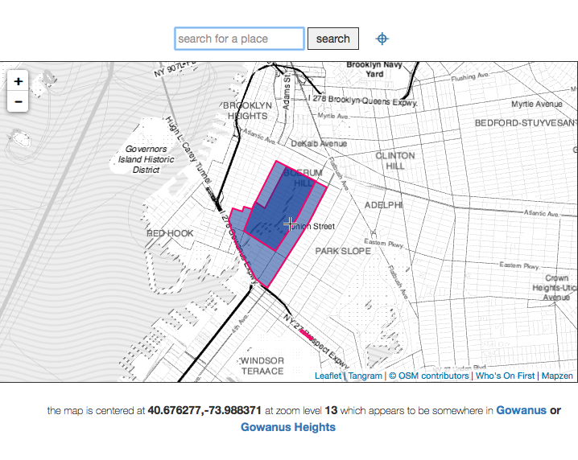

# I Am Here

## tl;dr

[https://whosonfirst.mapzen.com/iamhere/](https://whosonfirst.mapzen.com/iamhere/) is a shiny new version of [Simon Willison's](http://blog.simonwillison.net/) classic <q>Get Lat Lon</q> application [full of Mapzen-y goodness](https://github.com/whosonfirst/whosonfirst-www-iamhere).

## A short history

In late 2007 [Simon Willison](http://blog.simonwillison.net/) launched what some people have described as <q>the most useful website on the internet</q>. The website was called [Get Lat Lon](https://web.archive.org/web/20071013001113/http://getlatlon.com/) and its entire purpose was to enable a visitor to <q>find the latitude and longitude of a point on a map</a>. 

The website was built using [the Google Maps API](https://developers.google.com/maps/) and had a form for geocoding addresses or place names but the primary interface was a simple map with a set of crosshairs centered in the viewport. Get Lat Lon would simply print the geographic coordinates of whatever location happened to be beneath the crosshairs. Brilliant!

Somewhere between 2007 and now the domain renewal for Get Lat Lon lapsed and now it's... something else entirely, something not worth linking to. You can still get a feeling for the simplicity and elegance of its overall design because there are snapshots of the website in the [Wayback Machine](https://web.archive.org/) except... none of the Javascript works anymore.


In 2009 I decided to write my own version of Get Lat Lon. Instead of using the Google Maps API it would use all <q>open</q> software and data. The map data would be from [OpenStreetMap](http://www.openstreetmap.org/). The map tiles would be [from CloudMade using exciting new cartography from Stamen Design](http://mike.teczno.com/notes/cloudmade-styles.html). It would use the [modestmaps.js](https://github.com/stamen/modestmaps-js) library for managing all those tiles. It would support the then still-nascent browser-based [Geolocation API](http://www.w3.org/TR/geolocation-API/) to help determine your location. The geocoding would [be handled by Flickr](https://www.flickr.com/services/api/flickr.places.find.html) and in addition to geocoding it would also try to _reverse_ geocode your location and display [the shape of the place](http://code.flickr.net/2008/10/30/the-shape-of-alpha/) contained by a latlon, again [using the Flickr API](https://www.flickr.com/services/api/flickr.places.findByLatLon.html).


And... it would be [so clever and modular](https://github.com/straup/js-iamheremap) that it would support multiple service providers and you could just drop it in to any webpage and it would work, as if like magic. It was called <q>I Am Here</q> and I think I was the only person to ever use it but [it's still running](http://www.aaronland.info/iamhere/). In 2014, though, CloudMade [got out of the tile business](https://wiki.openstreetmap.org/wiki/CloudMade) and so there is literally not much to see anymore.


_I am pretty sure that it's exactly [one line of code to define a new map provider](https://github.com/straup/js-iamheremap/blob/master/iamheremap.src.js#L268-L280) to make I Am Here work again but to be perfectly honest just looking at all that too-too clever code now, in 2016, is exhausting. Also, see the way the licensing information on the map data hasn't been updated to reflect [the switch to the ODbL](http://www.openstreetmap.org/copyright)..._

## Reverse geocoding

Fast forward to last year (2015) and work has begun in earnest on the [Who's On First (WOF) gazetteer](https://whosonfirst.mapzen.com/) at Mapzen. Part of that work has been to build hierarchies for each record in the gazetteer which is something of a [chicken-and-egg problem](https://github.com/whosonfirst/whosonfirst-placetypes#here-is-a-pretty-picture). We've been automating the process with a general purpose [point-in-polygon tool](https://github.com/whosonfirst/go-whosonfirst-pip/) that we've written in-house using the Go programming language. It is called `go-whosonfirst-pip` and it works like this:

* It loads an arbitrary number of WOF documents in to memory. _Where <q>WOF document</q> just means any GeoJSON document with a properties dictionary containing `id`, `name` and `placetype` keys._

* The documents are indexed using an [R-tree](https://en.wikipedia.org/wiki/R-tree). _An R-tree is a data structure optimized for storing multi-dimensional information, like geometries._

* The document set is queried with a latitude and a longitude and optionally filtered by placetype.

* Because the R-tree stores bounding boxes instead of complex geometries (as Wikipedia says: _The "R" in R-tree is for rectangle_) there is a final operation (called [raycasting](https://en.wikipedia.org/wiki/Ray_casting)) to ensure that a point is actually contained by any of the candidate results.

That's it. The purpose of the `go-whosonfirst-pip` code is to do fiddly math across a large and heterogenous dataset as quickly as possible.

[](https://commons.wikimedia.org/w/index.php?curid=10008216)


_This is what an R-tree looks like, courtesy [Wikimedia user Chire](https://commons.wikimedia.org/wiki/User:Chire)_

It only knows about points and things that contains those points but it does not know about context. For example, consider the following question: What continent is [Russia](https://whosonfirst.mapzen.com/spelunker/id/85632685/) a part of? Europe? Asia? All of the above? There are lots of interesting applications that remain to be built on top of `go-whosonfirst-pip` but it is important to remember that it is _not_ an inference engine, by design. 


The code includes a simple HTTP server (called `wof-pip-server`) that you can use to easily load (and then query) one or more ["meta" files](https://github.com/whosonfirst/whosonfirst-data/tree/master/meta) containing pointers to different WOF documents. If a WOF document is just a GeoJSON with a few explicit properties then a "meta" file is just a CSV with a `path` column containing a _relative_ path to a WOF document.

_Although the "meta" files were originally conceived as little more than a simple helper tool (or index) for large volumes of data they have grown in to something of a "first class" object inside the world of Who's On First, with more and more of the tooling and infrastructure built around them. They are due for a longer more detailed discussion but not today._

To get started with an instance of `wof-pip-server` that will query for countries and neighbourhoods you would do:

```
$> ./bin/wof-pip-server -data /usr/local/mapzen/whosonfirst-data/data/ \
  /usr/local/mapzen/whosonfirst-data/meta/wof-country-latest.csv \
  /usr/local/mapzen/whosonfirst-data/meta/wof-neighbourhood-latest.csv 
[placetype] country 219
[placetype] neighbourhood 49906
```

Depending on how fast your computer is the indexing process might take a couple of minutes. By default the `wof-pip-server` listens for requests on port `8080` on your computer's local "loopback" network interface which is also called `localhost`, so the URL for querying the server would be `http://localhost:8080`. For example:

```
$> curl 'http://localhost:8080?latitude=40.677524&longitude=-73.987343' | python -mjson.tool
[
    {
        "Id": 102061079,
        "Name": "Gowanus Heights",
        "Placetype": "neighbourhood"
    },
    {
        "Id": 85633793,
        "Name": "United States",
        "Placetype": "country"
    },
    {
        "Id": 85865587,
        "Name": "Gowanus",
        "Placetype": "neighbourhood"
    }
]
```

If you want to limit the result set to a specific placetype simply append `placetype=PLACETYPE` to your query string, like this:

```
$> curl 'http://localhost:8080?latitude=40.677524&longitude=-73.987343&placetype=neighbourhood' | python -mjson.tool
[
    {
        "Id": 102061079,
        "Name": "Gowanus Heights",
        "Placetype": "neighbourhood"
    },
    {
        "Id": 85865587,
        "Name": "Gowanus",
        "Placetype": "neighbourhood"
    }
]
```

_Currently it is [not possible](https://github.com/whosonfirst/go-whosonfirst-pip/issues/22) to filter the result set with multiple placetypes. That's not technically a bug but it's become clear that it's also not a feature._

The `wof-pip-server` returns as little information as possible because it stores as little information as possible, mostly for performance reasons. It is left up to applications using `wof-pip-server` to decide whether and how to look up more information about any given WOF document.

The nice thing about the `go-whosonfirst-pip` tools is that they are designed to be agnostic as possible about the data they index and serve. For example I recently downloaded [version 2.0.1 of the Flickr Alpha Shape files](https://archive.org/details/FlickrShapesPublicDataset2.0.1.tar) and re-jiggled the file structure (but not the actual data) of the alpha shapes and now they will Just Work&#8482; with  `wof-pip-server`.

## whosonfirst-www-iamhere

So far, so good. We have [an enormous bag of (Who's On First) data](https://github.com/whosonfirst/whosonfirst-data/) and we have [a tool for establishing the relationship(s) between those files](https://github.com/whosonfirst/go-whosonfirst-pip/) but any volume of geographic data absent a map is... hard to see.

[](https://whosonfirst.mapzen.com/iamhere/#14/40.676277/-73.988371)

So, I rebuilt I Am Here (or Get Lat Lon) ... again. It's called [whosonfirst-www-iamhere](https://github.com/whosonfirst/whosonfirst-www-iamhere) or just I Am Here (again) for short.

It does everything that the combination of Get Lat Lon and the original I Am Here did, but is built entirely using Mapzen tools and services.

Aside from an ongoing need to simply know what the coordinates are for any given spot on a map it seemed like `whosonfirst-www-iamhere` would be a good and useful tool for visualizing and sanity-checking the results returned by the `go-whosonfirst-pip` code.

[](https://whosonfirst.mapzen.com/iamhere/#14/37.751376/-122.469149)

_For example, Golden Gate...what?_

This time, though, it's been built with two guiding principles in mind. The first is that <q>Mapzen should always be Consumer Zero (of Mapzen services)</q> and the second is to minimize the pain and nuisance of any one piece, of what is actually a pretty complex application, failing or shutting down or otherwise going offline.

### Mapzen as Consumer Zero

The latest version of I Am Here uses a bunch of Mapzen services already:

* It uses the [Tangram](https://github.com/tangrams/tangram) Javascript library for rendering tiles and [Refill](https://github.com/tangrams/refill-style) for styling them.
* It uses [Mapzen Search](https://mapzen.com/projects/search), for geocoding. _This is not enabled by default as you'll need to [sign up for an API key](https://mapzen.com/developers) (it's really easy!) and add it to the `mapzen.whosonfirst.config.js` config file._
* It uses [Who's On First data](https://whosonfirst.mapzen.com/data/) for reverse geocoding and for displaying geometries and other metadata about a place.

In time, it will also use:

* [Mapzen Turn-by-Turn](https://mapzen.com/projects/valhalla) to visualize the placetypes along a journey route. _There is [a branch of the `go-whosonfirst-pip` code](https://github.com/whosonfirst/go-whosonfirst-pip/tree/polyline) that will perform point-in-polygon tests along an [encoded polyline](https://developers.google.com/maps/documentation/utilities/polylinealgorithm) as returned by the Turn-by-Turn service so this feature is mostly waiting on user-interface details rather than number-crunching._
* A [Who's On First enabled IP lookup service](https://whosonfirst.mapzen.com/mmdb/) to help determine where to position the map when I Am Here is launched.

### Small pieces, loosely failing

The ultimate goal of `whosonfirst-www-iamhere` is to work from your own computer in offline-mode (or when you don't have a network connection) without needing to download and install a long list of dependencies. As of this writing:

* It _does not_ come with pre-installed WOF data, but that's also a deliberate choice. We'll talk more about that in a moment.
* It _does not_ come with pre-installed or cached vector tiles (used by Tangram). _There is [a margins-of-the-day project to enable tile-caching in Tangram](https://github.com/thisisaaronland/tangram/tree/localforage) but it is not ready for general usage yet._
* It _does not_ come with a pre-installed version of Mapzen Search for offline use. _Since the code that powers the service (Pelias) is open source and designed to be run by an individual that piece is left as an exercise to the user._
* It _does_ come with pre-installed platform specific (OS X, Linux and Windows) binary applications for serving the Tangram Javascript code and the `wof-pip-server` endpoint.
* It _does_ come with a handy "startup" tool meant to take care all of the details when launching `whosonfirst-www-iamhere`. _Currently the tool is written in Python which comes pre-installed on OS X and Linux computers. For people using Windows computers installing Python fails the yet-another-dependency test so there is added impetus for rewriting it (the startup tool) as something can be pre-compiled to run on a Windows machine, too._
* It _does not_ come with a handy GUI startup tool. _Currently it assumes a level of familiarity with your computer's command-line (or terminal) interface._

Here is an example of how you might start `whosonfirst-www-iamhere` from your computer. This assumes that you have downloaded (or cloned) the [whosonfirst-www-iamhere](https://github.com/whosonfirst/whosonfirst-www-iamhere) code and have navigated in to the root directory.

```
$> ./bin/start.py -d /path/to/your/whosonfirst-data/data \
  /path/to/your/whosonfirst-data/meta/wof-neighbourhood-latest.csv \
  /path/to/your/whosonfirst-data/meta/wof-locality-latest.csv
```

[](https://whosonfirst.mapzen.com/iamhere/#11/33.332823/44.426651)

The short version is that once the `start.py` script has finished setting everything up you can open your web browser up at `http://localhost:8001` and start poking around countries and neighbourhoods from Who's On First.

The longer version follows. By default the `start.py` tool requires a minimum of two arguments. The first (`-d`) is the path to where, on your computer, you've stored your raw Who's On First data files. The second and third arguments are the paths to "meta" files (remember them?) that the `wof-pip-server` will index. The `start.py` tool will start three separate servers running on your computer:

* A simple web server that will the Who's On First data you specified (with the `-d` parameter) running on port `9999`. _Remember the way we said that `wof-pip-server` returns little more than a WOF ID? The reason for this data-only server is that the `whosonfirst-www-iamhere` application will "inflate" a WOF ID, returned by the PIP server, by fetching its record from the data server._
* Another simple web server that will host the `whosonfirst-www-iamhere` application running on port `8001`. _These two pieces could be served by a single more sophisticated web server._
* Finally the `wof-pip-server` itself running on port `8080`.

All of these port numbers can be changed if necessary. To do so you would pass your own setting as parameters to the `start.py` tools and as custom settings in the `mapzen.whosonfirst.config.js` config file.

[](https://whosonfirst.mapzen.com/iamhere/#11/42.358430/-71.059770)

## Bundles

One of the challenges with Who's On First has been balancing our desire for a robust and portable data format (plain text GeoJSON files), the needs for an historical audit trail and the mechanics of working with and distributing a large and ever-growing dataset. We have been using Git and GitHub extensively for much of the work to date but as the commit history around [the data]() grows so too does the size of the `whosonfirst-data` repository and the burden in using it or simply getting started with Who's On First.

[](https://whosonfirst.mapzen.com/iamhere/#3/45.5080/-73.6166)

As an alternative we have been working on something called <q>bundles</q>. Bundles are:

>...a collection of GeoJSON formatted files (Who's On First data) grouped by a specific property, like placetype. They allow for people to more easily bulk download a subset of the entire Who's On First dataset. Currently there are only bundles by placetype but eventually we will add a variety of different "slices" of the data as demand and interest require.

Each bundle contains a "meta" file (_see... they just keep popping up all over the place!_) and a folder named `data` which contains the files listed in the meta file. Bundles do not contain any Git history or related metadata but our hunch is that many people don't need or want that information. The startup tool mentioned above does not yet have support for bundles but that will happen shortly. In the meantime you can get started with `whosonfirst-www-iamhere` and bundles with a few short commands in your terminal.

For example, if you just wanted to run a copy of `whosonfirst-www-iamhere` using only [microhoods](https://whosonfirst.mapzen.com/spelunker/placetypes/microhood/) (which are currently [all in San Francisco](https://whosonfirst.mapzen.com/spelunker/id/85922583/descendants/?&placetype=microhood)) you would do the following:

```
$> cd /path/to/your/whosonfirst-www-iamhere
$> curl -O https://whosonfirst.mapzen.com/bundles/wof-microhood-latest-bundle.tar.bz2
$> tar -xvjf wof-microhood-latest-bundle.tar.bz2
$> ./bin/start.py -d wof-microhood-latest-bundle/data wof-microhood-latest-bundle/wof-microhood-latest.csv
```

[](https://whosonfirst.mapzen.com/iamhere/#14/37.796356/-122.396107)

All of the details and currently available bundles are listed over at [https://whosonfirst.mapzen.com/bundles](https://whosonfirst.mapzen.com/bundles) and... yes, [Super Bowl City](https://whosonfirst.mapzen.com/spelunker/id/420561633/) is a thing that really happened in 2016.

## Or you can just use our version

As mentioned at the beginning of this blog post there is a publicly accessible version of I Am Here for you to play with at [https://whosonfirst.mapzen.com/iamhere/](https://whosonfirst.mapzen.com/iamhere/).

Right now it only display neighbourhoods but shortly [we will add the ability to select different (even multiple) placetypes to display at the same time](https://github.com/whosonfirst/go-whosonfirst-pip/issues/22). And as circumstance permits we will add the additional features (routing and IP lookups) mentioned above. And then all the stuff we haven't even thought of yet.

Enjoy!
