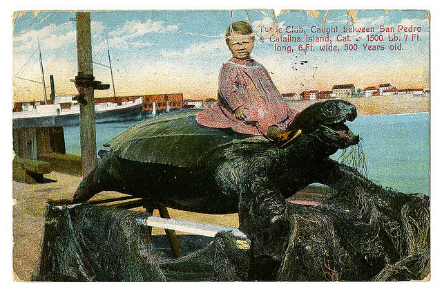

## Venues

tl;dr - [20 million openly licensed venues, all with full (or at least partial) Who's On First hierarchies](https://whosonfirst.mapzen.com/spelunker/placetypes/venue).

### What is this thing you call "venue" ?

By default, Who's On First strives to group places in to [as few distinct place types as possible](https://github.com/whosonfirst/whosonfirst-placetypes). The goal is to gather places in to buckets where they have _more in common with other kinds of places_ than not. Initially we defined venues as:

> Things with four walls and a ceiling.

Then we remembered that we want to (eventually) add [all the landmarks in the world](https://whosonfirst.mapzen.com/spelunker/tags/public_art/) to Who's On First. Rather than create a new placetype specific for landmarks we decided it made sense to classify them as venues, and to indicate their [landmark-iness](http://www.wikilovesmonuments.org/) via a Mapzen-prefixed property.

Which meant we needed to change the definition of a venue to reflect many landmarks lack of walls or ceilings. Now we define a venue as:

> Places that people might stand around, _together_.

That may sound a little silly in the telling. You could find lots of fancier ways of saying the same thing but at the end of the day you'd still be... saying the same thing and in a way that would probably sound like gibberish to non-experts and strip away both the ambiguity and the play inherent in the reality of things.

So, that's what we think a venue [&quot;is&quot;](https://www.youtube.com/watch?v=j4XT-l-_3y0).

Venues are still the holy grail of geo data, precisely because they are the psychic underwear to our daily lives. For good or bad, most people's entire lives are mediated through "venues" be they commercial, cultural or social. There are a lot of venues, even in the smallest of communities.

Multiply _a lot of venues, even in the smallest of communities_ by the _entire planet_ and you've got... well, a lot of venues.

Which makes venues a hard problem. It's a hard problem collecting all those venues. It's a hard problem vetting them and to keeping them up to date. It's a hard problem to figure out where to _put_ them all and harder still to figure out how to make that many things searchable. These are hard problems and that has meant only companies with an interest in reselling access to that data have endeavoured to take up the challenge. That's not very interesting to Who's On First.

Historically, there haven't been a whole lot venue databases that don't impose constraints, of one kind or another, on their re-use. The goal for Who's On First is to have an openly licensed database of places that _may_ be used in a commercial project, without any additional restrictions. Something akin to an [MIT](https://en.wikipedia.org/wiki/MIT_License) or [BSD](https://en.wikipedia.org/wiki/BSD_licenses) software license but for data. That is not everyone's definition of "open" and that's okay. There are different flavours of "open" and different reasons for choosing one over another.

Who's On First [has always been a wildly ambitious project](https://mapzen.com/blog/mapping-with-bias/) so rather than be discouraged by something as big and hairy and complicated as venues, we chose instead to jump in with both feet. 

### SimpleGeo (2009-2011)

In 2011, the now defunct geo-services company [SimpleGeo](https://www.twitter.com/simplegeo) published their [Public Spaces Collection](https://archive.org/details/2011-08-SimpleGeo-CC0-Public-Spaces), 20 million business listings, as a [Creative Commons Zero](https://creativecommons.org/publicdomain/zero/1.0/) (CC0) dataset. [Thanks, SimpleGeo!](https://web.archive.org/web/20110424090705/http://blog.simplegeo.com/2011/04/20/open-places-data/)

Most venues are in the [USA](https://whosonfirst.mapzen.com/spelunker/placetype/venue?iso=us) (approximately 12 million of them) but other countries with a not-insignificant number of venues include the [UK](https://whosonfirst.mapzen.com/spelunker/placetype/venue?iso=gb), [Germany](https://whosonfirst.mapzen.com/spelunker/placetype/venue?iso=de), [Canada](https://whosonfirst.mapzen.com/spelunker/placetype/venue?iso=ca), [Spain](https://whosonfirst.mapzen.com/spelunker/placetype/venue?iso=es) and [Australia](https://whosonfirst.mapzen.com/spelunker/placetype/venue?iso=au). There are still _many, many_ places in the world where the SimpleGeo dataset doesn't have any venue data so this is a just a beginning, and not a triumphal celebration on arrival. You can see a complete count of venues by country here:

[https://github.com/whosonfirst-data/whosonfirst-data-venue/blob/master/DATA.md](https://github.com/whosonfirst-data/whosonfirst-data-venue/blob/master/DATA.md)

In 2015, we started importing those venues in to Who's On First. The import process has been a start-and-stop affair and adding a little over 8 million venues, last year, we put things on hold and didn't pick them up again until ealier this year. That work [wrapped](https://github.com/whosonfirst-data/whosonfirst-data-venue-us/issues/1) [up](https://github.com/whosonfirst-data/whosonfirst-data-venue/issues/1), recently, meaning every one of those 20 millions venues has been assigned [their very own Who's On First ID](https://mapzen.com/blog/wof-lifecycle-documentation/) and a full set of ancestors within [Who's On First](https://github.com/whosonfirst/whosonfirst-placetypes#here-is-a-pretty-picture).

Aside from a general desire to add all those venues in to Who's On First the sheer volume of data was attractive as a way to test some of the assumptions and infrastructure we've developed to manage [all these places](https://mapzen.com/blog/who-s-on-first/) we've taken under our wing. Any comprehensive database of venues in Who's On First, whether we seeded it using SimpleGeo or another source, would have all the same problems of scale so even though there were some initial concerns about the quality and the focus of the Public Spaces Collection we figured "Why not at least use it to start testing things, now?"

The SimpleGeo data was released in 2011 and it's 2016, today, so it's safe to assume that we will _not_ have a venue record for that cool new bar which just opened in [London](https://whosonfirst.mapzen.com/spelunker/ID/descendants&placetype=venue) or [Los Angeles](https://whosonfirst.mapzen.com/spelunker/ID/descendants&placetype=venue) or [Shanghai](https://whosonfirst.mapzen.com/spelunker/ID/descendants&placetype=venue). We aspire to have those venues, and aspire to have them in something approaching real-time, but today we do not.

_We might actually have some of those cool new bars in New York City or San Francisco but that is largely a function of choosing those two cities to start testing [the Who's On First editorial stack](https://mapzen.com/blog/boundary-issues-properties) with, since that is where most of the Mapzen staff live. This coastal bias is not a feature of Who's On First, only reflective of the fact that it is still early days..._

On the other hand if you need a plumber or a notary in any of those cities, or places like rural Kansas, it's entirely possible [we have those listings](https://whosonfirst.mapzen.com/spelunker/search/?q=plumber&region_id=85688555).

That's the interesting thing about the term "venues", in 2016: It has become short-hand for a very specific _subset_ of venues, eclipsing everything else. Often when people say "venues" they're really talking about restaurants and bars in urban or metropolitain areas and shops where people arguably enjoy spending money on the things they're buying (as opposed to, say, picking up toilet paper at the drug store).

These venues are also almost always _current_ venues suggesting the thrill, however illusory, of something that [hasn't been discovered by everyone else yet](http://www.aaronland.info/weblog/2014/10/06/interpretation/#brick) and aimed very specifically at what marketers refer to as "the 18-35 year old" demographic.

But let's stop for a moment and remember a few things: Let's remember the [nearly 100-year old butcher shop](https://whosonfirst.mapzen.com/spelunker/id/572151977/) in your neighbourhood. Or the [local bar](https://whosonfirst.mapzen.com/spelunker/id/572077043/) that closed last year [whose history runs deeper](https://en.wikipedia.org/wiki/The_Lexington_Club) than a pint glass. Let's remember our new best friend [Poop Emoji Rock](https://whosonfirst.mapzen.com/spelunker/id/1008184051/).

As important as it is, there is more to life than tomorrow's happy hour. Plus, sooner or later, everyone gets ejected from [18-35 Year Old Club](http://www.aaronland.net/old-club/) and then what?

As we've been working with the SimpleGeo dataset it's become clear that despite some bunk data and some unfortunate absences if there was a venue that existed before 2011 which had any kind of following, or traffic, it's probably in there... _somewhere_.

Now that we've gotten over the initial hurdle of simply importing all those venues (more on that below) a big part of our work in the short-term is to think about how we can allow people to make sense of all that stuff. It's easy  to complain that there are no open venues in the world but then to be confronted by [86, 000 accountants in seven different countries](https://whosonfirst.mapzen.com/spelunker/placetypes/venue/?tag=accountant) can be equally disorienting.

Some of the work going forward will involve [Yes-No-Fix style tools](https://mapzen.com/blog/yesnofix) allowing people to quickly flag venues as being still-open or long-since-closed and some of the work will involve [grouping venues in to categories](https://github.com/whosonfirst/whosonfirst-categories) for directed searches and general browsing. Some of the work will simply be learning by building things and seeing what works and [what doesn't](https://www.youtube.com/watch?v=XnoqLtJbjcI).

It's not going to be perfect right away but if we do the job well then, at the very least, things will be _better than they were yesterday_.

In the meantime there are 20, 848, 132 (and counting) venues that have been [Who's On First -ifed](https://whosonfirst.mapzen.com/spelunker/placetypes/venue).

## Postal Codes

tl;dr - [3 million openly licensed postal codes with centroids or polygons](https://whosonfirst.mapzen.com/spelunker/placetypes/postalcode/?exclude=nullisland) in 14 countries.

In the same spirit as venues we've also started to tackle adding postal codes to Who's On First. The initial import of postal codes came courtesy the 7.10.0 release of the [Yahoo! GeoPlanet dataset](https://archive.org/details/geoplanet_data_7.10.0.zip), which contains postal codes for most countries, even if they don't include geometries. That's okay because each postal code does have a [parent ID](https://whosonfirst.mapzen.com/spelunker/concordances/geoplanet/) and that gives us enough information to group things by country and we can add geometries, opportunistically, one country at a time.

There are more than 14 countries in the world so there is a lot of work left to do but here are some of the highlights, to date:

### Thank you, Ordnance Survey!

We've imported all of the UK Ordance Survey's [Code-Point Open](https://www.ordnancesurvey.co.uk/business-and-government/products/code-point-open.html) dataset in to Who's On First and we're still trying to sort out why there are a healthy 300, 000 UK postal codes _without_ geometries. On the other hand there _are_ [1.6 million postal codes with centroids](https://whosonfirst.mapzen.com/spelunker/placetypes/postalcode/?iso=gb&exclude=nullisland) so that's progress.

### Thank you, Hannes and Kevin!

Thanks to [Hannes Junnila](https://github.com/hannesj) and Mapzen's own [Kevin Kreiser](https://twitter.com/kevinkreiser) we have imported official postal codes for [Finland](https://github.com/whosonfirst-data/whosonfirst-data-postalcode-fi/issues/1) and [Austria](https://github.com/whosonfirst-data/whosonfirst-data-postalcode-at/issues/1) and [Switzerland](https://github.com/whosonfirst-data/whosonfirst-data-postalcode-ch/issues/1).

### Thank you, America and Canadia!

Likewise we've imported the [US Census ZIP Code Tabulation Areas](https://www.census.gov/geo/reference/zctas.html) meaning we have geometries for around [75% of all the postal codes](https://whosonfirst.mapzen.com/spelunker/placetypes/postalcode/?iso=us&exclude=nullisland) in the USA.

North of the US border, it turns out that Canada has about [800, 000 six-character postal codes](https://whosonfirst.mapzen.com/spelunker/placetypes/postalcode/?iso=ca). The licensing around their geometries [has a long and tortured history](http://www.michaelgeist.ca/2016/06/crowdsourcedpostalcodelawsuit/). Statistics Canada, however, has been nice enough to [publish shapefiles for the 1, 621 Forward Sortation Areas (FSA)](http://www12.statcan.gc.ca/census-recensement/2011/geo/bound-limit/bound-limit-2011-eng.cfm) which are represented by the first three characters in a Canadian postal code.

Using that information we generated [approximate centroids for the all the six-character postal codes](https://whosonfirst.mapzen.com/spelunker/placetypes/postalcode/?iso=ca&exclude=nullisland) derived from the geometric center of their parent FSA. This is not Perfect Data but it does scope the problem to about a square kilometer rather than an [entire province](https://en.wikipedia.org/wiki/Postal_codes_in_Canada).

### Thank you, Open Addresses!

Using the [Clustr](https://github.com/whosonfirst/Clustr) tool originally developed to [extract shapefiles from geotagged Flickr photos](http://code.flickr.net/2008/10/30/the-shape-of-alpha/) we've been able to generate approximate geometries for postal codes derived from [Open Addresses](http://openaddresses.io/) data for [Australia](https://github.com/whosonfirst-data/whosonfirst-data-postalcode-au/), [the Netherlands](https://github.com/whosonfirst-data/whosonfirst-data-postalcode-nl/) and [France](https://github.com/whosonfirst-data/whosonfirst-data-postalcode-fr/).

These geometries are very much Weird Data so it is left up to you to decide whether you think they're better than no data at all. If nothing else we think having to option to make that choice is better than no data.

## All Those GitHub Repositories

tl;dr - We are betting on the future and [making do with the present](https://github.com/whosonfirst-data).

Recently we created a second organization in GitHub for Who's On First related work. The first organization is called [whosonfirst](https://github.com/whosonfirst) and houses all of the software we've written to date as well as a growing body of theory and [documentation](https://github.com/whosonfirst/whosonfirst-cookbook).

The second organization is called [whosonfirst-data](https://github.com/whosonfirst-data) and it is where the millions and millions of GeoJSON files representing [all of the places](https://mapzen.com/blog/all-of-the-places/) in Who's On First live. The decision for a second organization was spurred on by the work we've been doing to import venues and postal codes.

Work that has translated in to _24 million GeoJSON files spread across 488 GitHub repositories_. Before we go any further, let's be clear about one thing: This is not an ideal situation.

Ultimately our goal is to have a single monolithic Who's On First repository that will contain _all 24 million_ (and counting) records. In 2016 storing 24 million tiny files in a single Git repository is either technically impossible or so impractical as to "play impossible on TV".

Until that better day comes when a single "mono-repo" is possible we have been working instead to establish conventions for what repository a given file lives in and what that repository is called. The naming conventions for repositories at their _most granular_ are as follows:

`"whosonfirst-data-" + WHOSONFIRST_PLACETYPE + "-" + WHOSONFIRST_COUNTRY_CODE + "-" + WHOSONFIRST_SUBDIVISION_CODE`

For example:

* [whosonfirst-data](https://github.com/whosonfirst-data/whosonfirst-data) — administrative data ([continents - microhoods](https://github.com/whosonfirst/whosonfirst-placetypes)) for the world
* [whosonfirst-data-venue-us-ca](https://github.com/whosonfirst-data/whosonfirst-data-venue-us-ca) — venues in California, USA
* [whosonfirst-data-venue-ca](https://github.com/whosonfirst-data/whosonfirst-venue-ca) — venues in Canada
* [whosonfirst-data-postalcode-fi](https://github.com/whosonfirst-data/whosonfirst-data-postalcode-fi) — postalcodes in Finland

The first thing to note is that not all repositories are as granular as the rules described above.

Wherever feasible we try to bundle records with the _least amount_ of granularity as possible. For example postalcodes are grouped by country as are venues unless there are so many of them, like in the USA, that it is not practical to keep them in a single parent repository.

If a repository grows so much data that it is no longer practical to keep everything in one place then it may be subdivided in to a number of child repositories. Venues are a good example of this.

We try to maintain a separate "parent" repository for things that have been broken out in to multiple child repositories. For example there is a [whosonfirst-data-postalcode](https://github.com/whosonfirst-data/whosonfirst-data-postalcode) repository that contains no data but instead [a pointer](https://github.com/whosonfirst-data/whosonfirst-data-postalcode/blob/master/data.json) to all the repositories that do have postalcode data. We also do the same for [venues in the USA](https://github.com/whosonfirst-data/whosonfirst-data-venue-us).

The [whosonfirst-data](https://github.com/whosonfirst-data/whosonfirst-data) repository is the obvious exception (or perfect example, depending on how you look at it) to the scenario described above. This repository contains all "administrative" placetypes (all the places between and inclusive of continents to microhoods) for the entire world. While it is possible to imagine that the sum total of all the neighbourhoods in the world will require putting them in a separate repository but we are going to hold off doing that for as long as we can.

     

     	  
     

_This practice is still in its early stages so we apologize in advance if it's bumpy, weird or incomplete._

The goal is to provide a clear and reproducible template for subdividing a repository (that has grown too large) in such as way that all those repositories may eventually be merged in to a single collection without any conflicts. Who's On First documents are grouped by country and placetype as a convenience but, technically, they can live anywhere.

Finally, Who's On First records should always have a `wof:repo` property indicating the repository to which they belong. If they don't that's a bug.

Huzzah!

Images used in this blog post:

<ul style="margin-top:1em;">
<li><a href="https://www.flickr.com/photos/chs_commons/16356193176/">Entertaining guests at the California alligator farm, Los Angeles</a> <small>California Historical Society</small></li>
<li><a href="https://www.flickr.com/photos/philgyford/14251596747/">Franzi and cable car</a> <small>Phil Gyford</small></li>
<li><a href="https://www.flickr.com/photos/nantuckethistoricalassociation/3177485572/">Postcard of the sea serpent</a> <small>Nantucket Historical Association</small></li>
<li><a href="https://www.flickr.com/photos/chs_commons/15485394421/">Turtle club, caught between San Pedro & Catalina Island, Cal.</a> <small>California Historical Society</small></li>
<li><a href="https://www.flickr.com/photos/floridamemory/14889402267/">Sitting with travel trailer at St. Petersburg Beach</a> <small>State Library and Archives of Florida</small></li>
<li><a href="https://www.flickr.com/photos/benterrett/9785396672/">The Endless Staircase</a> <small>Ben Terrett</small></li>
</ul>

