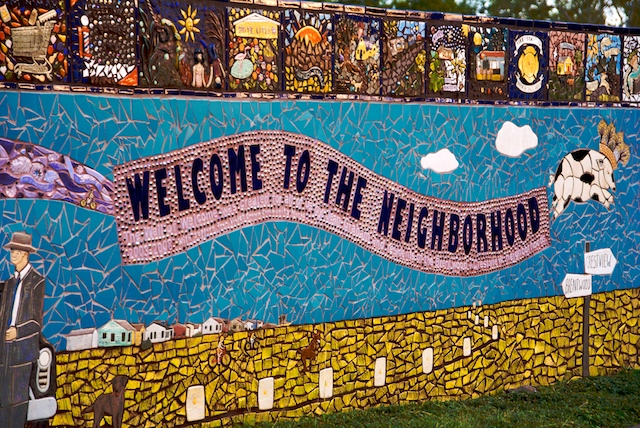

In two previous blog posts ([part one](https://mapzen.com/blog/sf-neighbourhood-updates/), [part two](https://mapzen.com/blog/neighbourhood-updates-two/)), we discussed out efforts to update neighbourhood records in Who's On First in over 35 localities around the globe. Today, we're happy to report that we've now imported open neighbourhood data for over 83 localities, as well as all administrative records in the Netherlands!

We’ve continued to use our streamlined approach to importing [new sources](https://github.com/whosonfirst/whosonfirst-sources/tree/master/sources) and adding [new properties](https://github.com/whosonfirst/whosonfirst-properties/tree/master/aliases) to existing records. We've made substantial gains since our last neighbourhood update eight months ago. 

Now, we'd like to take a moment to outline our most recent efforts.

##So, what's been updated?

In addition to the previous 35 localities that we've updated, we have imported new geometries and additional properties for microhoods, neighbourhoods, macrohoods, boroughs, localities, and some localadmin records in the following areas:

- All (!) of [the Netherlands](https://whosonfirst.mapzen.com/spelunker/download/85633337/)
- [Toronto, Canada](https://whosonfirst.mapzen.com/spelunker/download/101735835/)
- [Calgary, Canada](https://whosonfirst.mapzen.com/spelunker/download/890458845/)
- [Vancouver, Canada](https://whosonfirst.mapzen.com/spelunker/download/101741075/)
- [Burnaby, Canada](https://whosonfirst.mapzen.com/spelunker/download/101741055/)
- North Vancouver, Canada ([City](https://whosonfirst.mapzen.com/spelunker/download/101741057/) and [District](https://whosonfirst.mapzen.com/spelunker/download/101741071/))
- [New Westminster, Canada](https://whosonfirst.mapzen.com/spelunker/download/101741077/)
- [Richmond, Canada](https://whosonfirst.mapzen.com/spelunker/download/101741081/)
- [Surrey, Canada](https://whosonfirst.mapzen.com/spelunker/download/101741073/)
- [UBC-Point Grey, Canada](https://whosonfirst.mapzen.com/spelunker/download/1108951499/)
- [West Vancouver, Canada](https://whosonfirst.mapzen.com/spelunker/download/101741069/)
- [Edmonton, Canada](https://whosonfirst.mapzen.com/spelunker/download/890458485/)
- [Sherwood Park, Canada](https://whosonfirst.mapzen.com/spelunker/download/890456619/)
- [St. Albert, Canada](https://whosonfirst.mapzen.com/spelunker/download/890458621/))
- [Victoria, Canada](https://whosonfirst.mapzen.com/spelunker/download/101740879/)
- [Regina, Candada](https://whosonfirst.mapzen.com/spelunker/download/101739917/)
- [Winnipeg, Canada](https://whosonfirst.mapzen.com/spelunker/download/101734959/)
- [Saskatoon, Canada](https://whosonfirst.mapzen.com/spelunker/download/101740015/)
- [Quebec City, Canada](https://whosonfirst.mapzen.com/spelunker/download/101737491/)
- [Levis, Canada](https://whosonfirst.mapzen.com/spelunker/download/101737987/)
- [Ottawa, Canada](https://whosonfirst.mapzen.com/spelunker/download/101735873/)
- [Gatineau, Canada](https://whosonfirst.mapzen.com/spelunker/download/101737759/)
- [Montreal, Canada](https://whosonfirst.mapzen.com/spelunker/download/101736545/) (and smaller, surrounding localities)
- [Laval, Canada](https://whosonfirst.mapzen.com/spelunker/download/101737759/)
- [Longueuil, Canada](https://whosonfirst.mapzen.com/spelunker/download/101738793/)
- [Buenos Aires, Argentina](https://whosonfirst.mapzen.com/spelunker/download/421174285/) (Completed by an external contributor, shout out to [@mfogel](https://www.github.com/mfogel)!)
- [Madrid, Spain](https://whosonfirst.mapzen.com/spelunker/download/101748283/) 
- [Leganés, Spain](https://whosonfirst.mapzen.com/spelunker/download/101748281/)
- [Mostoles, Spain](https://whosonfirst.mapzen.com/spelunker/download/101748289/)
- [Fuenlabrada, Spain](https://whosonfirst.mapzen.com/spelunker/download/101748297/)
- [Barcelona, Spain](https://whosonfirst.mapzen.com/spelunker/download/101748323/)
- [London, UK](https://whosonfirst.mapzen.com/spelunker/download/101750367/)
- [Santa Barbara, California](https://whosonfirst.mapzen.com/spelunker/download/85921779/)

##Impressive, but what do these changes actually look like?

Below, we've created an interactive map with neighbourhood name labels for our updated records in the Netherlands in [Tangram](https://mapzen.com/tangram/play/). 

Notice that different placetype layers as you zoom in. You'll see:

- Locality records at a min zoom of `6`, max zoom of `7`.
- Borough records at a min zoom of `7`, max zoom of `8`.
- Macrohood records at a min zoom of `8`, max zoom of `9`.
- Neighbourhood records at a min zoom of `9`, max zoom of `10`.
- Microhood records at a min zoom of `10`, max zoom of `14`.

Dive in and enjoy!

<iframe src="https://tangrams.github.io/tangram-frame/?noscroll&url=https://mapzen-assets.s3.amazonaws.com/images/neighbourhood-updates-III/netherlands_admin.yaml#6.75/52.278/5.553"></iframe>

 <a style="font-weight:normal"href="https://tangrams.github.io/tangram-frame/?url=https://mapzen-assets.s3.amazonaws.com/images/neighbourhood-updates-III/netherlands_admin.yaml#6.75/52.278/5.553">Click to view the Netherlands in full screen ➹</a>  

##Property edit work

In addition to all of these new, clean geometries, Who's On First has also completed a substantial amount of work around the following properties for neighbourhood records:

- [mz:min_max](https://github.com/whosonfirst/whosonfirst-properties/blob/master/properties/mz/min_zoom.json)
- [mz:max_max](https://github.com/whosonfirst/whosonfirst-properties/blob/master/properties/mz/max_zoom.json)
- [lbl:latitude](https://github.com/whosonfirst/whosonfirst-properties/blob/master/properties/lbl/latitude.json)
- [lbl:longitude](https://github.com/whosonfirst/whosonfirst-properties/blob/master/properties/lbl/longitude.json)

Curated values for these properties allow us to be specific when displaying placetype labels in our housestyles, like [Bubble Wrap](https://mapzen.com/products/maps/bubble-wrap/#lat=37.7611&lng=-122.4419&z=13.0250). We've imported new, curated zoom level and location values for thousands of Who's On First records and plan to import many more.

##What's Next?

We are currently working on importing new geometries and properties for Paris, which should be imported into Who's On First shortly. Stay tuned for more and thanks for reading!

_Photo Credit: [Nathan Russell, Flickr](https://flic.kr/p/51Rkya)_
