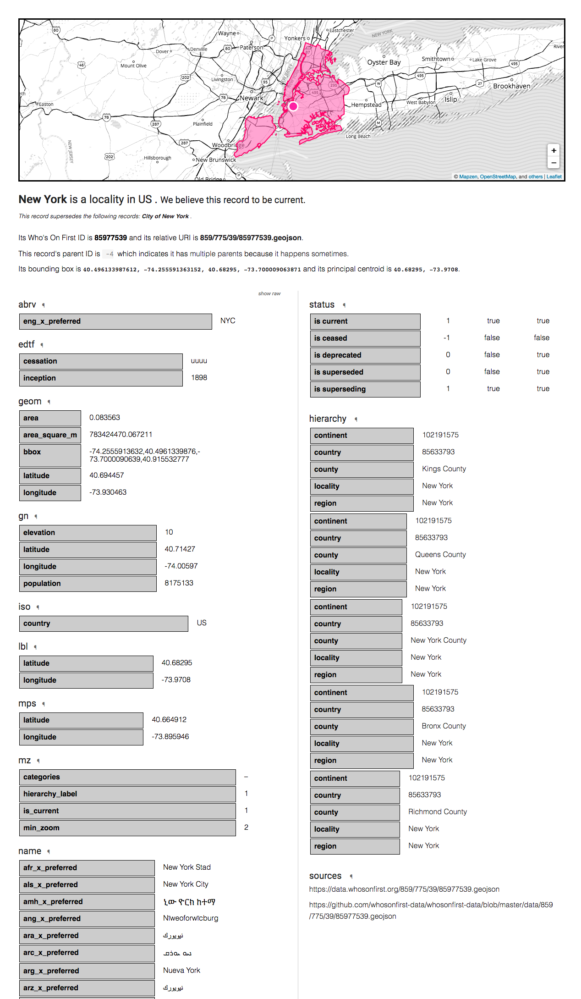

[](https://collection.cooperhewitt.org/objects/18805771/)

## The short version

We heard you liked 2017 so much that we decided to start 2018 with a bang...

## The longer version

So [that's a bummer](https://www.mapzen.com/blog/shutdown), yeah?

In many ways everything about the manner in which Who's On First has been designed has been done with this day in mind. We all endeavour to achieve the sort of "escape velocity" that immunizes us from circumstance but that is rare indeed and there was always a chance this day would come. So while "success" was the goal in many ways preventing what I call "the reset to zero" has always been of equal importance.

The "reset to zero" means that one day (like today) the Who's On First you use and pay for as a service on the Internet goes away... and then what?

Typically it's meant that anyone who's wanted to use an alternative to one of the Big Dominant Geo-Services or API Providers (BDGSAP) and has built their applications or services using that alternative has had little choice but to go fishing around in their desk drawer for their BDGSAP account information and think about re-tooling everything... all over again.

That's the "reset to zero".

I would like to think that we have, even just a little bit, prevented this from happening again.

I would be nice to believe that it's only been a reset to "five" (on a scale to ten) but realistically it's probably closer to a reset to "three".

That does not mean that people will be able to turn around and build or offer all of the Who's On First services in a day or even a week but if we've done our jobs well I'd like to think that there is nothing that couldn't be rebuilt (by us or by someone else) in a couple of months. It means that while things are not literally "better than yesterday" – since yesterday you didn't have to read this blog post – it means that things are hopefully better than the yesterday of the last time a service you came to depend on had to shutter its doors.

We'll see, right? The dust hasn't settled yet so there are likely gotchas that remain to be discovered.

## The long version

In practical terms what this means for Who's On First in the short-term is:

* Both the data and the code will [continue to be worked on](https://whosonfirst.mapzen.com/spelunker/recent/), but at a slower pace.

* All of the data [has been cloned to the Internet Archive](https://archive.org/search.php?query=whosonfirst+mapzen).

* All of the code [has also been cloned](https://archive.org/search.php?query=whosonfirst&sort=-publicdate&and[]=subject%3A%22code%22) to the Internet Archive, thanks to the handy [iagitup](https://github.com/gdamdam/iagitup) tool. If you've never [donated to the Internet Archive](https://archive.org/donate/) before this would be a good time to give them a friendly money-hug.

* All of the [data](http://github.com/whosonfirst-data) and [code](https://github.com/whosonfirst) will continue to be hosted in their respective GitHub organizations.

* I have set up an out-of-pocket S3 bucket (and related services) to host a copy of the data, at least in the short-term. This is discussed in detail, below.

* Dan's "Who's On First in a Box" blog posts (parts [one](https://mapzen.com/blog/wof-in-a-box/) and [two](https://mapzen.com/blog/wof-in-a-box-part2/)) demonstrate that it's possible to run most of the WOF stack locally or on an internal network.

* Speaking of [blog posts](https://mapzen.com/tag/whosonfirst), all the Who's On First related blog posts have been cloned in to the [whosonfirst-www](https://github.com/whosonfirst/whosonfirst-www) repo. They still need some formatting-love but [all the text and images](https://github.com/whosonfirst/whosonfirst-www/tree/master/blog) are safe and sound.

* The current set of [editorial tools](https://mapzen.com/tag/boundaryissues/) will go offline, in the short-term.

* The current version of the [API](https://mapzen.com/documentation/places) will go offline, in the short-term.

* The current version of the [Spelunker](https://whosonfirst.mapzen.com/spelunker) will go offline short-term but I would like to get that up and running somewhere again in the near-term. A side-effect of the API going offline is that the [bundler tool](https://mapzen.com/blog/bundler/) in the Spelunker will go offline until further notice.

* Batch processing and cascading edits will stop in the short-term, pending a review of how and where to spin those back up again. This mostly means time and cost which in a silver-ha-ha-lining kind of way might be a good thing since it's probably time to revisit [some of the decisions we've made in the past](https://github.com/whosonfirst/go-whosonfirst-updated).

### What's next

[](https://collection.cooperhewitt.org/objects/18634775/)

A lot of people have been asking me "what's next" and I've generally answered by saying that we'll take some time to lick our wounds (and our bruised egos) and then we'll pick things up again and figure out how to keep it going. But it is work that will have to be done in layers, rebuilding things piece by piece, which is to say:

1. Make sure the raw data is available, period. This is mostly done, albeit in human un-friendly forms.

2. Make sure each record is available as an addressable resource (forgive me, I just said "resource"...) on the web. Again, we have one instance of this (`data.whosonfirst.org`) but the more the merrier.

3. Spin up the [Spelunker](https://github.com/whosonfirst/whosonfirst-www-spelunker) again along with its great big Elasticsearch index.

4. Build something akin to the recently announced [AWS "S3 Select" API](https://aws.amazon.com/about-aws/whats-new/2017/11/amazon-s3-select-is-now-available-in-limited-preview/) which allows you to extract individual, specific properties from S3 documents. This is meant to be a bridge between the Spelunker and the formal API (below). I have a working prototype for this, today.

5. Spin up the [API servers](https://github.com/whosonfirst/whosonfirst-whosonfirst-api), without any spatial functionality enabled.

6. Spin up the [point-in-polygon services](https://github.com/whosonfirst/go-whosonfirst-pip-v2) and re-enable them in the API.

7. Figure out where and how to rebuild the other spatial queries _blah blah blah databases blah blah blah scale blah blah blah computrons blah blah blah..._ and re-enable them in the API.

8. Rebuild the editorial tools ([Boundary Issues](https://github.com/whosonfirst/whosonfirst-www-boundaryissues)) and figure out how to improve upon the batch/cascading updates. This might also be the right time, or opportunity, to think about how we open up the editorial process more broadly to people on the Internet.

9. It feels like there is enough work in Who's On First, past present and future, to warrant a 3-4 year granted funded project (especially if we aim to make a dent in the "historical places" problem) but that's not anything that will happen right away.

In my mind everything up to and including the Spelunker is "near-term", the API and the spatial services are "medium-term" and the editorial stuff is "longer-term". It's not ideal but it seems the most realistic given whatever world of new everyone involved in the project will be negotiating during the coming year.

Aside from the near-term work we're doing ourselves (which we'll talk more about below, I promise) we've been in touch with a handful of institutions to see whether they are interested in helping out. In the short term what this has meant is asking whether they would be interested in hosting a static copy of the data (2) and donating a spare computer or two to run the Spelunker and Elasticsearch (3).

Simply hosting the data alone would be fantastic since it would mean that people already relying on existing Who's On First documents will only need to update their URLs to point to `whosonfirst.INSTITUITION.org/data` (or whatever).

Sidenote: In case you've ever wondered why Who's On First defaults to publishing relative URLs for things, this is why...

Running a copy of the Spelunker would be icing on the cake. Everything else seems premature, right now. If you or your institution (or your company) is interested in helping out the dataset consists of 26.5M files and requires approximately 60GB of storage without any Git history data. With Git history data the storage requirements are approximately 300GB. The Elasticsearch index is about 130GB today so let's just round it up to a nice and easy 200GB.

```
./bin/wof-du-stats -mode repo /usr/local/data/whosonfirst-data* | python -mjson.tool
{
    "stats": {
        "0-10k": 26336534,
        "1-10m": 428,
        "10-100k": 170186,
        "10-100m": 30,
        "100-500k": 14563,
        "100m-BIG": 1, <-- oh New Zealand...
        "500k-1m": 827
    },
    "totals": {
        "bytes": 58514102879,
        "files": 26522569
    }
}
```

I tend to think that keeping more copies of things (2,3) in more places is a good thing and also serves as an opportunity to figure out how make them play nicely together across multiple institutions. That's a larger meta-project separate from Who's On First but equally important in its own right.

### In the meantime

Here's what we've been doing in the meantime:

* [https://www.whosonfirst.org](https://www.whosonfirst.org) is a thing that exists, now. This is the same [website](https://github.com/whosonfirst/whosonfirst-www) that we've always had with a new home. We'll go through and update all the links and pointers in the next week or two.

* [https://data.whosonfirst.org](https://data.whosonfirst.org) and [https://dist.whosonfirst.org](https://dist.whosonfirst.org) are also a thing that exists, too. These are the new homes for Who's On First data. The former is where individual Who's On First records live and the latter is where bundled versions of that data, like the [SQLite databases](https://www.whosonfirst.org/sqlite/) or the original "[bundles](https://www.whosonfirst.org/bundles/)", will live from now on.

* [https://id.whosonfirst.org](https://id.whosonfirst.org) is a first attempt at re-thinking the various "read-only" services to run as [containers](https://github.com/whosonfirst/go-whosonfirst-roundhouse#docker). `id.whosonfirst.org` is a simple HTTP-based service that takes a Who's On First ID as its path argument and redirects you to the fully-qualified URL for that record on `data.whosonfirst.org`. For example:

```
curl -s -I https://id.whosonfirst.org/101736545 | grep Location
Location: https://data.whosonfirst.org/101/736/545/101736545.geojson
```

This is simultaneously an effort to reduce costs, minimize maintenance and overhead and generally make sure that Who's On First plays nicely with all the tools and services. In the same way that Who's On First tries to actively not-care about what sort of database you want to use we try equally to have no opinion about what sort of infrastructure stack you're using. It is early days so it remains to be seen how many of those goals are actually met.

There is also in-progress work to build an [on-demand service for publishing static renderings](https://github.com/whosonfirst/go-whosonfirst-static) of Who's On First documents. These include HTML, SVG and "standard place response" (or SPR) JSON responses. These static renderings are meant to serve as a bridge between the raw data files and services like the [Spelunker](https://github.com/whosonfirst/whosonfirst-www-spelunker) or the [API](https://github.com/whosonfirst/whosonfirst-www-api) and live under the `places.whosonfirst.org` domain.

[](images/places-wof-html.png)

For example, the URL for New York City is [https://places.whosonfirst.org/id/85977539](https://places.whosonfirst.org/id/85977539) and to fetch the SPR response you would do:

```
curl -s https://places.whosonfirst.org/id/85977539.spr | python -mjson.tool
{
    "mz:is_ceased": -1,
    "mz:is_current": 1,
    "mz:is_deprecated": 0,
    "mz:is_superseded": 0,
    "mz:is_superseding": 1,
    "mz:latitude": 40.68295,
    "mz:longitude": -73.9708,
    "mz:max_latitude": 40.915532777005,
    "mz:max_longitude": -73.700009063871,
    "mz:min_latitude": 40.496133987612,
    "mz:min_longitude": -74.255591363152,
    "mz:uri": "https://whosonfirst.mapzen.com/data/859/775/39/85977539.geojson",
    "wof:country": "US",
    "wof:id": 85977539,
    "wof:lastmodified": 1511825453,
    "wof:name": "New York",
    "wof:parent_id": -4,
    "wof:path": "859/775/39/85977539.geojson",
    "wof:placetype": "locality",
    "wof:repo": "whosonfirst-data",
    "wof:superseded_by": [],
    "wof:supersedes": [
        1125397311
    ]
}
```

A few things to note about this example:

1. It probably makes more sense to use a `.json` extension, rather than `.spr`.
2. See the `mz:uri` property? Depending on when you read this that might have been replaced with a `wof:uri` property already. I was (still am) always ambivalent about including that property in the so-called "[standard places response](https://github.com/whosonfirst/go-whosonfirst-spr#interface)" for just this reason.
3. It would be nice to update the `id.whosonfirst.org` service to redirect you to the correct HTML, SVG, etc. endpoint based on content headers or equivalent hints.


I mentioned there are also SVG versions of all the geometries. This is still experimental work so we haven't formalized how it will be operationalized or sorted out all the kinks. My hope is that, in time, we can generate [canned PNG versions from these SVG renderings](https://github.com/whosonfirst/java-dropwizard-squeegee) for use in applications that just need a picture of a place rather than the raw data.

That's as far as we've gotten, today. As you might imagine it's been a little crazy around here and there's been a lot of other stuff to deal with.

### How you can help (with the software)

[](https://collection.cooperhewitt.org/objects/18639905/)

If you'd like to help out on the software side of things, here's a short list of things (in no particular) order that I've been thinking about:

* Document all the things. Really, almost nothing has been properly documented because there have been so few of us and everything's been moving so fast. The bad news is that the documentation isn't great. The good news is that if you're feeling like helping out you could probably start with anything in the [whosonfirst organization](https://github.com/whosonfirst) and whatever contribution you make will be an improvement.

* Migrate all the [py-mapzen-whosonfirst-* libraries](https://github.com/whosonfirst?utf8=%E2%9C%93&q=py-mapzen&type=&language=) from Python 2 to Python 3, ideally with as few changes as possible. The other things I'd like to do is untangle specific libraries that require installing things like `shapely` (and by extension battleships like `gdal`) for unrelated operations (I'm looking at you [py-mapzen-whosonfirst-utils](https://github.com/whosonfirst/py-mapzen-whosonfirst-utils)).

* Speaking of the Python code it's also long past time to document the steps we go through to [transform a Who's On First document](https://github.com/whosonfirst/py-mapzen-whosonfirst-search/blob/master/mapzen/whosonfirst/search/__init__.py#L62-L369) in to something that Elasticsearch can index, so that we can index things in other languages.

* The same is true of [the logic for indexing Who's On First documents](https://github.com/whosonfirst/go-whosonfirst-index) but this time porting the code from Go to other languages.

* Update the [Javascript libraries](https://github.com/whosonfirst/js-mapzen-whosonfirst) to play well with both nodejs and browser-based applications, alike.

* Help improve the tools for [validating and repairing geometries](https://github.com/whosonfirst/java-whosonfirst-jts) in Who's On First documents.

* Backport everything in the [whosonfirst-www-api](https://github.com/whosonfirst/whosonfirst-www-api) and [whosonfirst-www-api](https://github.com/whosonfirst/whosonfirst-www-boundaryissues) in to their respective [Flamework libraries](https://github.com/whosonfirst?utf8=%E2%9C%93&q=flamework&type=&language=). An added bonus would be finally merging the changes back in to the [exflickr](https://github.com/exflickr) organization but they are so far out of sync at this point that may never happen...

* Make [Dockerfiles](https://www.docker.com/) for things where appropriate, like the [Spelunker](https://github.com/whosonfirst/whosonfirst-www-spelunker) and the [API](https://github.com/whosonfirst/whosonfirst-www-api) and use this as an opportunity to sort out how to manage [data bundles, both large and small](https://github.com/whosonfirst-data) in a Docker context. Dan's excellent "WOF in a Box" series (part [one](https://mapzen.com/blog/wof-in-a-box) and [two](https://mapzen.com/blog/wof-in-a-box-part2/)) is a good place to start from.

* Update the [WOF point-in-polygon (PIP) server](https://github.com/whosonfirst/go-whosonfirst-pip-v2) (which conveniently has a [Dockerfile](https://github.com/whosonfirst/go-whosonfirst-pip-v2/blob/master/Dockerfile) already) to optionally work with either Google's [S2 geospatial library](https://s2geometry.io/) or [Spatialite](https://www.gaia-gis.it/fossil/libspatialite/index) in addition to the default RTree implementation. The reasoning here is speed and additional functionality in the case of the former and potentially reducing the memory requirements for the PIP server in the case of the latter. _There is an [active branch to work on the S2 stuff](https://github.com/whosonfirst/go-whosonfirst-pip-v2/blob/s2/index/s2.go) although as of this writing it is still returning incorrect results and I haven't had a chance to determine why..._ 

* Update the [Spelunker](https://github.com/whosonfirst/whosonfirst-www-spelunker) or the [static places.whosonfirst.org pages](https://github.com/whosonfirst/go-whosonfirst-static) (or both) to optionally read from the [Who's On First SQLite databases](https://dist.whosonfirst.org/sqlite/) instead of Elasticsearch which would allow for limited search and filtering capabilities.

* Finish mapping or importing the remaining [Geonames](https://geonames.org) places used in the [MaxMind GeoLite2 city database](https://dev.maxmind.com/geoip/geoip2/geolite2/) and that we don't have Who's On First concordances for and then clean up, refactor and document the [toolchain we use to build WOF-enabled IP lookup databases and services](https://github.com/whosonfirst/go-whosonfirst-mmdb#usage).

* Re-think how changes applied to the "source of truth" for any given record (currently that's [GitHub](https://github.com/whosonfirst-data) roll out to things like [places.whosonfirst.org](https://places.whosonfirst.org) and cause derivative products (like the [SQLite databases](https://whosonfirst.org/sqlite)) to be generated. In the past this was done with a bit of a [bubblegum-and-duct-tape solution](https://github.com/whosonfirst/go-whosonfirst-updated) which got us this far (so that's cool) but is in need of some care and attention.

### How you can help (with the data)

[](https://collection.cooperhewitt.org/objects/18493519/)

I asked Stephen Epps to outline some ways that people can help out with the data side of things going forward. This is what he said:

### Geometry fixes

* Bulk edits. This includes issues like [issue 713](https://github.com/whosonfirst-data/whosonfirst-data/issues/713), where more than a single geometry is incorrect. These issues are high priority issues because they "trickle down" the placetype chain.
* One-offs. These issues are like [issue 911](https://github.com/whosonfirst-data/whosonfirst-data/issues/911) and should be taken care of as they arise.

### Data additions

* These types of issues are data additions for places that Who's On First does not already know about. In some areas of the world, Who's On First just doesn't have data at a
specific placetype. See [issue 854](https://github.com/whosonfirst-data/whosonfirst-data/issues/854) for an example.  This type of issue does not return "wrong" results for a place, but should be fixes so Who's On First has complete administrative data at all appropriate placetypes.

### Property edits

* Bulk edits. These issues are lower importance and not necessarily an urgent issue for Who's On First.
* These issues add Statoids data for "leftovers", update Geonames properties, importing new concordances, and reclassifying name properties.
* Property edits can be taken care of in pull requests without point-in-polygon (PIP) work and generally "nice to have" fixes.
* One-off. These are the least important, and can be taken care of through some like BI or in a simple PR

### Other issues

* This includes overall structural issues in Who's On First records, like: [issue 975](https://github.com/whosonfirst-data/whosonfirst-data/issues/975). If you find an issue like the ones listed above in Who's On First or would like to contribute to the project, we will gladly work with you to import recommended changes.
* Reviewing the [open issues](https://github.com/whosonfirst-data/whosonfirst-data/issues) or filing a new issue in the repository is the best way to start. Once we understand the issue, we'll proceed as we have in the past - with a set of property changes, geometry updates, or data additions through a pull request in GitHub.

### Tools

* A useful tool to visualize and categorize these issue would be [this one](https://github.com/whosonfirst/whosonfirst-placetypes/issues/9).

To all of that I would add:

* Keep [telling us where there are mistakes](https://github.com/whosonfirst-data/whosonfirst-data/issues) and gaps in the coverage. We have our own idea of where there are still problems in the data but the world is a big place and it's likely we've overlooked some things.

* Help us add concordances between Who's On First and all the other gazetteers. Who's On First has never wanted to be the "only" gazetteer but we would like to hand hands with all the other projects out there from WikiData to the Getty Thesaurus of Geographic Names to projects we haven't even heard of yet.

* The same holds true for names (of places). Who's On First aspires to have all the names, and all the nicknames, in all the languages for all the places. We've [got a lot of them](https://mapzen.com/blog/summer-2017-wof/) but we definitely don't have all of them yet.

* Help us start cleaning up the venue data. As with the documentation the bad news is that [venues are a big, hairy problem](https://mapzen.com/blog/whosonfirst-sotmus-2017/) but the good news is that there are lots of way you can contribute. In the short-term things we're looking for include: Flagging bad or duplicate venues, flagging venues as being "current" or not, adding metadata like addresses or store hours, associating venues with a [brand ID](https://github.com/whosonfirst-data/whosonfirst-brands/) (which are just like Who's On First IDs but for "brands" which is a term we use loosely to refer to venues that can from [one-off locations to giant multinational corporations with stores in every country](https://github.com/whosonfirst/whosonfirst-brands-sizes/tree/master/sizes)). Suggest new venues!

* Help find and clean up venues that were initially included in a country-specific repository (because of the ISO country code originally assigned by SimpleGeo, who [first published the data](https://mapzen.com/blog/whosonfirst-venues/)) but whose actual coordinate data put them in an entirely other place.

* Help finish up mapping [All The Places spiders](https://github.com/alltheplaces/alltheplaces/tree/master/locations/spiders) to [Who's On First brands](https://github.com/whosonfirst-data/whosonfirst-brands). For example, [BestBuy](https://github.com/whosonfirst-data/whosonfirst-brands/blob/master/data/420/574/385/420574385.json#L2-L8) has three spiders: `bestbuy, bestbuy_ca, bestbuy_mx`. Once we have a complete mapping we can better compare Who's On First venues with [All The Places](https://mapzen.com/blog/all-the-places/) venues and import newer data with confidence.

### Inspirational conclusion

[](https://collection.cooperhewitt.org/objects/18651191/)

It's a disappointing day for sure, but it has been both a luxury and a privilege to work "40 hours a week" on Who's On First for this long. Importantly, things are just a little bit better in January 2018 than they were in July 2015 when we started the project.

We all know that [a comprehensive, high quality and openly licensed gazetteer](https://www.whosonfirst.org/blog/2016/08/15/mapping-with-bias/) is a need and a benefit to all. Most people, though, have no idea how difficult a problem those three things are to tackle simultaneously and nor should they. There is a lot of work left to do but my hope is that we have contributed enough to make a dent in the problem at least deep enough for the next person or persons to get a toe-hold and carry things forward still without having to start from scratch.

<div style="font-size:small; margin-top:4em;">
Image credits:

* [Poster, Chrome Cube, ca. 1981; Designed by Beck & Jung (Sweden); USA; computer ink plotter print on paper; 76.8 × 62.4 cm (30 1/4 × 24 9/16 in.); 1985-9-1](https://collection.cooperhewitt.org/objects/18805771/)
* [Hanging, Pillars of Heaven, no.2, 1990; Designed by Lois Bryant (American, b. 1955); USA; cotton, metallic; W (rolled): 109 cm (42 15/16 in.); 1990-46-1](https://collection.cooperhewitt.org/objects/18634775/)
* [Textile, Watercolour Stripe, 1984; Designed by Eddie Squires (1940 – 1995); England; cotton; Warp x Weft: 252 x 143 cm (8 ft. 3 3/16 in. x 56 5/16 in.) Repeat H: 63 cm (24 13/16 in.); Gift of Eddie Squires; 1992-3-26](https://collection.cooperhewitt.org/objects/18639905/)
* [Textile, Nucleus, 1976; Richard Landis (American, b. 1931); USA; cotton; Warp x Weft (selvedge to selvedge): 47.6 x 43.2 cm (18 3/4 x 17 in.); Museum purchase from Friends of Textiles Fund; 1978-102-1](https://collection.cooperhewitt.org/objects/18493519/)
* [Print, League of Women Voters, 1969; Designed by Richard Anuszkiewicz (American, b.1930); USA; screenprint on paper; 57.2 × 99.9 cm (22 1/2 × 39 5/16 in.); Gift of Joshua Mack; 1995-38-8](https://collection.cooperhewitt.org/objects/18651191/)
