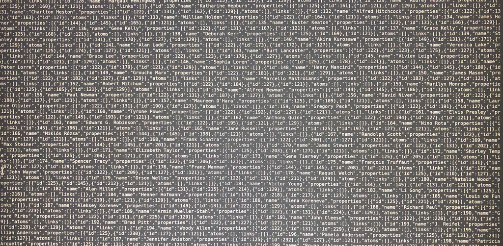

If you've done any digging into Who's On First you'll probably know that each _place_
has a GeoJSON document and all of these GeoJSON documents are fed into Elasticsearch
to allow you to ask the [Spelunker](https://spelunker.whosonfirst.org/) questions about these places.

For historical reasons, the Spelunker runs on an old version of Elasticsearch, 2.4.6 to be precise and the 2.4.x series of releases stopped being supported in [February of 2018](https://www.elastic.co/support/eol). Which means it's a good time to start looking at not only upgrading the Spelunker to the most recent
version of Elasticsearch but also to look at what's coming up in future releases to try
and make the upgrade as future proofed as it can be.

This was going to be a post about how the migration and upgrade of Elasticsearch happened.
But that hasn't happened quite yet. Instead this has ended up as a post about data type
consistency and about wrestling with JSON Schema instead. This is a post about the _fun_ that ensued. It's also a post about the _reverse domino effect_, where to take one step forwards
you end up having to take multiple steps back at first.

### First Step Backwards - "schema-less document indexing and other false statements"


Elasticsearch is a great tool and my first choice for when I have a data set in JSON that I
want to poke around in. If I don't have a data set in JSON I convert it _to_ JSON and then
poke around in it with Elasticsearch. One day I will find a data set that can't be converted to JSON. That's not to say Elasticsearch is perfect. The
[documentation](https://www.elastic.co/guide/en/elasticsearch/reference/current/dynamic-mapping.html) makes it all sound very easy ...

> One of the most important features of Elasticsearch is that it tries to get out of your way and let you start exploring your data as quickly as possible. To index a document, you don’t have to first create an index, define a mapping type, and define your fields — you can just index a document and the index, type, and fields will spring to life automatically:

Which is _kind_ of true; _if_ you have a relatively small data set and _if_ that data set
has consistent data types. Who's On First isn't small and, until recently, had some
data type inconsistencies. This was a problem.

It was a problem because unless you've defined the mappings for all your JSON document's
properties, the first time Elasticsearch comes across a JSON property
it doesn't know about, it tries to work out the property's data type automagically and
then uses that data type from that point on. So `"foo": "bar"` will be _dynamically mapped_
so a string, `"bar": 1234` will be mapped to an `integer` and so on. If Elasticsearch then encounters another
document with the same property but a different data type, if you're lucky it will
complain. If you're unlucky it will do it's best to coerce the new data type into the
one it's already seen, with the potential for much fun and games when you discover your
documents aren't indexed in quite the way you thought they'd be.

### Second Step Backwards - Learning Python through trial and (lots of) error


So how best to identify which properties are inconsistent and what should the data type
of all the Who's On First properties be in the first place? And how many documents need
to be checked anyway?

```
$ cd whosonfirst-data/data
$ find . -name '*.geojson' | wc -l
  951540
```

_Lots_ of documents. Most of the `whosonfirst` scripts are written in either Python or Go. As I knew a little Python and no Go whatsoever, Python it was.

With some trial and a lot of error I was able to write a [script](https://github.com/whosonfirst/py-mapzen-whosonfirst-geojson/blob/master/scripts/wof-find-property) that dumped out _all_ of the properties in _all_ of the [`whosonfirst-data`](https://github.com/whosonfirst-data/whosonfirst-data) repo  together with their corresponding data types.

I was then able to compare this against the list of what data types the properties _should_ be according to the definitions in the [`whosonfirst-properties`](https://github.com/whosonfirst/whosonfirst-properties) repo, which helpfully has one JSON definition per property.

In most cases the `whosonfirst-properties` definitions agreed with the data types in the WOF documents. Where they didn't I could take an educated guess, based on the property values and in the worst case, fall back on `string` as a default.

I could then write _another_ [script](https://github.com/whosonfirst/py-mapzen-whosonfirst-geojson/blob/master/scripts/wof-fix-props) to fix these inconsistencies. Now to validate that everything was consistent.

### Third Step Backwards - "learning to drive a car by looking at its blueprints"



 Maybe JSON Schema will help here? After all it's [_a vocabulary that allows you to **annotate** and **validate** JSON documents_](http://json-schema.org/). [Tim Bray](https://www.tbray.org/ongoing/) has this [helpful advice](https://www.tbray.org/ongoing/When/201x/2016/04/30/JSON-Schema-funnies) ...

> If you find yourself needing to use it (JSON Schema), run don’t walk over to Understanding JSON Schema, which has lots of examples and reasonably human-readable narrative; a nice piece of work.

> In its first paragraph, it says “learning to use [JSON Schema] by reading its specification is like learning to drive a car by looking at its blueprints.”

> They’re being tactful; the JSON Schema spec is really not very good at all. I don’t think this is a controversial thing to say, but let me offer some evidence anyhow.

> Most obvious: There are multiple pieces of software out there that claim to implement JSON Schema, and their behavior is really inconsistent, in my experience.

There's already the [`whosonfirst-json-schema`](https://github.com/whosonfirst/whosonfirst-json-schema) repo that contains a JSON schema implementation for _some_ of the properties that could be present in a WOF document but not _all_ of them. In other words, this allowed me to validate that a WOF document was both valid GeoJSON _and_ that is contained a minimal set of `properties`. But I wanted to validate _all_ the properties and to ensure that for each property, the data type of the property's value was both sane _and_ consistent. And as Tim mentioned in his post, Michael Droettboom's [Understanding JSON Schema](https://spacetelescope.github.io/understanding-json-schema/index.html) is _insanely_ useful.

With the help of Michael's guide I was able to bring together what was at least a good start at a full WOF JSON Schema implementation. Now to actually validate it and the WOF data itself.

Looking at the list of [JSON Schema implementations](http://json-schema.org/implementations.html), there's, ahem, quite a few, not all of which support the latest (still in draft) version of the spec. By a process of more trial and a whole lot more error I was able to (_finally_) find a validator that didn't die horribly on install and that actually did what it claimed to do, which was  [`ajv`](https://github.com/epoberezkin/ajv) (Another JSON Validator, ho ho).

Of course, once I'd written a [script](https://github.com/whosonfirst/whosonfirst-json-schema/blob/master/scripts/wof-validate) to iterate over all the WOF documents in a directory tree
and to validate each document against the JSON Schema not everything was valid and consistent.
But by using an iterative process of checking the WOF documents, taking the validation failures,
re-editing the WOF documents and the schema and checking everything against the applicable
property definitions I finally had a version of [`whosonfirst-data`](https://github.com/whosonfirst-data/whosonfirst-data) that validated cleanly and
consistently.

This was good but not great. Three things stuck out as being far from optimal.

Firstly the resulting Who's on First JSON schema definition, which defined every single property that lived in the `whosonfirst-properties` repo, that's 1012 of them at the time of writing, was one big, monolithic, JSON file. To paraphrase [Douglas Adams](http://hhgproject.org/entries/infinite.html) ...

> Bigger than the biggest thing ever and then some. Much bigger than that in fact, really amazingly immense, a totally stunning size, real "wow that's big," time. (The WOF JSON schema) is just so big that, by comparison, bigness itself looks really titchy. Gigantic multiplied by colossal multiplied by staggeringly huge is the sort of concept we're trying to get across here.

From reading the JSON Schema specification it seemed that splitting the WOF schema into parts and linking/including the parts together using the [`$ref` keyword](http://json-schema.org/latest/json-schema-core.html#rfc.section.8.3) was theoretically possible. But it took (more) trial and error and the help of Michael's aforementioned [_JSON schema for humans_ guide](https://spacetelescope.github.io/understanding-json-schema/structuring.html) to put this into practice. I was able to define JSON schema fragments that defined an overall GeoJSON document, a GeoJSON `bbox` object, a GeoJSON `geometry` object, the `wof:hierarchy` object and the WOF specific GeoJSON `properties` object, which still ran to almost three and a half thousand lines of JSON. But more about the `properties` object in a moment.

The second suboptimal thing was that the validation script is _slow_. Despite being written in asynchronous Node (due to `ajv` being a Node library), the iteration over each candidate WOF document is sequential. There's grounds for much optimisation there in the future, but for now and in the spirit of _it works and it's good enough_ I've left that there for the time being.

The third and final less than ideal thing is that I had ended up with two distinct and functionally identical sources of truth of what should be in a WOF document. This had to change.

### Fourth Step Backwards - "so we now have multiple places that say what should be in a WOF document?"


As an unlovely side effect of getting JSON Schema up and running I now had a source of truth for what should live in the `properties` object of a WOF document defined in JSON Schema format. But there was also _another_ source of truth for what should live in the `properties` object, defined on a per-property basis in the [`whosonfirst-properties`](https://github.com/whosonfirst/whosonfirst-properties) repo. I could have left this as is for the time being but something that Aaron wrote in a [recent post](https://www.whosonfirst.org/blog/2018/02/27/why-of-the-how/) struck me ...

> I think, as I write this now, that I had faint hopes of being able to generate the ES schemas from the JSON schemas, or at least use the latter as a starter kit for the former.

Can I enhance each property definition in the `whosonfirst-properties` repo, such that they
can be used to _build_ the JSON schema for any WOF document's `properties` object? It turns out
that you can. By way of example, here's the original property definition for `wof:country` ...

```
{
    "id": 1158807947,
    "name": "country",
    "prefix": "wof",
    "description": "A two-letter country code from ISO 3166.",
    "type": "string"
}
```

And here's the original property definition for `name:{lang}_x_preferred` ...

```
{
    "id": 1158804557,
    "name": "{lang}_x_preferred",
    "prefix": "name",
    "description": "The preferred name for a place. Used in Pelias and to generate language-specific map labels.",
    "type": "list"
}
```

Amongst other things, I augmented the property definitions to perform additional validation on
the property's value with a regex as well as handling property names which have a range of values encoded in their name, such as `{lang}_x_preferred` so as not to have to explicitly define what is effectively the same definition for each ISO 639-3 language code.

So the updated versions of `whosonfirst-properties/properties/wof/country.json` and `whosonfirst-properties/properties/name/preferred.json` now look like this ...

```
{
    "id": 1158807947,
    "name": "country",
    "prefix": "wof",
    "description": "A two-letter country code from ISO 3166.",
    "type": "string",
    "patterns": {
        "value": "^$|^[A-Za-z]{2}$|-99|-1"
    }
}
```

```
{
    "id": 1158804557,
    "name": "{lang}_x_preferred",
    "prefix": "name",
    "description": "The preferred name for a place. Used in Pelias and to generate language-specific map labels.",
    "type": "list",
    "items": {
        "type": "string"
    },
    "patterns": {
        "name": "*_x_preferred"
    }
}
```

This isn't _quite_ JSON schema syntax, so there's a [new script](https://github.com/whosonfirst/py-whosonfirst-json-schema) that iterates over the `whosonfirst-properties/properties` directory tree and transforms the pseudo JSON schema syntax into _proper_ JSON schema syntax, which builds the contents of `whosonfirst-json-schema/schema/properties.json`, which in turn is _included_ into the overall WOF JSON schema to work it's validation magic. Which, running with the example of the `wof:country` and `name:{lang}_x_preferred` properties, means their JSON schema definitions now look like this ...

```
{
  "$schema": "http://json-schema.org/draft-06/schema#",
  "$id": "properties.json",
  "definitions": {
    "properties": {
      "description": "The properties that can exist in a WOF document",
      "type": "object",
      "properties": {
        "wof:country": {
          "type": "string",
          "pattern": "^$|^[A-Za-z]{2}$|-99|-1"
        },
        ...
      }
      "patternProperties": {
        "^name:*_x_preferred$": {
          "type": "array",
          "items": {
            "type": "string"
          }
        },
        ...
      }
    }
  }
}
```

... plus all of the other 1010 properties as well.

And after three steps back, 97 commits and 77,620 changed files, Who's On First now has data type consistency across the `whosonfirst-data` repo, a way of consistently validating the contents of each WOF document, a single source of truth for each WOF document's property definitions and a way of autogenerating the `properties` object JSON schema definitions from the `whosonfirst-properties` repo.

Which is surely cause for _some_ rejoicing.

### First Step Forwards - "So, about that Elasticsearch upgrade"


And so, some two thousand words of blog post later, I'm back where I originally started and can now start to look at migrating to the latest version of Elasticsearch and hopefully autogenerate the mappings from the `whosonfirst-properties` repo as well. But that will need some more work and will be the topic of an entirely different post as well.

<hr />

<div style="font-style:italic; font-size:small;">
Images used in this blog post:

    <ul style="margin-top:1em;">
        <li><a href="https://www.flickr.com/photos/mkream/6645260569/">Dominoes</a> <small>Mary-Katherine Ream, CC-BY-NC</small></li>
        <li><a href="https://www.flickr.com/photos/132826082@N06/32639557764/">False</a>
        <small>Kevin Simmons, CC-BY</small></li>
        <li><a href="https://www.flickr.com/photos/kushaldas/989250288/">Python rocks!!</a>
        <small>Kushal Das, CC-BY</small></li>
        <li><a href="https://www.flickr.com/photos/morgner/40233336425">imdb</a>
        <small>Manfred Morgner, CC-BY-SA</small></li>
        <li><a href="https://www.flickr.com/photos/jasoneppink/50360115">truth</a>
        <small>Jason Eppink, CC-BY</small></li>
        <li><a href="http://toamke.tumblr.com/post/119417007773">And there was much rejoicing</a>
        <small>toamke</small></li>
    </ul>
</div>
