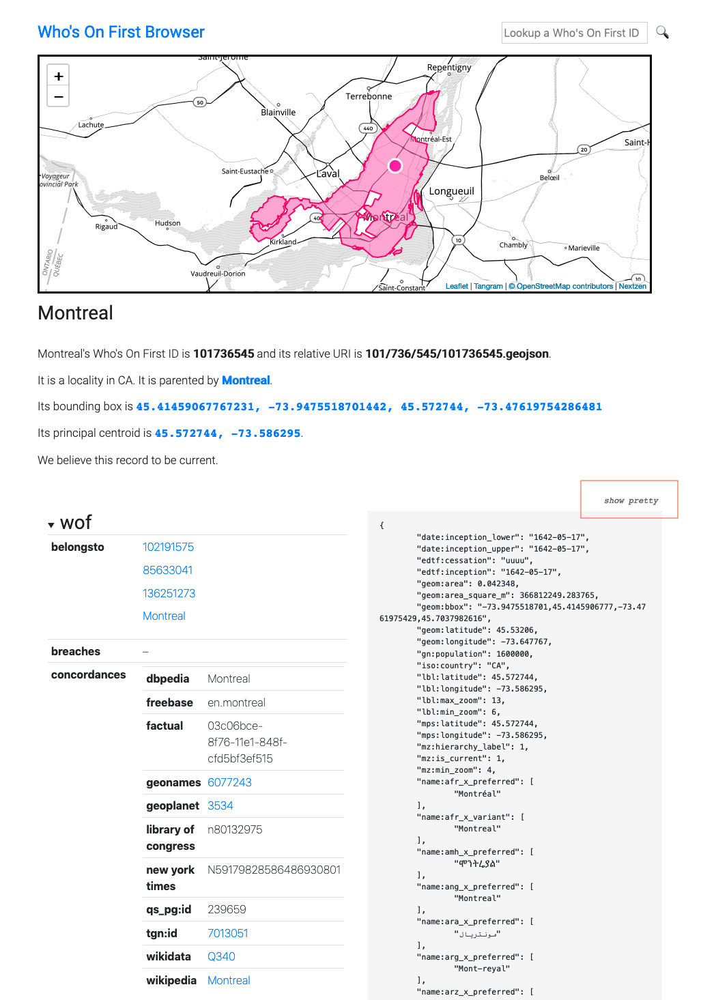
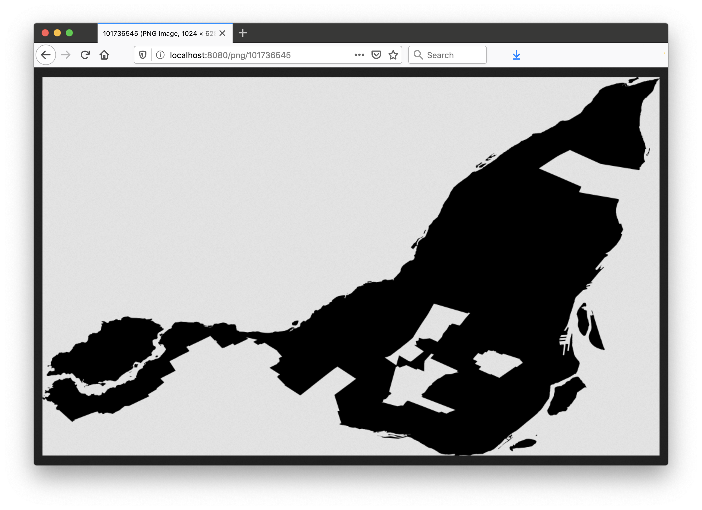
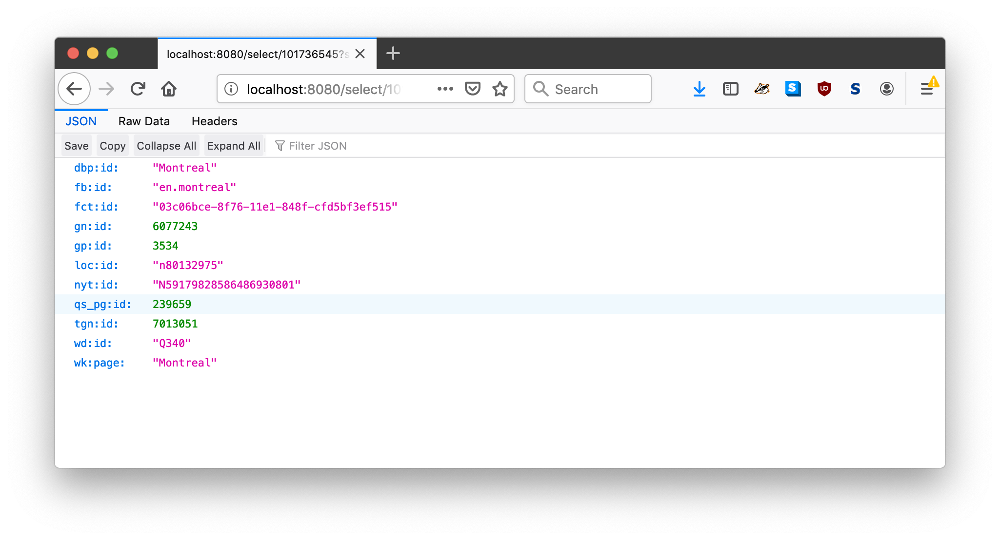
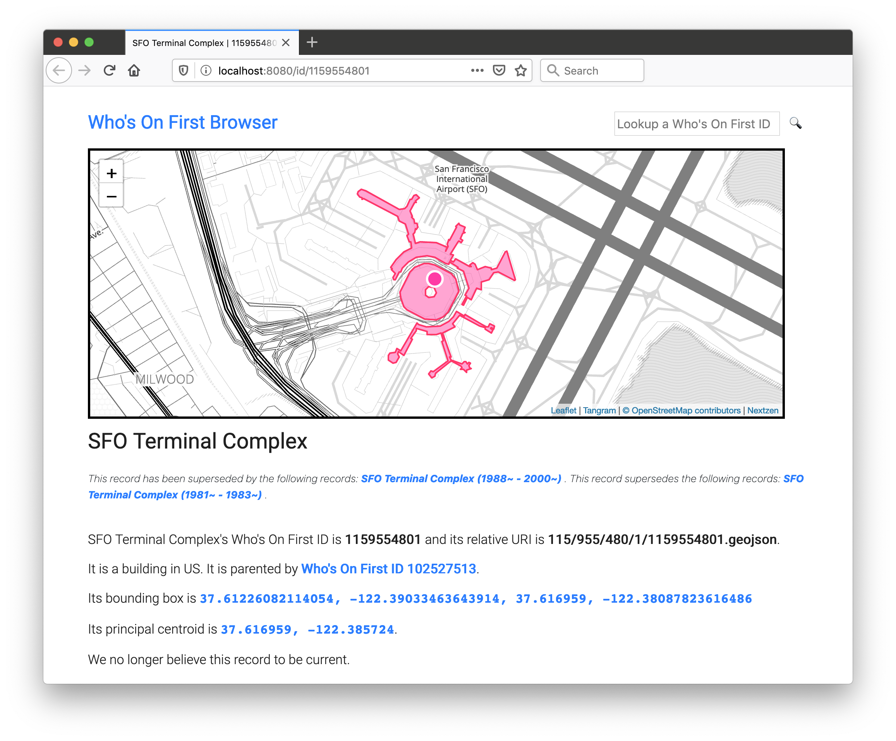

In late 2017 when it became clear that [Mapzen would shut down](https://whosonfirst.org/blog/2018/01/02/chapter-two/)...

[go-whosonfirst-browser](https://github.com/whosonfirst/go-whosonfirst-browser) is version two of the previously name `go-whosonfirst-static` package that we published in 2018. It is a tool written in the [Go programming language](https://golang.org) for rendering known [Who's On First](https://whosonfirst.org/) (WOF) IDs in a number of formats including HTML, SVG, PNG and GeoJSON.


It uses [Bootstrap](https://getbootstrap.com/) for HTML layouts and [Leaflet](https://leafletjs.com/), [Tangram.js](https://github.com/tangrams/tangram) and [Nextzen](https://nextzen.org) vector tiles for rendering maps. All of these dependencies are bundled with the tool and served locally. With the exception of the vector tiles (which can be cached) and a configurable data source there are no external dependencies.

Some things this tool is _not_:

### It is not a replacement for the [Who's On First Spelunker](https://spelunker.whosonfirst.org/).

At least not yet.

`go-whosonfirst-browser` was designed to be a simple display tool for known Who's On First (WOF) IDs and records. That constitutes a third to half of [what the Spelunker does](https://github.com/whosonfirst/whosonfirst-www-spelunker) (the remainder being list views and facets) so in principle it would be easy enough to add the same functionality here. Except for the part where the Spelunker is backed by a real search engine (Elasticsearch).

The principle advantage of migrating Spelunker functionality to this package is that it does not have any external dependencies and has support for multiple data sources and caches and can be pre-compiled in to a standalone binary tool. The principle disadvantage would be that experimenting and developing code and functionality in Python (used by the existing Spelunker) has a lower barrier to entry than doing the same in Go (used by this package).

For the time being though they are separate beasts.

### It is not a search engine.

This is a tool that is primarily geared towards displaying _known_ Who's On First IDs. It does not maintain an index, or a list of known records, before it displays them.

It would be easy enough to add flags to use an external instance of the [Pelias Placeholder API](https://millsfield.sfomuseum.org/blog/2019/11/04/placeholder/) for basic search functionality so we'll add that to the list of features for a "2.x" release.

It might also be easy enough to preload a [Bleve](https://github.com/blevesearch/bleve) index, or generate one at runtime depending on the data source and its size, but that is currently out of scope for the project.

### It is not a tool for editing Who's On First documents.

At least not yet.

Interestingly the code that renders Who's On First (WOF) property dictionaries in to pretty HTML tables is the same code used for the experimental Mapzen "[Yes No Fix](https://whosonfirst.org/blog/2016/04/08/yesnofix/) project". That functionality has not been enabled or tested with this tool yet.

On the other hand editing anything besides simple key-value pairs means identifying all the complex types, defining rules for how and when they can be updated (or added) and then maintaining all the code to do that. These are all worthwhile efforts but they are equally complex and not things this tool aims to tackle right now.

If you'd like to read more about the subject of editing Who's On First documents have a look at:

* Dan Phiffer's blog posts about the [Boundary Issues editing tool](https://whosonfirst.org/blog/tags/boundaryissues/).
* Gary Gale's [Three Steps Backwards, One Step Forwards; a Tale of Data Consistency and JSON Schema](https://whosonfirst.org/blog/2018/05/25/three-steps-backwards/).

### It does not retrieve, render or display "alternate" geometries

It really should but today it does not. Hopefully it will, soon.


## For example

```
$> bin/browser -enable-all -nextzen-api-key {NEXTZEN_APIKEY}
2019/12/14 18:22:16 Listening on http://localhost:8080
```

[WORDS ABOUT DEFAULTS]

Then if you visited `http://localhost:8080/id/101736545` in your web browser you would see this:



By default Who's On First (WOF) properties are rendered as nested (and collapsed) trees but there is are handy `show raw` and `show pretty` toggles for viewing the raw WOF GeoJSON data.

## Output formats

The following output formats are available.

### GeoJSON

A raw Who's On First (WOF) GeoJSON document. For example:


`http://localhost:8080/geojson/101736545`

### HTML

A responsive HTML table and map for a given WOF ID. For example:


`http://localhost:8080/id/101736545`

### PNG

A PNG-encoded representation of the geometry for a given WOF ID. For example:



`http://localhost:8080/png/101736545`

### "select"

A JSON-encoded slice of a Who's On First (WOF) GeoJSON document matching a query pattern. For example:



`http://localhost:8080/select/101736545?select=properties.wof:concordances`

`select` parameters should conform to the [GJSON path syntax](https://github.com/tidwall/gjson/blob/master/SYNTAX.md).

As of this writing multiple `select` parameters are not supported. `select` parameters that do not match the regular expression defined in the `-select-pattern` flag (at startup) will trigger an error.
 
### SPR (Standard Places Response)

A JSON-encoded "standard places response" for a given WOF ID. For example:


`http://localhost:8080/spr/101736545`

### SVG

An XML-encoded SVG representation of the geometry for a given WOF ID.  For example:


`http://localhost:8080/svg/101736545`

## Tiles

`go-whosonfirst-browser` uses [Nextzen](https://nextzen.org/) vector data tiles and the [Tangram.js](https://github.com/tangrams/tangram) rendering library for displaying maps. The Tangram code and styling assets are bundled with this tool and served directly but, by default, tile data is retrieved from the Nextzen servers.

It is possible to cache those tiles locally using the `-proxy-tiles` flag at start up. The default cache for proxying tiles is an ephemiral in-memory cache but you can also specify an alternative [go-cache](https://github.com/whosonfirst/go-cache) `cache.Cache` source using the `-proxy-tiles-cache` flag. Caches are discussed in detail below.

You will need a [valid Nextzen API key](https://developers.nextzen.org/) in order for map tiles to work. If no API key is present then the browser tool will display the SVG rendering for a place's geometry. For example:


## Data sources and Caches

`go-whosonfirst-browser` uses the [go-reader](https://github.com/whosonfirst/go-reader) `reader.Reader` and [go-cache](https://github.com/whosonfirst/go-cache) `cache.Cache` interfaces for reading and caching data respectively. This enables the "guts" of the code to be developed and operate independently of any individual data source or cache.

Readers and caches alike are instantiated using the `reader.NewReader` or `cache.NewCache` methods respectively. In both case the methods are passed a URI string indicating the type of instance to create. For example, to create a local filesystem based reader, you would write:

```
import (
       "github.com/whosonfirst/go-reader"
)

r, _ := reader.NewReader("fs:///usr/local/data")
fh, _ := r.Read("/123/456/78/12345678.geojson")
```

The base `go-reader` package defines a small number of default "readers". Others types of readers are kept in separate packages and loaded as-need. Similar to the way the Go language `database/sql` package works these readers announce themselves to the `go-reader` package when they are initialized.

For example, if you wanted to use a [Go Cloud](https://gocloud.dev/howto/blob/) `Blob` reader you would do something like this:

```
import (
       "github.com/whosonfirst/go-reader"
       _ "github.com/whosonfirst/go-reader-blob"       
)

r, _ := reader.NewReader("s3://{S3_BUCKET}?region={S3_REGION}&prefix=data")
fh, _ := r.Read("/123/456/78/12345678.geojson")
```

The same principles appy to caches.

The default `whosonfirst-browser` tool allows data sources to be specified as a localfile system or a remote HTTP(S) endpoint and caching sources as a local filesystem or an ephemiral in-memory lookup.

This is what the code for default `whosonfirst-browser` tool looks like, with error handling omitted for the sake of brevity:

```
package main

import (
	"context"
	_ "github.com/whosonfirst/go-reader-http"
	"github.com/whosonfirst/go-whosonfirst-browser"
)

func main() {
	ctx := context.Background()
	browser.Start(ctx)
}
```

The default settings for `go-whosonfirst-browser` are to fetch data from the `https://data.whosonfirst.org` servers and to cache those records in an ephemeral in-memory [go-cache](https://github.com/patrickmn/go-cache) cache.

If you wanted, instead, to read data from the local filesystem you would start the browser like this:

```
$> bin/whosonfirst-browser -enable-all \
	-reader-source 'fs:///usr/local/data/whosonfirst-data-admin-us/data' \
	-nextzen-api-key {NEXTZEN_APIKEY}	
```

Or if you wanted to cache WOF records to the local filesystem you would start the browser like this:

```
$> bin/whosonfirst-browser -enable-all \
	-cache-source 'fs:///usr/local/cache/whosonfirst' \
	-nextzen-api-key {NEXTZEN_APIKEY}	
```

The browser tool will work with any WOF-like data including records outside of the "[core](https://github.com/whosonfirst-data)" dataset. For example this is how you might use the browser tool with the [SFO Museum architecture dataset](https://millsfield.sfomuseum.org/blog/2018/08/28/whosonfirst/):

```
$> bin/whosonfirst-browser -enable-all \
	-reader-source 'fs:///usr/local/data/sfomuseum-data-architecture/data' \
	-nextzen-api-key {NEXTZEN_APIKEY}	
```

And then if you went to `http://localhost:8080/id/1159554801` in your browser you would see:



The "guts" of the application live in the `browser.go` package. This is by design to make it easy (or easier, at least) to create derivative browser tools that use custom readers or caches.

For example if you wanted to create a browser that read files using the [Go Cloud Blob package](https://gocloud.dev/howto/blob/) you would write:

```
// cmd/blob-browser/main.go
package main

import (
	"context"
	_ "github.com/whosonfirst/go-reader-blob"
	"github.com/whosonfirst/go-whosonfirst-browser"
)

func main() {
	ctx := context.Background()
	browser.Start(ctx)
}
```

And then you would start the browser tool like this:

```
$> bin/blob-browser -enable-all \
	-reader-source 's3://{BUCKET}?region={REGION}' \
	-nextzen-api-key {NEXTZEN_APIKEY}

2019/12/18 08:44:15 Listening on http://localhost:8080
```

Or if you wanted to read data from a specific GitHub repository:

```
// cmd/github-browser/main.go
package main

import (
	"context"
	_ "github.com/whosonfirst/go-reader-github"
	"github.com/whosonfirst/go-whosonfirst-browser"
)

func main() {
	ctx := context.Background()
	browser.Start(ctx)
}
```

And then:

```
$> bin/github-browser -enable-all \
	-reader-source 'github://whosonfirst-data/whosonfirst-data-admin-ca'
	-nextzen-api-key {NEXTZEN_APIKEY}
	
2019/12/18 08:44:15 Listening on http://localhost:8080
```

As of this writing the `browser.go` packages does everything _including_ parsing command line flags. This is not ideal and flag parsing will be moved in to a separate method and be made extensible.

### See also

* [List of available go-reader.Reader implementations](https://github.com/whosonfirst/go-reader#available-readers)
* [List of available go-cache.Cache implementations](https://github.com/whosonfirst/go-cache#available-caches)
