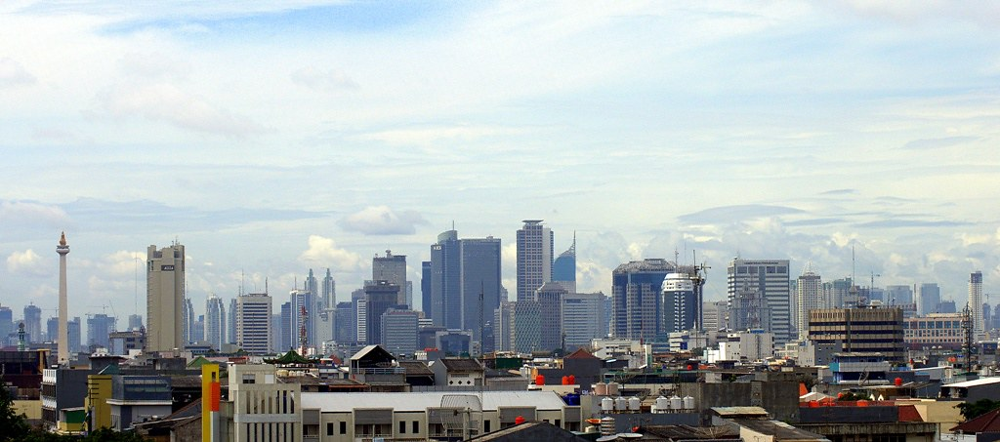
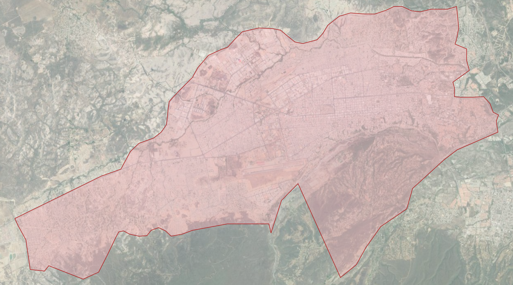
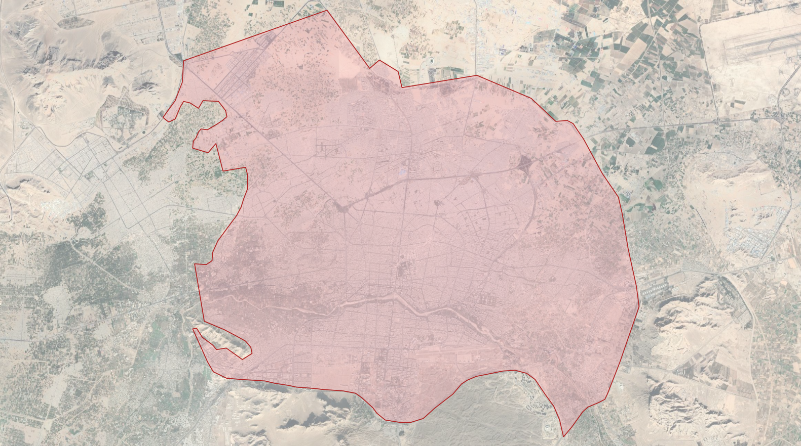
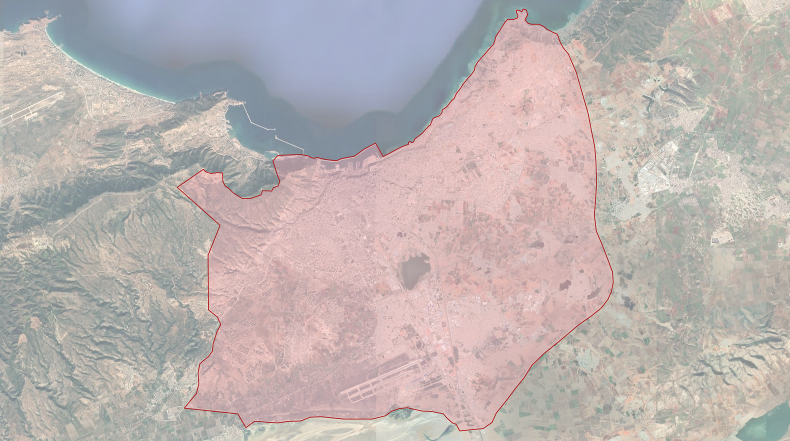
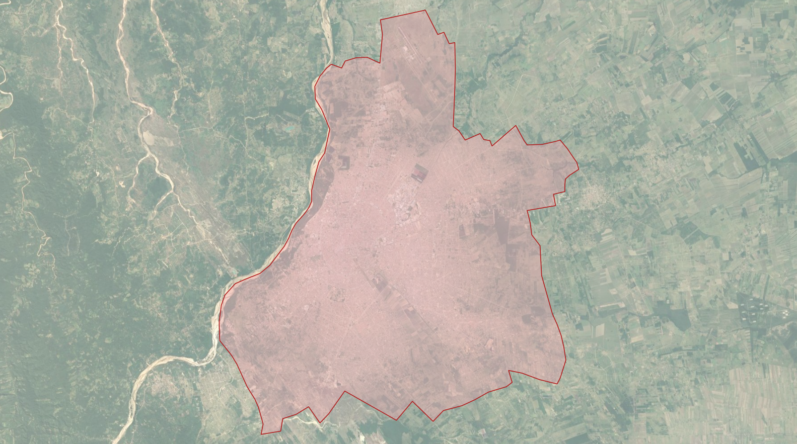
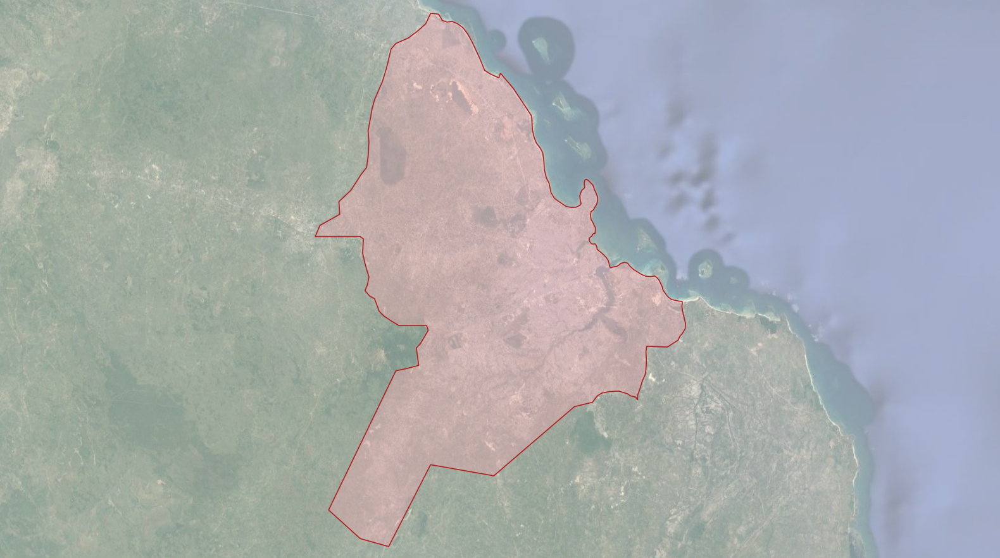

## Updating our Megacity Localities

In 2019, Who's On First announced the addition of comprehensive global coverage at the locality placetype; read more about that work [here](https://www.whosonfirst.org/blog/2019/05/13/geonames/). Building on this locality work, we've recently reviewed some of these more populous localities, adding hand-curated geometries, new name translations, and concordances.

## Megacities

In Who's On First, the world's most populous cities are represented using the [`wof:megacity`](https://github.com/whosonfirst/whosonfirst-properties/blob/master/properties/wof/megacity.json) property. According to [Wikipedia](https://en.wikipedia.org/wiki/Megacity), a "megacity is a very large city, typically with a population of more than 10 million people." Other sources suggest megacities are defined as having populations lower, closer to five million. While Who's On First does not have a population cut-off for how these megacities are defined, we have relied on Natural Earth's [Populated Places](http://www.naturalearthdata.com/downloads/10m-cultural-vectors/) file for this work. Natural Earth identifies 590 global populated places, each identified with a `MEGACITY` attribute (actual or emergent), name translations, and concordances, for urban agglomerations with a population of 750,000 or more in 2010.

These large megacities are important to Who’s On First because these densely populated, global cities have particular significance in urbanization; according to the United Nations, nearly 60% of the world's population lives in urban areas today, growing to nearly 70% in 2050 ([source](https://web.archive.org/web/20210129003633/https://www.un.org/development/desa/en/news/population/2018-revision-of-world-urbanization-prospects.html)); nearly 25% of the world's population lives in cities with populations over one million ([source](https://web.archive.org/web/20210210102954/https://www.un.org/en/events/citiesday/assets/pdf/the_worlds_cities_in_2018_data_booklet.pdf)). Maintaining accurate, localized names and detailed geometries for populous localities will not only help our users, but also help geocoding and map services that rely on Who’s On First data.

Some examples of these megacities, displayed in Who’s On First’s Spelunker tool:

- [London](https://spelunker.whosonfirst.org/id/101750367/)
- [Los Angeles](https://spelunker.whosonfirst.org/id/85923517/)
- [Lima](https://spelunker.whosonfirst.org/id/421186805/)
- [Chennai](https://spelunker.whosonfirst.org/id/102029537/)
- [Taipei](https://spelunker.whosonfirst.org/id/102026641/)

## What was updated?

In total, Who’s On First now has 590 locality records that maintain a `wof:megacity` property.

To begin this work, the Populated Places file from Natural Earth was used to identify locality records in Who's On First that should be flagged with a `wof:megacity` property. Once identified, we confirmed the presence or added the `wof:megacity` property on these records maintained in the [`whosonfirst-data`](https://github.com/whosonfirst-data) administrative repositories.

Once these populated places were matched to current Who's On First records, a simple Python script was used to automate the import of the Populated Places’ attributes into new properties on each Who’s On First records. These properties include:

- Name translations
- Label centroid locations
- Concordances to Natural Earth and Wikidata, when available

[Here](https://github.com/whosonfirst-data/whosonfirst-data-admin-ir/pull/11/files) is an example of these updates in a GitHub pull request for records in Iran.

#### Updating Geometries

In cases where Who's On First only maintained a `Point` geometry for one of these populated places, we were interested in creating a new `Polygon` geometry. Because many of these localities are represented at more than one placetype in Who's On First - Toronto, for example, is represented as both a [`county`](https://spelunker.whosonfirst.org/id/890457465/), and [`locality`](https://spelunker.whosonfirst.org/id/101735835/) - we were able to use existing "parent" geometries of some of these localities to create (or re-use as) new megacity geometries. In other cases, we hand-curated new geometries using QGIS software.

Because megacities often spread over a larger metropolitan area, we are creating polygons for the “core” cities (which can sometimes be a handful of cities), but we’re exploring creating metropolitan area polygons, too. Please reach out to us via [a new issue](https://github.com/whosonfirst-data/whosonfirst-data/issues/new) if you are interested in this work.

## A few examples of these new geometries:

_Barquisimeto, Venezuela_

_Isfahan, Iran_

_Oran, Algeria_

_Santa Cruz, Bolivia_

_Dar es Salaam, Tanzania_
 
## Benefits

Aside from our goal to maintain accurate place data in Who's On First, this work is helpful for two use cases worth calling out.

First, the `wof:megacity` property is helpful to geocoding service by identifying "big name" geocoding targets. The `wof:megacity` properties can be used by geocoding services like [Pelias](https://github.com/pelias/pelias) to decorate search results for these major localities.

Second, this work curated more accurate name and zoom properties. The `mz:min_zoom` and `mz:max_zoom` properties for these places were updated using Natural Earth's [Populated Places file](http://www.naturalearthdata.com/downloads/10m-cultural-vectors/) file. Name translations for megacities were also updated. Combined, these new properties help display map labels for large, global cities at the correct zoom levels.

You can browse the megacity records via Who's On First's [Spelunker tool](https://spelunker.whosonfirst.org/megacities/).

## What’s Next

While we’ve taken time to update administrative records with new geometries, properties, and concordances, we’ve also been quite busy updating and iterating on Who’s On First’s  various tools. Take a look at our [go-whosonfirst-spatial](https://github.com/whosonfirst/go-whosonfirst-spatial) and [go-whosonfirst-spatial-sqlite](https://github.com/whosonfirst/go-whosonfirst-spatial-sqlite) repositories for details. The new megacity geometries we've added will be excellent candidates for new and in-progress spatial tools.

_Photo Credit: [Stenly Lam, flickr](https://www.flickr.com/photos/stenlylam/5635983463/in/photolist-9A2TwF-5VmgKL-5RXnLp-7Ez8om-7bFLvz-8hhYce-7bKynJ-7bFLWH-7bFKT6-7bFLpi-7bFLLi-7bKzPj-7bKyNj-7bKAp9-7bFLc6-5WU1in-6hNwpM-6H8Viw-6hSEp1-vdpmMA-aDeQNG-9RkctE-9Rkbvu-Cs2BPJ-8acvrv-8acwpe-7qNjDw-8acxh6-9RkbX9-8acw7c-8acwue-bX2T26-bX2U6D-bX2Tht-bX2QS6-bX2Ump-8afLmm-bX2TYk-5Y8yM1-bX2Rfc-bX2UcH-cepdjo-bX2QMH-7ditKg-8afNUq-qMtQvP-8aczgB-cepeCh-cepesC-8afJCL)_