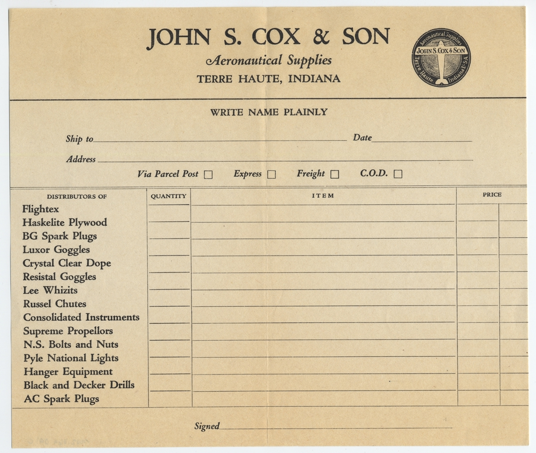
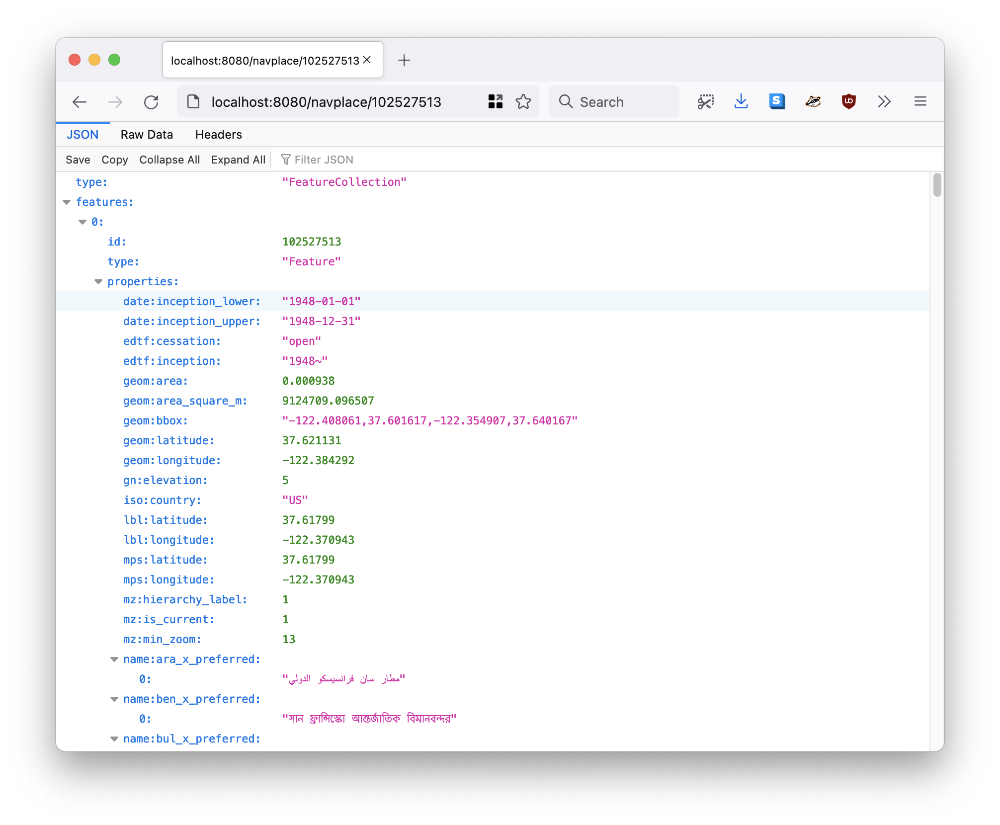
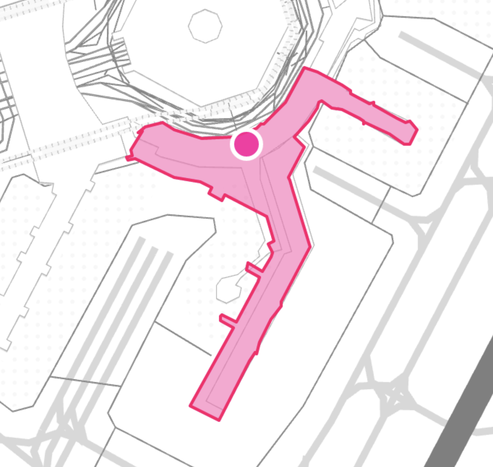

[](https://collection.sfomuseum.org/objects/1511941919/#1527852859)

<div style="font-size:small;font-style:italic;text-align:center;">
Catalog: John S. Cox & Son, aeronautical supplies c. 1934. Purchase. <a href="https://collection.sfomuseum.org/objects/1511941919">Collection of SFO Museum</a>. 2002.064.041 a e
</div>

The [Who's On First Browser](https://github.com/whosonfirst/go-whosonfirst-browser) project was a by-product of the [Great Mapzen Shutdown](https://www.whosonfirst.org/blog/2018/01/02/chapter-two/) of 2018. At the time there was some question about whether we'd be able to keep the [Who's On First Spelunker](https://spelunker.whosonfirst.org) running without the support of Mapzen. In the end everything worked out.

The Spelunker is still running, today, but the experience highlighted the importance of having a ready alternative on hand. Something inexpensive and easy-to-maintain which, absent a searchable index, made sure there were still [human, machine readable and graphical representations](https://whosonfirst.org/blog/2019/12/20/browser/) for every Who's On First ID, with links to their relations, available on the web.

This post is about some recent, optional, features we've added to that tool: The ability to run it as a [Tailscale virtual private service](https://tailscale.com/blog/tsnet-virtual-private-services/) and to use [Protomaps](https://protomaps.com) for display maps.

### A quick recap

The basic requirements for the Who's On First Browser were:

* It would be written in Go.

* It could be run as a standalone web server or as an AWS Lambda function attached to an AWS API Gateway instance.

* It would read and render individual records from any valid "reader" source, typically the local file system or something like an AWS S3 bucket.

For example, something that could be started as easily as:

```
$> bin/whosonfirst-browser \
	-enable-all \
	-reader-uri repo:///usr/local/data/sfomuseum-data-architecture \
	-nextzen-api-key {NEXTZEN_APIKEY}
```

_The `sfomuseum-data-architecture` repository is not part of the [core Who's On First dataset](https://github.com/whosonfirst-data) but is instead a data from the [SFO Museum](https://github.com/sfomuseum-data) modeled after, and compatible with, Who's On First._

When I visit `http://localhost:8080/id/1477855657`, which is the ID for [Harvey Milk Terminal 1](https://millsfield.sfomuseum.org/terminals/1477855657/) building at the San Francisco International Airport, the Browser application will render that ID like this:


If you look closely at that screenshot you'll see that most of the other places the terminal building is associated with don't have names. The exceptions are the terminal complex and the airport itself. That's because both of those records are part of the [sfomuseum-data-architecture](https://github.com/sfomuseum-data/sfomuseum-data-architecture) repository which we've referenced in the `-reader-uri` flag at startup.


It's possible to specify multiple "reader" sources so if I restart the server telling it to read data from both the [sfomuseum-data-architecture](https://github.com/sfomuseum-data/sfomuseum-data-architecture) and [sfomuseum-data-whosonfirst](https://github.com/sfomuseum-data/sfomuseum-data-whosonfirst) repositories, like this:

```
$> bin/whosonfirst-browser \
	-reader-uri repo:///usr/local/data/sfomuseum-data-architecture \
	-reader-uri repo:///usr/local/data/sfomuseum-data-whosonfirst \	
	-enable-all -nextzen-api-key {NEXTZEN_APIKEY}
```

I'll see the same thing but all those pointers to other places referenced by the Harvey Milk Terminal will have names now:


The Who's On First Browser can be configured to use a number of [different "reader" implementations](https://github.com/whosonfirst/?q=go-reader) for consuming Who's On First data from a variety of sources. I'll write more about those readers, in detail, in future blog posts.

Under the hood the Who's On First Browser uses a library called [go-http-server](https://github.com/aaronland/go-http-server) to abstract away the details of how it is configured to serve requests. Different server implementations are defined using custom URIs. For example to start the server as a standalone web server you would pass the following command-line flag:

```
-server-uri http://localhost:8080
```

And to start the server as a Lambda function you would specify:

```
-server-uri lambda://
```

In point of fact, to start the server as a Lambda function you would actually set the `BROWSER_SERVER_URI=lambda://` environment variable which is then used to assign the `-server-uri` flag behind the scenes. But the idea is still the same: It should be easy to switch between deployment environments simply by changing the `-server-uri` flag.

And that's pretty much the story of the Who's On First Browser for the last few years. Every once in a while a new "representation" endpoint is added to the server, like the ability to produce [IIIF navPlace](https://github.com/whosonfirst/go-whosonfirst-browser#iiif-navplace) records so you can reference places in Who's On First IDs from all your [IIIF manifests](https://preview.iiif.io/api/navplace_extension/api/extension/navplace/), but otherwise it hasn't been necessary to change anything.



### Tailscale

[](https://collection.sfomuseum.org/objects/1779735477/)

<div style="font-size:small;font-style:italic;text-align:center;">
Uniform patch: Pan American World Airways, Security police. Gift of the Pan Am Association. <a href="https://collection.sfomuseum.org/objects/1779735477/">Collection of SFO Museum</a>. 2000.058.0754
</div>

At the beginning of November, 2022 the [Tailscale](https://tailscale.com/) group published a blog post titled [Virtual private services with tsnet](https://tailscale.com/blog/tsnet-virtual-private-services/). In that post they wrote:

> Tailscale lets you connect to your computers from anywhere in the world. We call this setup a virtual private network. Any device on the tailnet (our term for a Tailscale network) can connect directly to any other device on the tailnet. This isn’t limited to your computers, phones, and servers, though. You can use Tailscale as a library in Go programs to allow them to connect to your tailnet as though it were a separate computer. You can also use Tailscale to run multiple services with different confidentiality levels on the same machine. Today I’m going to explain more about how you can use tsnet to make your internal services easier to run, access, and secure by transforming them into virtual private services on your tailnet.

Basically what all of that meant was that it would be possible to write an implementation of the `go-http-server` interfaces to allow web services to be started as standalone web servers, Lambda functions or Tailscale virtual private services. Instead of starting an instance of the Who's On First Browser like this:

```
-server-uri http://localhost:8080/
```

It could be started like this:

```
-server-uri tsnet://whosonfirst:80?auth-key={TAILSCALE_AUTH_KEY}
```

And that instance of the Who's On First Browser would be available in any web browser at `http://whosonfirst` but only to people logged in to the Tailscale VPN associated with `{TAILSCALE_AUTH_KEY}`. Importantly the computer running the machine running the Who's On First Browser doesn't need to be publicly available, or reachable, on the internet at large which is, sadly, a practical consideration that you need to think about in 2022.

With all of that in mind, the [go-http-server-tsnet](https://github.com/aaronland/go-http-server-tsnet) server implentation was written and has since been added to the [go-whosonfirst-browser](https://github.com/whosonfirst/go-whosonfirst-browser) codebase. But why is this important?

It's important because not everyone using Who's On First, or a complimentary project like the [SFO Museum's Who's On First compatible dataset](https://millsfield.sfomuseum.org/blog/tags/whosonfirst), may not want to be as open or transparent as the Who's On First project in their own work. It's as simple as that. There are lots of different reasons why the access control and security that tools like Tailscale virtual private services provide may be desirable so we're happy to start making it part of the Who's On First tooling.

And then, while running the Who's On First browser on one computer and loading `http://whosonfirst` from a separate mobile device, connected to Tailscale, I noticed this:


What happened to the [Nextzen](https://nextzen.org) map tiles? Were tiles not being displayed because the mobile device in question had [Lockdown Mode](https://support.apple.com/en-us/HT212650) enabled and wouldn't enable WebGL (required to render Nextzen tiles using [Tangram.js](https://github.com/tangrams/tangram))? Were tile not being displayed because of [networking or DNS issues](https://tailscale.com/learn/why-split-dns/) in Tailscale? Or... was this, instead, an opportunity to solve a completely different problem like adding support for [Protomaps](https://protomaps.com) map tiles to the Who's On First Browser?

Yes!

### Protomaps

[](https://collection.sfomuseum.org/objects/1511923151/)

<div style="font-size:small;font-style:italic;text-align:center;">
Folding fan: Philippine Airlines</strong> 1960s. Gift of Thomas G. Dragges. <a href="https://collection.sfomuseum.org/objects/1511923151/">Collection of SFO Museum</a>. 2002.035.158
</div>

Protomaps is a suite of tool for producing digital maps consisting of two parts:

* A single static data file containing vector tile data, derived from [OpenStreetMap](https://openstreetmap.org), for a geographic region (or even the whole world) that can be served from a variety of cloud-based storage providers or just a plain old web server.

* Software which reads which that vector data by translating `{Z}/{X}/{Y}` map tile requests in to [HTTP Range requests](https://developer.mozilla.org/en-US/docs/Web/HTTP/Headers/Range) (so you don't have to download the whole data file) and styling the responses (using the HTML [Canvas](https://developer.mozilla.org/en-US/docs/Web/API/Canvas_API) APIs rather than WebGL).

This is interesting for a few reasons:

* You might not want to use a third-party service, not even the good ones like [Nextzen](https://nextzen.org), to host your maps.

* You don't want to depend on a third-party service for maps but you also don't want to manage the burden of a global map-tile infrastructure.

* You don't want WebGL to be a requirement for rendering display maps.

* You want map data that is updated at the speed of the OpenStreetMap project.

The Nextzen base tiles haven't been updated since 2019 which is a problem for places like SFO and SFO Museum since entire buildings that were there in 2019 have been demolished and replaced; for example the old Boarding Area B wing which is now the Harvey Milk Terminal 1 concourse. This is not just a Nextzen issue, either; this same problem exists today, in 2022, [in both Apple Maps and Google Maps](https://millsfield.sfomuseum.org/blog/2022/08/08/maps/).



So, where do Protomaps data files come from? You can either create your own, [pay for global data files](https://app.protomaps.com/store) or use the free [Protomaps Small Map tool](https://app.protomaps.com/store) to generate data files for small geographic areas. Here's what that looks like for the area around SFO:


This will produce a file called `sfo.pmtiles`. To use that data file with the Who's On First Browser you would specify the following command-line options:

```
$> bin/whosonfirst-browser/main.go \
	-enable-all \
	-reader-uri repo:///usr/local/data/sfomuseum-data-architecture \
	-reader-uri repo:///usr/local/data/sfomuseum-data-whosonfirst \
	-map-provider protomaps \
	-protomaps-bucket-uri file:///usr/local/data/ \
	-protomaps-tiles-database sfo
```

Do you see the various "protomaps" flags? This is what they mean:

* `-map-provider protomaps` overrides the default map provider (Nextzen).

* `-protomaps-bucket-uri file:///usr/local/data/` is fully-qualified URI where Protomaps data files are located.

* `-protomaps-tiles-database` is the name of the Protomaps data files to use for display maps.

When configured this way the Who's On First Browser is serving tile requests using the data file specified by `protomaps-bucket-uri` and `protomaps-tiles-database`. For example:


Remember: There are only tiles for the immediate area around SFO because that's all the data the `sfo.pmtiles` file contains.


In these examples tiles are being served from data stored on the local disk but it is also possible to serve data stored in any remote location that can be read using the [GoCloud Blob](https://gocloud.dev/howto/blob/) package, for example an [AWS S3 bucket](https://gocloud.dev/howto/blob/#s3).

Finally, to make it all work on a Tailscale network just add a `-server-uri tsnet://...` command-line flag:

```
$> bin/whosonfirst-browser/main.go \
	-enable-all \
	-reader-uri repo:///usr/local/data/sfomuseum-data-architecture \
	-reader-uri repo:///usr/local/data/sfomuseum-data-whosonfirst \
	-map-provider protomaps \
	-protomaps-bucket-uri file:///usr/local/data/ \
	-protomaps-tiles-database sfo \
	-server-uri tsnet://whosonfirst:80?auth-key={TAILSCALE_AUTH_KEY}

2022/11/11 22:25:47 Listening on http://whosonfirst:80
```

And here are the map tiles being displayed as expected in a mobile client connected to a Tailscale VPN visiting `http://whosonfirst/id/1159396147`:


Protomaps has [its own styling language](https://protomaps.com/docs/frontends/leaflet#custom-vector-data) for defining how map should be displayed. As of this writing custom styles are not supported by the Who's On First Browser but only because I haven't decided the best way to import them. If you have some ideas or thoughts about how that should work [we'd love your input](https://github.com/whosonfirst/go-whosonfirst-browser).

[](https://collection.sfomuseum.org/objects/1762688329/)

<div style="font-size:small;font-style:italic;text-align:center;">
Postcard: Los Angeles International Airport 1960s. Gift of Thomas G. Dragges. <a href="https://collection.sfomuseum.org/objects/1762688329/">Collection of SFO Museum</a>. 2015.166.2054
</div>

As mentioned at the top of the post both of these features, running the Who's On First Browser as a Tailscale virtual private service and using Protomaps for display maps, are disabled by default but we hope they are ready to be enabled when the circumstances present themselves.