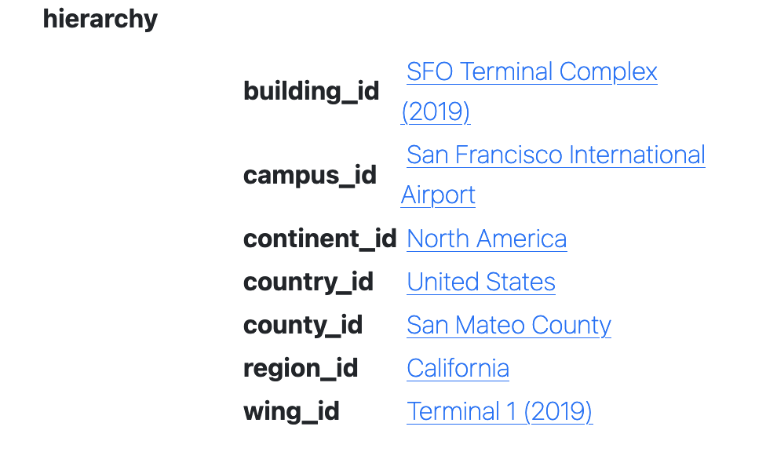
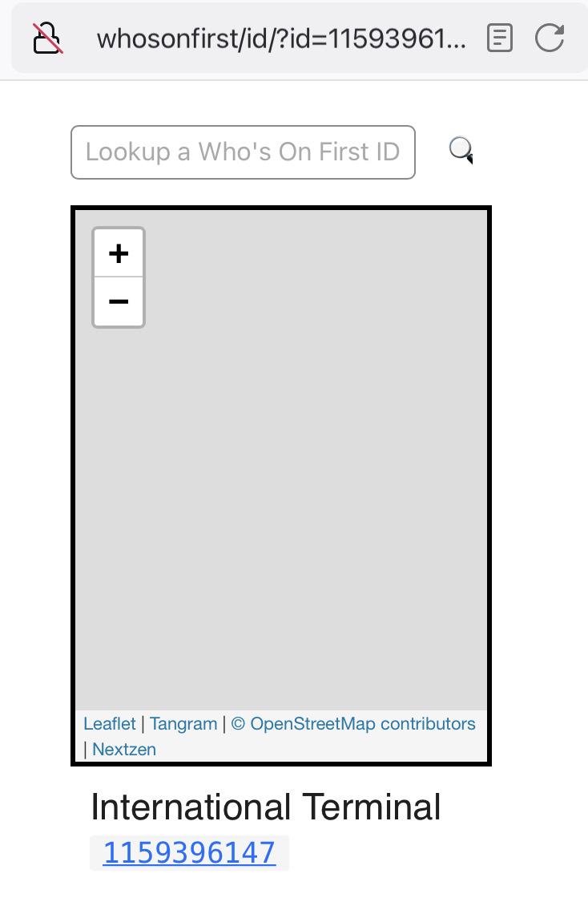
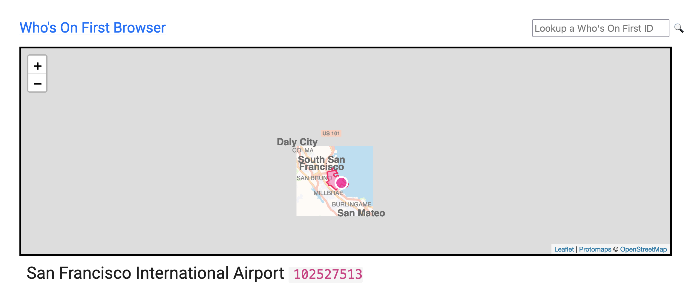

The [Who's On First Browser](https://github.com/whosonfirst/go-whosonfirst-browser) project was a by-product of the [Great Mapzen Shutdown](https://www.whosonfirst.org/blog/2018/01/02/chapter-two/) of 2018. At the time there was some question about whether we'd be able to keep the [Spelunker](https://spelunker.whosonfirst.org) running without the support of Mapzen. We did but it highlighted the importance of having an inexpensive and easy-to-maintain service that, absent a searchable index, made sure there were still [human, machine readable and graphical representations](https://whosonfirst.org/blog/2019/12/20/browser/) for every Who's On First ID available on the web.

### A quick recap

The basic requirements for that service for the service were three-fold. 1) It would be written in Go. 2) It could be run as a standalone web server or as an AWS Lambda function attached to an AWS API Gateway instance. 3) It would read and render individual records from any valid "reader" source, typically the local file system or something like an AWS S3 bucket. For example:

```
$> bin/whosonfirst-browser \
	-reader-uri repo:///usr/local/data/sfomuseum-data-architecture \
	-enable-all -nextzen-api-key {NEXTZEN_APIKEY}
```

And then when I visit `http://localhost:8080/id/1477855657`, which is the ID for [Harvey Milk Terminal 1 building](https://millsfield.sfomuseum.org/terminals/1477855657/) at the San Francisco International Airport, I'll see this:


If you look closely at that screenshot you'll see that most of the other places that terminal building is associated with don't have names. The exceptions are the terminal complex and the airport itself. That's because both of those records are part of the [sfomuseum-data-architecture](https://github.com/sfomuseum-data/sfomuseum-data-architecture) repository which we've referenced in the `-reader-uri` flag at startup.


It's possible to specify multiple "reader" sources so if I restart the server telling it to read data from both the [sfomuseum-data-architecture](https://github.com/sfomuseum-data/sfomuseum-data-architecture) and [sfomuseum-data-whosonfirst](https://github.com/sfomuseum-data/sfomuseum-data-whosonfirst) repositories, like this:

```
$> bin/whosonfirst-browser \
	-reader-uri repo:///usr/local/data/sfomuseum-data-architecture \
	-reader-uri repo:///usr/local/data/sfomuseum-data-whosonfirst \	
	-enable-all -nextzen-api-key {NEXTZEN_APIKEY}
```

I'll see the same thing but all those pointers to other places referenced by the Harvey Milk Terminal have names:



There are a number of [different "readers" for consuming Who's On First data from a variety of sources](https://github.com/whosonfirst/?q=go-reader) and we'll write more about in the detail future blog posts.

Under the hood the Who's On First Browser uses a library called [go-http-server](https://github.com/aaronland/go-http-server) to abstract away the details of how it is configured to serve requuests. Specific server implementations are defined using URIs. For example to start the server as a standalone web server you would specify the following command-line flag:

```
-server-uri http://localhost:8080
```

And to start the server as a Lambda function you would specify:

```
-server-uri lambda://
```

In point of fact, to start the server as a Lambda function you would actually set the `BROWSER_SERVER_URI=lambda://` environment variable which is then used to assign the `-server-uri` flag behind the scenes. But the idea is still the same: It should be easy to switch between deployment environments simply by changing the `-server-uri` flag.

And that's pretty much the story of the Who's On First Browser for the last few years. Every once in a while a new "representation" endpoint is added to the server, like the ability to produce [IIIF navPlace](https://github.com/whosonfirst/go-whosonfirst-browser#iiif-navplace) records so you can reference places in Who's On First IDs from all your [IIIF manifests](https://preview.iiif.io/api/navplace_extension/api/extension/navplace/), but otherwise it hasn't been necessary to change anything.

### Tailscale

At the beginning of November, 2022 the [Tailscale](https://tailscale.com/) group published a blog post titled [Virtual private services with tsnet](https://tailscale.com/blog/tsnet-virtual-private-services/). In that post they wrote:

> Tailscale lets you connect to your computers from anywhere in the world. We call this setup a virtual private network. Any device on the tailnet (our term for a Tailscale network) can connect directly to any other device on the tailnet. This isn’t limited to your computers, phones, and servers, though. You can use Tailscale as a library in Go programs to allow them to connect to your tailnet as though it were a separate computer. You can also use Tailscale to run multiple services with different confidentiality levels on the same machine. Today I’m going to explain more about how you can use tsnet to make your internal services easier to run, access, and secure by transforming them into virtual private services on your tailnet.

Basically what all of this means it that it's possible to write an implementation of the `go-http-server` interfaces which would allow web services to be started as standalone web servers, Lambda functions or Tailscale virtual private services. Instead of starting an instance of the Who's On First Browser like this:

```
-server-uri http://localhost:8080/
```

It could be started like this:

```
-server-uri tsnet://whosonfirst:80?auth-key={TAILSCALE_AUTH_KEY}
```

And that instance of the Who's On First Browser would be available in any web browser at `http://whosonfirst` but only to people logged in to the Tailscale VPN associated with `{TAILSCALE_AUTH_KEY}`. Importantly the computer running the machine running the Who's On First Browser doesn't need to be publicly available, or reachable, on the internet at large.

With all of that in mind, [go-http-server-tsnet](https://github.com/aaronland/go-http-server-tsnet) was written and has since been added to the [go-whosonfirst-browser](https://github.com/whosonfirst/go-whosonfirst-browser) codebase. But why is this important?

It's important because not everyone using Who's On First, or a complimentary project like the [SFO Museum's Who's On First compatible dataset](https://millsfield.sfomuseum.org/blog/tags/whosonfirst), may not want to be as open or transparent as the Who's On First project in their own work. It's as simple as that. There are lots of different reasons why the access control and security that functionality like Tailscale virtual private services provide may be desirable so we're happy to start making it part of the Who's On First tooling.

And then, running the Who's On First browser on one computer and loading `http://whosonfirst` from a separate mobile device, connected to Tailscale, I noticed this:



What happened to the [Nextzen](https://nextzen.org) map tiles? Were they not being displayed because the mobile device in question had [Lockdown Mode](https://support.apple.com/en-us/HT212650) enabled and wouldn't enable WebGL (required to render Nextzen tiles using [Tangram.js](https://github.com/tangrams/tangram))? Were they not being displayed of networking or DNS issues in Tailscale? Or was this, instead, an opportunity to solve a completely different problem like adding support for [Protomaps](https://protomaps.com) map tiles to the Who's On First Browser?

Yes!

### Protomaps

Protomaps is a framwork for web-based maps that consists of two parts:

* A single static data file containing vector tile data for a geographic region (or even the whole world) that can be served from a variety of cloud-based storage providers or just a plain old web server.

* Software which reads which that vector data by translating `{Z}/{X}/{Y}` map tile requests in to [HTTP Range requests](https://developer.mozilla.org/en-US/docs/Web/HTTP/Headers/Range) (so you don't have to download the whole data file) and styling the responses (using the HTML [Canvas](https://developer.mozilla.org/en-US/docs/Web/API/Canvas_API) APIs rather than WebGL).

Where do these data files come from? You can either create your own, [pay for global data files](https://app.protomaps.com/store) or use the [Protomaps Small Map tool](https://app.protomaps.com/store) to generate data files for small geographic areas for free. Here's what that looks like for the area around SFO:


This will produce a file called `sfo.pmtiles`. To use that data file with the Who's On First browser you would specify the following command-line options:

```
$> bin/whosonfirst-browser/main.go \
	-enable-all \
	-reader-uri repo:///usr/local/data/sfomuseum-data-architecture \
	-reader-uri repo:///usr/local/data/sfomuseum-data-whosonfirst \
	-map-provider protomaps \
	-protomaps-bucket-uri file:///usr/local/data/ \
	-protomaps-tiles-database sfo
```

Do you see the various "protomaps" flags? This is what they mean:

* `-map-provider protomaps` overrides the default map provider (Nextzen).

* `-protomaps-bucket-uri file:///usr/local/data/` is fully-qualified URI where Protomaps data files are located.

* `-protomaps-tiles-database` is the name of the Protomaps data files to use for display maps.

When configured this way the Who's On First Browser is serving tile requests using the data file specified by `protomaps-bucket-uri` and `protomaps-tiles-database`. For example:


Remember: There are only tiles for the immediate area around SFO because that's all the data the `sfo.pmtiles` file contains.



In these examples tiles are being served from data stored on the local disk but it is also possible to serve data stored in any remote location that can be read using the [GoCloud Blob](https://gocloud.dev/howto/blob/) package, for example an [AWS S3 bucket](https://gocloud.dev/howto/blob/#s3).

Finally, to make it all work on a Tailscale network just add a `-server-uri tsnet://...` command-line flag:

```
$> bin/whosonfirst-browser/main.go \
	-enable-all \
	-reader-uri repo:///usr/local/data/sfomuseum-data-architecture \
	-reader-uri repo:///usr/local/data/sfomuseum-data-whosonfirst \
	-map-provider protomaps \
	-protomaps-bucket-uri file:///usr/local/data/ \
	-protomaps-tiles-database sfo \
	-server-uri tsnet://whosonfirst:80?auth-key={TAILSCALE_AUTH_KEY}

2022/11/11 22:25:47 Listening on http://whosonfirst:80
```

And here are the map tiles being display as expected in a mobile client connected to a Tailscale VPN visiting `http://whosonfirst`:

