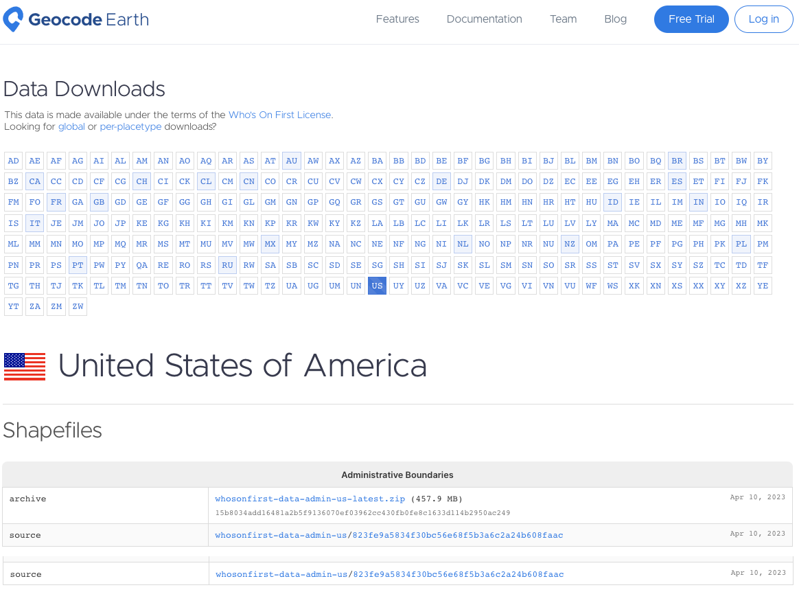

One of our founding principles when the Who’s On First gazetteer launched in [2015](https://whosonfirst.org/blog/2015/08/18/who-s-on-first/) was data **portability** – that our data should work in any database. By publishing our gazetteer in GeoJSON, CSV, and SQLite formats we allowed you to decide how you wanted to import the data into your software stack of choice.

However, in conversation with the mapping community we’ve heard that data portability should be paired with **accessibility** by a wider audience who are more familiar with accessing geographic data in the [shapefile](https://en.wikipedia.org/wiki/Shapefile) format widely used by GIS practitioners and supported by almost all GIS software packages.

Accessibility is actually one of the core tenants of the [International Open Data Charter](https://en.wikipedia.org/wiki/International_Open_Data_Charter) which pairs accessibility with usability in the same principle. Over time, the Who’s On First [properties](https://github.com/whosonfirst/whosonfirst-properties/) schema has grown more complicated both in breadth and depth – including nested GeoJSON properties that don’t play nice with other formats. While this richness in properties holds space for managing multiple viewpoints about a place, the many hundreds of properties can be daunting for a first time user.

We’ve also heard that reading from and **writing** to the WOF gazetteer should be equally important.  The [Spelunker](https://spelunker.whosonfirst.org/) has long provided an easy way to preview place records on the web. Adding Shapefile downloads, along with the existing SQLite downloads, makes it easier to read the data in bulk. There is also growing community interest in providing quick **edits** and more extensive bulk **imports** to keep the data fresh. This post will detail ongoing efforts in the “write” direction.

Our goal with this new work is three fold:

1. broaden the audience for the WOF gazetteer with a new Shapefile distribution format
2. make it more approachable with a small set of core properties
3. encourage more community engagement via simple edits, bulk imports, and knowledge sharing

## Downloads

While we manage Who’s On First place records as individual text files in git repos hosted on Github, from the early days we’ve made “bundled” distributions available. Those distributions were more geared for software engineers than for a more general audience of map makers and cartographers.

**SQLite** databases contain the full firehose of Who's On First data, including mixed geometry types and full set of nested GeoJSON properties. Unlike the raw GeoJSON files in the git repos, data in the SQLite databases are organized into several tables, including: spr, names, concordances, ancestors, and geojson. Geometries (default and alternate) are stored in the geojson table. The field layout of the spr table is explained in the Standard Place Response section below.

**Shapefile** downloads for the Who’s On First gazetteer are immediately available as per-country ZIP archives including admin (country, region, county, locality, neighbourhood & more), postalcode, and constituency placetypes.

While the shapefile format is more familiar for GIS technicians using desktop applications like [QGIS](https://qgis.org/en/site/) or [ArcGIS Pro](https://pro.arcgis.com/en/pro-app/latest/get-started/get-started.htm#:~:text=ArcGIS%20Pro%20is%20a%20full,or%20your%20ArcGIS%20Enterprise%20portal.), it has several significant limitations which means the downloads will lack the full range of Who’s On First features, properties, names, and geometries for a given place. They only include “active” features with a small set of essential properties.

> If you’re new to Who’s On First the new shapefile option will provide an easy way to get up and going, and we hope make you hungry for the full range of data in the SQLite databases.

Since shapefiles don’t support mixed geometry types, there’s 2 shapefiles for every WOF placetype, like “locality-points” and “locality-polygons”.


For example:

- whosonfirst-data-admin-us-locality-polygon.shp
- Whosonfirst-data-admin-us-locality-point.shp

Since "shapefiles" are actually a collection of individual files (like `{shp,shx,dbf,prj,cpg}`), we group them into a single compressed ZIP archive for downloading and name the ZIP using same "latest" convention used for the SQLite downloads. If you're using QGIS you can add the ZIP directly to your project without uncompressing it.

For example:

- [whosonfirst-data-admin-us-latest.zip](https://data.geocode.earth/wof/dist/shapefile/whosonfirst-data-admin-us-latest.zip)


To limit the file size of shapefile downloads (which have a 2 GB per file component limit), exported features are a limited subset of Who’s On First data, which:

- only includes one row per id
- excludes alt geometries
- excludes id=1 (planet earth)
- excludes non-current records
- excludes unnamed records
- excludes null island records (with point geometries at 0,0)

Shapefiles also have a 10-character limitation on DBF field name length, which often truncates longer WOF property names into ambiguous field (column) names. We provide a mapping of shorter shapefile field names with the full WOF property names below.

**Other formats?** We may contemplate adding additional downloads in GeoPackage, GeoParquette, or other formats for the Who’s On First gazetteer, if there is interest. Please reach out!

## Data Schema

### Standard Place Response (SPR) fields

The Who's On First “[standard place response](https://github.com/whosonfirst/go-whosonfirst-spr/blob/main/spr.go#L8)” (or SPR) provides just the essential properties with simple field names that sometimes coalesce values from multiple source properties.

Distributions like SQLite include SPR properties by default while also making the full set of original and nested GeoJSON properties, alternate geometries, and all name translations available.

With Shapefile we export most of the core SPR properties, and a few other goodies. Because of Shapefile's 10-character limitation on DBF field name length (which would truncate some column names in an ambiguous way) we rename them explicitly, as noted below in the "field" column, with the "field_full" indicating the full SPR field name in the other formats, or full WOF property name.

field     | field_full   | type    | description
--------- | ------------ | ------- | ----------------------------------------------------
id        | Id           | integer | The unique ID of the place
parent_id | ParentId     | integer | The unique parent ID of the place. Negative values indicate "[complicated](https://github.com/whosonfirst/whosonfirst-properties/tree/main/properties/wof#parent_id)".
name      | Name         | string  | The default name of the place (mostly English, mostly ASCII-7)
placetype | Placetype    | string  | The Who's On First placetype of the place
country   | Country      | string  | The two-letter country code of the place
repo      | Repo         | string  | The (Git) repository name where the source record for the place is stored.
lat       | Latitude     | float   | The latitude for the principal centroid (typically "label") of the place
lon       | Longitude    | float   | The longitude for the principal centroid (typically "label") of the place
min_lat   | MinLatitude  | float   | The minimum latitude of the bounding box of the place
min_lon   | MinLongitude | float   | The minimum longitude of the bounding box of the place
max_lat   | MaxLatitude  | float   | The maximum latitude of the bounding box of the place
max_lon   | MaxLongitude | float   | The maximum longitude of the bounding box of the place
modified  | LastModified | integer | The Unix timestamp indicating when the place was last modified

_NOTE: In the Shapefile format, last “modified” is a date instead of the original Unix timestamp in integer seconds. In GIS software like QGIS this field will display in your local date-time system settings, like 2019-08-24.)_

Basic properties for New York city ([view on Spelunker](https://spelunker.whosonfirst.org/id/85977539/)):

```
id: 85977539
parent_id: -4
name: New York
placetype: locality
country: US
repo: whosonfirst-data-admin-us
lat: 40.682949999999998
lon: -73.970799999999997
min_lat: 40.496133999999998
min_lon: -74.255590999999995
max_lat: 40.915533000000003
max_lon: -73.700008999999994
modified: 2023-04-10
```

_NOTE: The Spelunker sometimes shows outdated records, use [Github.com](https://raw.githubusercontent.com/whosonfirst-data/whosonfirst-data-admin-us/master/data/859/775/39/85977539.geojson) for source of truth.__

### Other SPR fields

Formats besides Shapefile will include the other core SPR fields. They are excluded from Shapefiles because of the format's 2GB file size limit, and because the export filter can imply their value.

field_full    | type    | description
------------- | ------- | ----------------------------------------------------
BelongsTo     | integer | The list of Who's On First IDs that are ancestors of the place
IsCurrent     | boolean | The Who's On First "existential" flag denoting whether the place is "current" or not
IsCeased      | boolean | The Who's On First "existential" flag denoting whether the place is "ceased" or not
IsDeprecated  | boolean | The Who's On First "existential" flag denoting whether the place is superseded or not
IsSuperseded  | boolean | The Who's On First "existential" flag denoting whether the place has been superseded
IsSuperseding | boolean | The Who's On First "existential" flag denoting whether the place supersedes other records
Inception     | string  | The EDTF inception date of the place
Cessation     | string  | The EDTF cessation date of the place
SupersededBy  | integer | The list of Who's On First IDs that supersede the place
Supersedes    | integer | The list of Who's On First IDs that are superseded by the place
Path          | string  | The relative path for the Who's On First record associated with the place
URI           | string  | The fully-qualified URI (URL) for the Who's On First record associated with the place

But Who’s On First is more than just basic properties, it’s also about names, holding hands with other data sources, contextualizing a place’s hierarchy, and a few other goodies we’ve found useful in our regular work with the gazetteer.

### Names

To provide a more ergonomic Shapefile experience, we've pre-joined the SPR to the names table to include 25 more localized names, when available, for:

> Arabic, Bengali, Chinese (simplified and/or traditional), Dutch, English, Farsi, French, German, Greek, Hebrew, Hindi, Hungarian, Indonesian, Italian, Japanese, Korean, Polish, Portuguese, Russian, Spanish, Swedish, Turkish, Ukrainian, Urdu, and Vietnamese

Who’s On First [uses](https://github.com/whosonfirst/whosonfirst-names#rfc-5646-bcp-47-comformance) the RFC 5646/ BCP-47 [language indications](https://www.loc.gov/standards/iso639-2/php/code_list.php) for names to specify a 3-character code for the following preferred locales as `name_{locale}` properties (so `name_eng` for English).

The list of supported Shapefile languages is adapted from [Natural Earth](https://github.com/nvkelso/natural-earth-vector/tree/master/tools/wikidata#supported-languages--now-26) and [Tilezen's](https://github.com/tilezen/vector-datasource/blob/master/docs/SEMANTIC-VERSIONING.md#languages-are-not-versioned) list of core languages. Arabic, Chinese, English, French, Russian and Spanish are used by the United Nations for meetings and official documents. The other languages listed are either proposed as an official language of the United Nations (Bengali, Hindi, Portuguese, and Turkish) or frequently used in OpenStreetMap, Who's On First, or Wikipedia.

Several hundred other languages are supported in the SQLite distributions in the “names” table.

#### Languages and their name fields

field      | 3-char | 2-char | language   | native script
---------- | ------ | ------ | ---------- | -------------
name_ara   | ara    | ar     | Arabic     | العربية
name_ben   | ben    | bn     | Bengali    | বাংলা
name_deu   | deu    | de     | German     | Deutsch
name_eng   | eng    | en     | English    | English
name_ell   | ell    | el     | Greek      | ελληνικά
name_fas   | fas    | fa     | Farsi      | فارسی
name_fra   | fra    | fr     | French     | français
name_heb   | heb    | he     | Hebrew     | עִבְרִית‎
name_hin   | hin    | hi     | Hindi      | हिन्दी
name_hun   | hun    | hu     | Hungarian  | magyar
name_ind   | ind    | id     | Indonesian | Bahasa Indonesia
name_ita   | ita    | it     | Italian    | italiano
name_jpn   | jpn    | ja     | Japanese   | 日本語
name_kor   | kor    | ko     | Korean     | 한국어
name_nld   | nld    | nl     | Dutch      | Nederlands
name_pol   | pol    | pl     | Polish     | Polski
name_por   | por    | pt     | Portuguese | Português
name_rus   | rus    | ru     | Russian    | Русский
name_spa   | spa    | es     | Spanish    | español
name_swe   | swe    | sv     | Swedish    | Svenska
name_tur   | tur    | tr     | Turkish    | Türkçe
name_ukr   | ukr    | uk     | Ukrainian  | українська
name_urd   | urd    | ur     | Urdu       | اردو
name_vie   | vie    | vi     | Vietnamese | Tiếng Việt
name_zho   | zho    | zh     | Chinese    | 中文

NOTE: Chinese names may include a mix of simplified and/or traditional Chinese characters. The SQLite file tries to imply Simplified or Traditional characters with additional country tags.

Back to our New York city example:

```
name_ara: نيويورك
name_ben: নিউ ইয়র্ক সিটি
name_deu: New York City
name_eng: New York
name_ell: Νέα Υόρκη
name_fas: نیویورک
name_fra: New York
name_heb: ניו יורק
name_hin: न्यूयॉर्क नगर
name_hun: New York
name_ind: Kota New York
name_ita: New York
name_jpn: ニューヨーク
name_kor: 뉴욕
name_nld: New York
name_pol: Nowy Jork
name_por: Nova Iorque
name_rus: Нью-Йорк
name_spa: Nueva York
name_swe: New York
name_tur: New York
name_ukr: Нью-Йорк
name_urd: نیویارک شہر
name_vie: Thành phố New York
name_zho: 纽约
```

### Concordances

To provide a more ergonomic Shapefile experience, we've pre-joined the SPR to the “concordances” table in the SQLite database and shorted the full WOF property names in the original GeoJSON:


field    | field_full     | type    | description
-------- | -------------- | ------- | ------------
gn_id    | gn:id          | integer | GeoNames unique identifier
wd_id    | wd:id          | string  | Wikidata unique identifier
usgeo_id | uscensus:geoid | string  | US Census unique identifier
hasc_id  | hasc:id        | string  | Statoids Hierarchical Set of Subdivision Codes

Back to our New York city example:

```
gn_id: 5128581
wd_id: Q60
usgeo_id: 3651000
hasc_id: NULL
```

### Hierarchy

To provide a more ergonomic Shapefile experience, we've pre-joined the SPR to the “ancestors” table in the SQLite database, keyed off ancestor_placetype:

field      | field_full | type    | description
---------- | ---------- | ------- | ------------
country_id | country    | integer | The unique ID of the place's country ancestor
region_id  | region     | integer | The unique ID of the place's region ancestor
county_id  | county     | integer | The unique ID of the place's county ancestor

_NOTE: Some country_id will be empty in the case of dependencies._

Back to our New York city example:

```
country_id: 85633793
region_id: 85688543
county_id: 102082361
```

### Other goodies

To provide a more ergonomic Shapefile experience, we've extracted several GeoJSON properties from the SPR table in the SQLite database and shorted the full WOF property names in the original GeoJSON:

field      | field_full     | type    | description
---------- | -------------- | ------- | ------------
population | wof:population | integer | An integer value to represent the most current, known population of a place
is_funky   | mz:is_funky    | integer | An integer value used when the record is suspect, bad, or inappropriate but additional confirmation is needed before the feature is deprecated. Records with a 1 value are recommended to be hidden from map display and search unless explicitly asked for by name.
min_zoom   | mz:min_zoom    | float   | Float values (though in practice mosts are integer values) that match to web map zoom schema. Common range is 0.0 to 18.0, though they can be greater.
max_zoom   | mz:max_zoom    | float   | Float values (though in practice mosts are integer values) that match to web map zoom schema. Common range is 0.0 to 18.0, though they can be greater.
min_label  | lbl:min_zoom   | float   | When the feature's label should first appear. Float values (though in practice mosts are integer values) that match to web map zoom schema. Common range is 0.0 to 18.0, though they can be greater.
max_label  | lbl:max_zoom   | float   | When the feature's label should be removed (or switched to a different representation like exterior ring labels). Float values (though in practice mosts are integer values) that match to web map zoom schema. Common range is 0.0 to 18.0, though they can be greater.
geom_src   | src:geom       | string  | The data source of a record's geometry. Valid property values are listed in the [`whosonfirst-sources`](https://github.com/whosonfirst/whosonfirst-sources/tree/master/sources) repository

Back to our New York city example:

```
population: 8405837
is_funky: NULL
min_zoom: 1.7
max_zoom: NULL
min_label: 5
max_label: 12
geom_src: whosonfirst
```

## Simple data edits

Sadly our earlier [Boundary Issues](https://whosonfirst.org/blog/2016/10/05/boundary-issues-properties/) web app for data edits in Who’s On First went offline when Mapzen shut down. In the intervening years we’ve developed [Write Field](https://writefield.nextzen.org/), an web app for making quick data edits to a smaller set of WOF record properties commonly used in map display and search. You’ll need a Github.com account to login and propose edits, which are then reviewed using the Github pull request process.

Example loading the New York city record:

- [https://writefield.nextzen.org/place/edit?url=https://raw.githubusercontent.com/whosonfirst-data/whosonfirst-data-admin-us/master/data/859/775/39/85977539.geojson](https://writefield.nextzen.org/place/edit?url=https://raw.githubusercontent.com/whosonfirst-data/whosonfirst-data-admin-us/master/data/859/775/39/85977539.geojson)

<< insert screenshot of Write Field >>

Edits using the tool generates a Github PR for review using the standard WOF process:

- [https://github.com/whosonfirst-data/whosonfirst-data-admin-us/pull/143](https://github.com/whosonfirst-data/whosonfirst-data-admin-us/pull/143)

<< insert screenshot of Write Field pull request >>

We’ve enhanced the Spelunker to include a new “Edit” link in the right sidebar when browning a place.

- [https://spelunker.whosonfirst.org/id/85977539/](https://spelunker.whosonfirst.org/id/85977539/)

<< insert screenshot of Spelunker sidebar >>

## Bulk data imports

The great thing about the open data movement is more and better data about the places is released every year. We are grateful for efforts like [INSPIRE](https://inspire.ec.europa.eu/about-inspire/563) in Europe and many other efforts elsewhere. Sometimes that means updating existing Who’s On First records and their properties. Often it means editing more than one record at a time, or even importing thousands of new records into our gazetteer which we have done for many countries as better open data comes online. The benefit of incorporating new data into Who’s On First is it’s immediately available in all downstream applications that rely on Who’s On First.

To do bulk edits we often extract, transform, and load the the new open data in the QGIS desktop application, and then use a script to loop thru the final aggregate product to update existing individual WOF records in the git repos, or to create new records (when appropriate) with a minimum set of properties. Exportifying the record in single line per property formatted GeoJSON which allows easy visual diff’ing of changes, setting the lastmodified date, and setting the hierarchy via reverse geocoding are extra steps in this bulk data import workflow. But the final result is a Github PR that can be easily reviewed and linked with any accompanying property or source definitions.

This work flow continues to evolve, and has been documented in several blog posts, including:

- Tk tk tk
- Tk tk tk
- Tk tk tk

Often bulk imports take some time to discuss, coordinate, implement, and review. To simplify the workflow and make it easier to review, larger imports for a new source in a country are commonly split into smaller Pull Requests by placetype or group of placetypes (like country, region, and county features in one PR, and localadmin and/or locality features in another PR).

We’re hopeful that the complexity of reverse geocoding to determine a place’s ancestor hierarchy can be simplified by new technologies like PMTiles, as Aaron has been [exploring](https://millsfield.sfomuseum.org/blog/2022/12/19/pmtiles-pip/) at the SFO Museum.

## Get the data

Downloads are kindly processed and hosted by [Geocode Earth](https://geocode.earth/data/whosonfirst/), including SQLite and now Shapefiles by country.

- Load [Data Downloads](https://geocode.earth/data/whosonfirst/) page
- Click on the desired 2-character country code button in the top matrix
- Confirm your country's name and flag below the top matrix
- Scroll down to the Shapefiles section, "administrative" boundaries" section, click the name of the ZIP file to download it (eg [whosonfirst-data-admin-us-latest.zip](https://data.geocode.earth/wof/dist/shapefile/whosonfirst-data-admin-us-latest.zip))

_NOTE: There's also an [inventory.json](https://data.geocode.earth/wof/dist/shapefile/inventory.json) file available for programatic use._

Particular thanks to [Peter Johnson](https://www.linkedin.com/in/missinglink/) there for getting the new format setup.



## Feedback

We hope you enjoy data from the Who's On First gazetteer!

If you have feedback please submit a [new issue](https://github.com/whosonfirst-data/whosonfirst-data/issues/new) or [discussion](https://github.com/whosonfirst-data/whosonfirst-data/discussions/new/choose) topic via Github.

If you prefer email:

- [Subscribe to WOF Announcements](http://eepurl.com/ipOxd2) for "big news", via Mailchimp. Frequency is a few times per year. Subscribe now and you'll be first to know about our big India locality data drop!
- Join our new [WOF Gazetteer discussion group](https://groups.google.com/g/wof-gazetteer) on Google to ask questions and share updates on your country's latest changes to it's internal administrative subdivisions. If you're a geography geek, this one's for you.

_Photo Credit: [Umbra Desktop Utensils in Case, Cooper Hewitt Design Museum](https://collection.cooperhewitt.org/objects/18622933/)_