

Drawing, Screen Design: "Heads of State," Front Side, by Dan Friedman. <a href="https://collection.cooperhewitt.org/objects/18673263/">Collection of Cooper Hewitt  Museum, published by the Smithsonian Institution</a>.

## State of the Gazetteer in 2023

The Who’s On First (WOF) gazetteer is a big list of places, each with a stable identifier, and a set of common and optional descriptive properties about that location. Like any product, Who’s On First is made by people, and we’ve collectively spent about “20 years” building WOF as an original work and as an aggregation of many other open data projects.

Since we [launched](https://whosonfirst.org/blog/2015/08/18/who-s-on-first/) in 2015, the project has grown in coverage, complexity, and supported applications. In this this post I will summarize Who’s On First’s key advantages, offer a comparative analysis of WOF and other open gazetteers, quantify our global coverage by [placetype](https://github.com/whosonfirst/whosonfirst-placetypes), offer score cards by country, dive into name localization, look at internationalization through the lens of disputed territories, and quantify geometry types and sources of those polygon and points, hold hands with and thank our [sources](https://github.com/whosonfirst/whosonfirst-sources/blob/main/sources/README.md), and invite collaboration.

WOF gazetteer’s focus on [localities](https://en.wikipedia.org/wiki/Human_settlement) and unique identifiers sets us apart from many other projects. We choose to approach geography at a personal level – starting with the `locality` (or populated place) where people play, study, work, and sleep – and `country` for when people need a passport to cross a frontier and experience something new and exciting.

Between those “top” and “bottom” placetypes in the administrative hierarchy, countries choose to order their geography in many varied and nested subdivisions. Who’s On First doesn’t judge, but we do align them into common `region` (1st order subdivisions, tracked by the ISO), “county” (2nd order subdivisions), and `localadmin` (municipalities) placetypes. Most localities aren’t legally incorporated, and may or may not be coincidental with a parent localadmin. Many urban localities are further subdivided into `borough` and `neighbourhood` areas. There are even more optional [placetypes](https://github.com/whosonfirst/whosonfirst-placetypes) to allow for intermediate levels and other edge cases.

This common structure allows us to track all the places in the world. Or at least those places we’ve learned about thus far. We hope it provides you an easier mental model to integrate the data into your own application.

_Eager to play with the data yourself? Jump to the [downloads](#Downloads) section below..._

## Who’s On First gazetteer at a glance

* A single source of truth across a minimalist common set of [placetypes](https://github.com/whosonfirst/whosonfirst-placetypes), spanning the entire globe, and supplemented as-needed on a regional level
* Global coverage for `5M` (million) administrative places, including `4.5M` localities
* More than `25M` additional places are available, including: `3.9M` postal codes, `7K` (thousand) constituencies, and `21M` venues
* `452K` features have detailed polygons, with complete coverage at country, region, and county placetypes and exhaustive coverage for localadmin and large localities in major industrialized economies, with exhaustive coverage as point geometries for remaining features. We also store `447K` alternate geometries.
* Names are localized into hundreds of languages, using internet standard language codes
* Population values, `min_zoom` ranking, and polygon label centroids enable sophisticated map designs with beautiful and informative cartography
* Internationalized with disputed territory boundaries for global audiences and compliance with local regulations
* Open license (CC-BY attribution) means you’re free to use the data for commercial purposes, including derivative rights, as long as you credit the project and our sources
* Includes original work and data aggregated from [360+ authoritative sources](https://github.com/whosonfirst/whosonfirst-sources/blob/main/sources/README.md). Our source data licenses have been vetted by multiple corporate attorneys at large, publicly traded companies.
* Holds hands with 60+ datasets via linked unique identifiers to allow crosswalk across `6.5M` feature-level concordances.
* Spelunker web app for viewing formatted data with a map 
([browse New York city record](https://spelunker.whosonfirst.org/id/85921881/))
* Write Field web editor for quick property edits 
([edit New York city record](https://writefield.nextzen.org/place/edit?url=https://raw.githubusercontent.com/whosonfirst-data/whosonfirst-data-admin-us/master/data/859/775/39/85977539.geojson)) with human review
* View raw data on Github ([view New York city example](https://github.com/whosonfirst-data/whosonfirst-data-admin-us/blob/master/data/859/218/81/85921881.geojson))
* Downloadable SQLite and Shapefile distributions from [geocode.earth](https://geocode.earth) (thanks!)
* Collaborative project started in 2015 and remains active, including contributions from Snapchat
* The Who’s On First project is hosted by the Linux Foundation

## Comparative Analysis of Open Gazetteers

We recognize our WOF gazetteer is one of many open gazetteers, let’s look at five, including Who’s On First:

* **[Who’s On First](https://whosonfirst.org/):** Open data project with both administrative and non-administrative data like postal codes, constituencies, and venues. The CC-BY license allows commercial use. Includes polygons, fully localized names, disputed territory handling for reverse geocoding, navigation centroids, and unique IDs to capture value from metrics. The data is used in applications with over 300 million monthly active users.
* **[GeoNames](https://www.geonames.org/):** Commercial project across a range of administrative and non-administrative placetypes including postal codes and venues. Premium polygons can be licensed for a fee. Great locality coverage!
* **[geoBoundaries](https://www.geoboundaries.org/):** Academic project focused exclusively on administrative hierarchy. A complicated license that mixes in ODbL and other non-commercial data sources with CC-BY data. Names are not localized, no disputed territories, no label centroids, and no unique IDs.
* **[GADM](https://gadm.org/):** Academic project focused exclusively on administrative hierarchy. Non-commercial use license although a custom commercial license is available on request. Names include latin, variants, and local script but not in a machine readable way. No disputed territories, no label centroids, and no unique IDs.
* **[All The Places](https://www.alltheplaces.xyz/):** Open data project with CC-0 license focused exclusively on venues.

LEGEND for tables below

* ✅ Great coverage and usability
* ☑️ Basic coverage or usability
* ❌ No coverage or usability (unless noted)
* Unique IDs must also be stable
* L10n = Localized names
* i18n = Internationalized features
* Links = Concordance 🔗 with other gazetteer projects

#### Gazetteer data competitive analysis table

Project        | Started | License | Admin records | Localities | Others | Unique IDs | L10n | i18n | Admin polygons | Admin points | Links
-------------- | ---- | ----- | ---- | ---- | ----- | --- | --- | ---️ | ---- | ---- | ---
[Who’s On First](https://whosonfirst.org/)      | 2015 | CC-BY    | 5.0M | 4.5M | 25.0M | ✅ | ✅ | ☑️ | ✅ 0.4M          | ✅ 4.6M | ✅
[GeoNames](https://www.geonames.org/)           | 2005 | CC-BY    | 5.1M | 4.6M | 5.8M  | ✅ | ✅ | ❌ | ❌ $$$ (💰 0.5M) | ✅ 4.6M | ✅
[geoBoundaries](https://www.geoboundaries.org/) | 2017 | `*` ODbL | 1.0M | 0.0M | 0.0M  | ❌ | ❌ | ❌ | ✅ 1.0M         | ❌       | ❌
[GADM](https://gadm.org/)                       | 2009 | CC-BY-NC | 0.4M | 0.0M | 0.0M  | ❌ | ☑️ | ❌ | ✅ 0.4M          | ❌       | ❌
[All The Places](https://www.alltheplaces.xyz/) | 2017 | CC-0     | 0.0M | 0.0M | 2.5M  | ☑️  | ❌ | ❌ | ❌              | ❌       | ☑️

Project        | Started | License | Admin records | Localities | Others | Unique IDs | L10n | i18n | Admin polygons
-------------- | ---- | ----- | ---- | ---- | ----- | --- | --- | ---️ | ----
[Who’s On First](https://whosonfirst.org/)      | 2015 | CC-BY    | 5.0M | 4.5M | 25.0M | ✅ | ✅ | ☑️ | ✅ 0.4M
[GeoNames](https://www.geonames.org/)           | 2005 | CC-BY    | 5.1M | 4.6M | 5.8M  | ✅ | ✅ | ❌ | ❌ $$$ (💰 0.5M)
[geoBoundaries](https://www.geoboundaries.org/) | 2017 | `*` ODbL | 1.0M | 0.0M | 0.0M  | ❌ | ❌ | ❌ | ✅ 1.0M
[GADM](https://gadm.org/)                       | 2009 | CC-BY-NC | 0.4M | 0.0M | 0.0M  | ❌ | ☑️ | ❌ | ✅ 0.4M
[All The Places](https://www.alltheplaces.xyz/) | 2017 | CC-0     | 0.0M | 0.0M | 2.5M  | ☑️  | ❌ | ❌ | ❌

_`*` WARNING: geoBoundaries contains multiple sources, many of which are ODbL and some of which are CC-BY. Discretion is advised!_
_DISCLAIMER: The above table represents a good faith effort to compare open gazetteer projects with nominally CC-BY and more permissive licenses in May 2023. Each project has its own motivations, use cases, and update frequencies. Major respect for everyone involved (and to [OpenStreetMap](https://www.openstreetmap.org/) and their ODbL effort)._

#### Gazetteer applications competitive analysis table

Project | Search | Reverse Geocoding | Map Display | Routing | Metrics logging | Venues | Postcodes | Constituencies | Tooling
------- | ------ | ----------------- | ----------- | ------- | --------------- | ------ | --------- | -------------- | -------
[Who’s On First](https://whosonfirst.org/) | ✅ | ✅ | ✅ | ✅ | ✅ | ☑ ️21M | ✅ 3.9M | ☑ ️7K | Web & CLI
[GeoNames](https://www.geonames.org/) | ✅ | ❌ $$$ | ☑️ | ✅ | ✅ | ☑️ 1.1M | ✅ 1.5M | ❌ | API
[geoBoundaries](https://www.geoboundaries.org/) | ☑️ | ☑️ | ☑️ | ❌ | ❌ | ❌ | ❌ | ❌ | Web & API
[GADM](https://gadm.org/) | ☑️ | ☑️ | ☑️ | ❌ | ❌ | ❌ | ❌ | ❌ | ❌
[All The Places](https://www.alltheplaces.xyz/) | ✅ | ❌ | ✅ | ✅ | ☑️ | ✅ 2.5M | ❌ | ❌ | Web

_NOTE: geoBoundaries has a great web viewer to [compare data](https://www.geoboundaries.org/geoContrast.html?country=BHR&mainSource=geoBoundaries+%28Open%29&comparisonSource=Natural+Earth+v5.0.1&mainLevel=1&comparisonLevel=1) for countries and their subdivisions across projects – including those here in WOF and from the lower geometry precision [Natural Earth](https://www.naturalearthdata.com/)._

## Who’s On First global coverage deep dive

Who’s On First has `5M` administrative places, including `4.5M` localities. Detailed breakdowns by placetype, geometry type, country & etc are available farther down in the “[By Geometry Type](#by-geometry-type)” section.

placetype | count
--------- | -----:
locality | 4,498,136
neighbourhood | 233,712
localadmin | 203,513
county | 47,431
region | 5,139
country | 232
disputed | 104
dependency | 43
(other admin) | 29,934
TOTAL | 5,018,244

Additional coverage is available in the WOF gazetteer for `3.9M` postal codes, `7K` constituencies, and `21M` venues, but they are largely excluded from the “administrative” tables below, although descriptions and coverage maps are provided.

### Coverage by placetype

#### Locality coverage

Localities form the bulk of place records in the WOF gazetteer. Of those `4.5` million records, 95% have point geometries and 5% have polygons. Distribution of our localities follows population density. See the “[Scorecards](#country-scorecards)” section below for a description of which countries have locality polygon coverage.

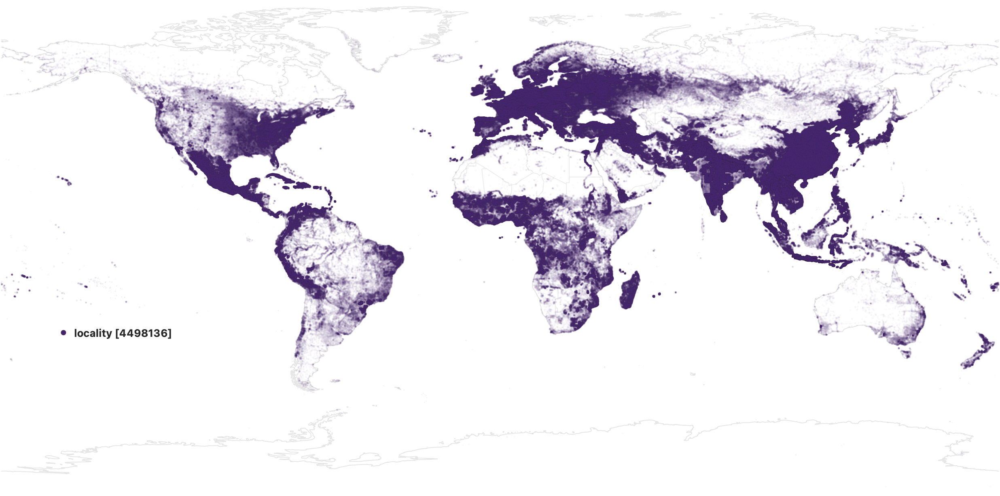

#### Primary administrative hierarchy coverage

Gazetteer projects must decide how to set up 1st order administrative divisions around the world, and this decision has repercussions in calculating the depth of administrative levels in a country.

Take for example the United Kingdom of Great Britain and Northern Ireland. Are the 4 “constituent countries” of the U.K. the 1st order subdivisions or are their 334 subdivisions? Are the 101 provinces of France the 1st order subdivisions, or the 29 regions? Are the “overseas” regions and provinces of France part of the main country or different countries? What about the United Kingdom, France, and other country’s dependencies? What about Belgium and its federal system? Or the United States and it’s dependencies?

Who’s On First tracks `countries` and `dependencies` as equal top-level placetypes and group them into `empires` as appropriate. WOF chooses to represent all ISO 1st order subdivisions as “region” placetype features in a continuous fabric of global coverage. When the ISO also provides groupings of those, as reported by the country itself for administrative (versus statistical) use, we import those as an optional `macroregion` with complete in-country coverage but sparse global coverage. This situation (and others like in Belgium) impact over a dozen countries globally.

“[What are…](https://www.jeopardy.com/jbuzz/behind-scenes/what-are-some-questions-about-jeopardy)” in WOF: the United Kingdom has 4 `macroregion` and 334 `region` records; France has 29 `macroregion` and 101 `region` records; the United States has 51 `region` records (including the [District of Columbia](https://spelunker.whosonfirst.org/id/85688741/) which is marked in `label:eng_x_preferred_placetype` as a “federal district”). Puerto Rico is a dependency of the United States empire. Naming placetypes in inherently controversial so we also provide an optional and localized “[label:{lang}_x_preferred_placetype](https://github.com/whosonfirst/whosonfirst-properties/blob/main/properties/label/README.md#lang_x_preferred_placetype)” property on records that carries the specific word used for that place in its country and translated to English (including the region of [Riyadh](https://spelunker.whosonfirst.org/id/85676813/) in Arabic script, latinized Arabic, and English).

_(below) Feature counts for each placetype are included in the legend. Every feature on the map below has a polygon geometry, but is represented as a point for visualization purposes._

#### Localadmin coverage

Most of the `230K` localadmin placetype features have polygon geometries. See the “[Depth of administrative levels](#depth-of-administrative-levels-by-country)”, “[By geometry type](#by-geometry-type)”, and “[Improving WOF data coverage and quality (a more detailed look)](#improving-wof-data-coverage-and-quality)” sections below for more information.

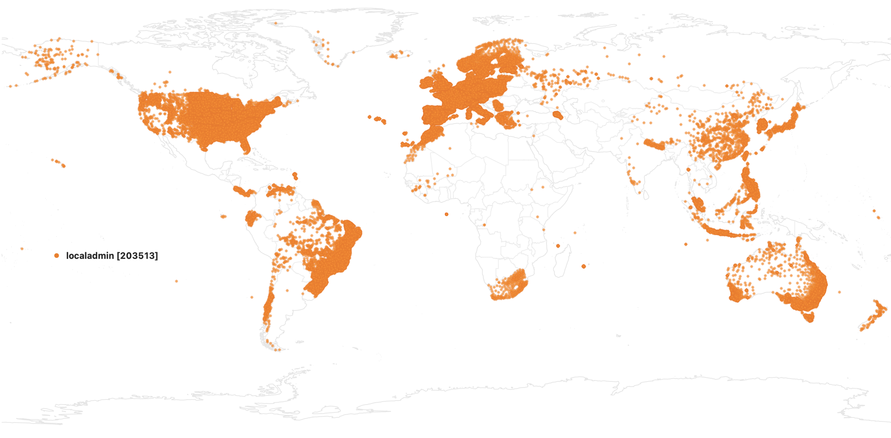

#### Campus coverage

Most of the `24K` campus placetype features are airports, but we include national park polygons in select countries, and in the USA there are ~ `20K` mobile home parks.

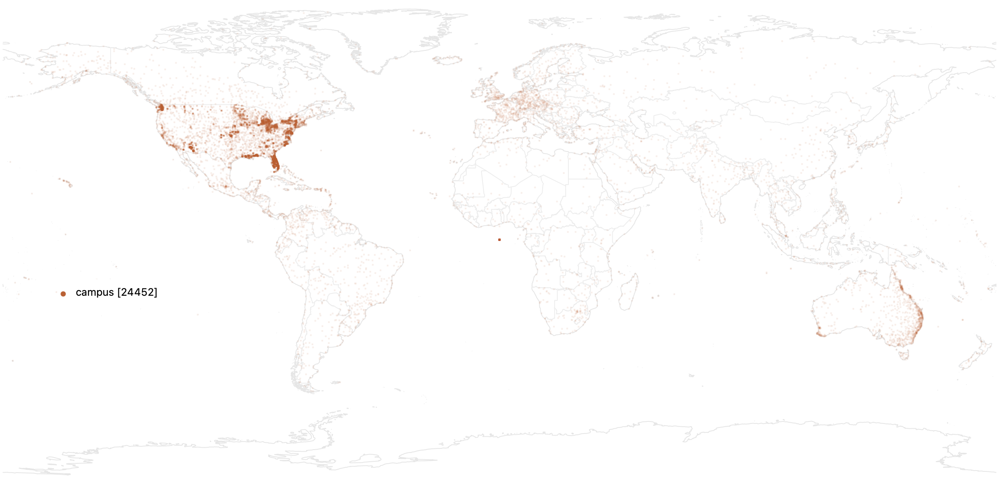

#### Other core “administrative” placetypes coverage

Additional placetypes in the “admin” repos are included for convenience to name and/or reverse geocode for continents, oceans, marine areas, time zones, and more exotic features like empires and market areas. We’re also wondering what those 2 unknown features are!

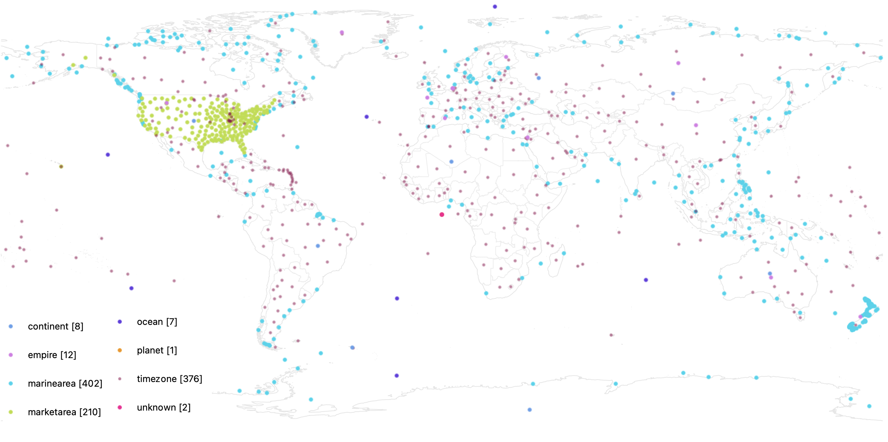

#### Postalcode coverage

Who’s On First has `3.4M` postalcodes with a range spatial aggregations, geometry types, and polygon accuracies:

1. Polygons for fully qualified postalcodes (e.g. “[95501](https://spelunker.whosonfirst.org/id/554784877/)” in the United States sourced from the US Census Zip code tabulation areas, and also available in Australia, Australia, Finland, France, and Switzerland)
2. Polygons for postal aggregation areas (Canada, Netherlands). Think “955” in the United States which is useful for calculating regional statistics.
3. Point locations for specific delivery routes, like “[SW1A 1AA](https://spelunker.whosonfirst.org/id/487748609/)” in the United Kingdom (think ZIP+4 in the United States) which have a precise location (the same situation is true for Japan) or an approximate location mapped to the nearest available polygon centroid (like in Canada which has a combination of precise and official 3-character “forward sorting area” aggregation polygons and approximate centroids for the 6-character postal codes).
4. In the Netherlands we also have a 4th type of polygon created from the alphashape of the postalcode attributes on WOF venue point locations.

The majority of WOF postalcode records exist in other countries – but their locations are approximate (or [are visiting](https://spelunker.whosonfirst.org/nullisland/) [Null Island](https://www.wsj.com/articles/if-you-cant-follow-directions-youll-end-up-on-null-island-1468422251)) and are not shown in the map below based on the [shapefile distribution](https://geocode.earth/data/whosonfirst/) – but they are included in the [SQLite distribution](https://geocode.earth/data/whosonfirst/). If you’re interested in mapping postalcodes to the post office / locality names, we provide that for the United States in the `mz:postal_locality` property. If you need global mapping, see [Pelias’ postal cities](https://github.com/pelias/postal-cities) project.

_NOTE: The United Kingdom and Australia receive regular updates, the rest are an older vintage and could use a refresh._

Several detailed map views are provided farther below for the more unusual cases.

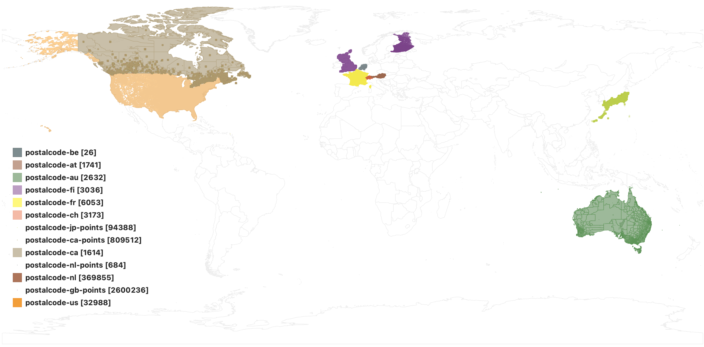

##### Vancouver, Canada postalcodes

When precise locations for postalcodes (like the “[V5K 1A2](https://spelunker.whosonfirst.org/id/521319439/)” delivery route) are not available they are sometimes mapped to the polygon centroids of their parent postal area (e.g. “[V5K](https://spelunker.whosonfirst.org/id/504805001/)” postal aggregation area) in Vancouver, Canada shown below.

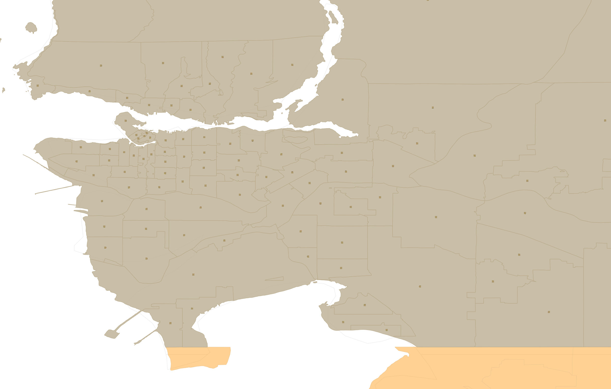

##### London postalcodes

Detailed point locations for specific delivery routes like “[SW1A 1AA](https://spelunker.whosonfirst.org/id/487748609/)” are available in the United Kingdom, updated approximately quarterly, with the London metro area shown below.

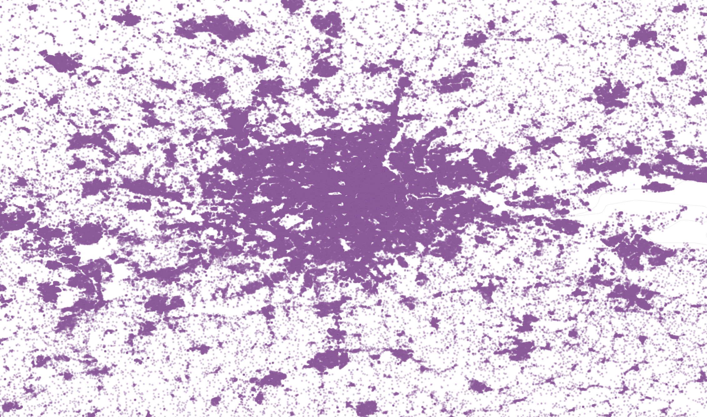

##### Tokyo, Japan postalcodes

Similar point geometries are available in Japan, with the Tokyo metro area shown below.

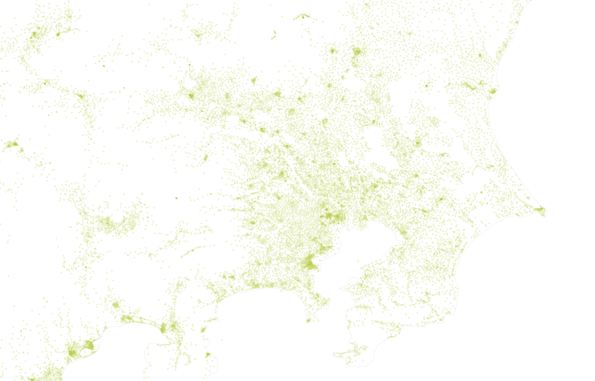

##### Amsterdam, Netherlands postalcodes

Several experiments have created [alphashapes](https://en.wikipedia.org/wiki/Alpha_shape) from WOF venues address data, including in the Netherlands. These approximate polygons are marked “[mz:is_approximate](https://github.com/whosonfirst/whosonfirst-properties/tree/main/properties/mz#is_approximate)” and capture the bounding box extent of the zipcode and the label centroid in search and even reverse geocoding, but are not suitable for display in a thematic map.

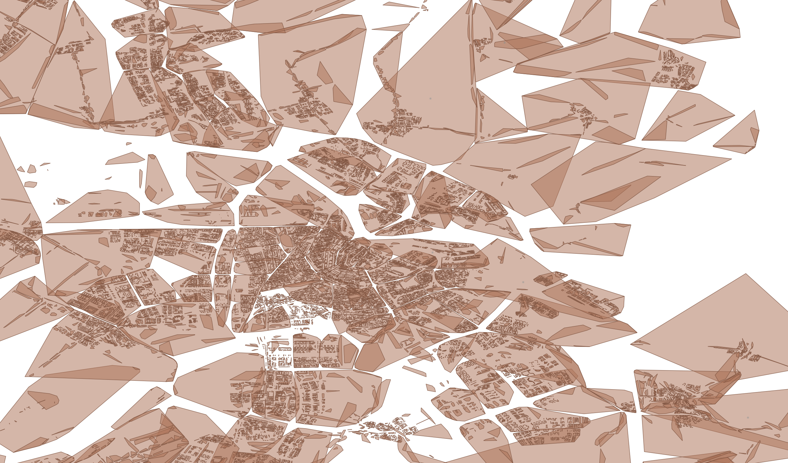

#### Constituency coverage

For national and regional legislative bodies, including upper and lower chamber indication via “[wof:association](https://github.com/whosonfirst/whosonfirst-properties/blob/main/properties/wof/README.md#association)”. These will need a refresh for the 2023 redistricting in the United States. Canada includes data in British Columbia only.

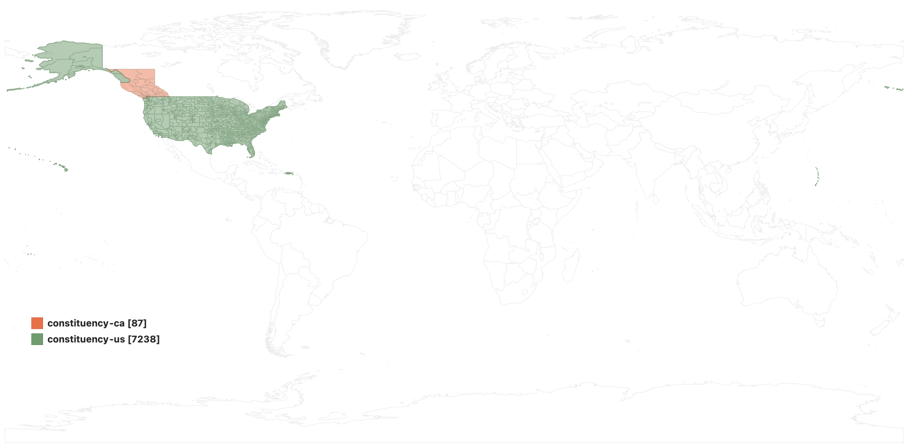

#### Venue coverage

Back in 2015 and 2016 we imported 21 million venues in 63 countries from the [SimpleGeo CC0 venues](https://web.archive.org/web/20120314172738/http://blog.simplegeo.com/2011/08/01/august-updates/) dataset. We added place hierarchy by reverse geocoding these points against the WOF administrative polygons, and otherwise normalized them into the WOF schema. But venues come and go – they are more ephemeral than administrative data – especially the last few years during the COVID pandemic. So the WOF venue coverage will lack newer businesses and still include businesses that have closed IRL. A separate analysis of WOF venues is available in an [earlier blog post](https://whosonfirst.org/blog/2017/10/24/whosonfirst-sotmus-2017/).

### By Geometry Type

Nearly 10% of Who’s On First’s `5M` administrative records have polygons, with complete global coverage at the `country` and `dependency` (collectively the “top administrative level”), and `region` (1st order administrative subdivision) levels. Nearly continuous global coverage is provided at the `county` (2nd order administrative subdivision) level. Many countries also include complete polygon coverage at the `localadmin` level.

Countries with any coloring in the “[Country scorecards](#country-scorecards)” map in the next section include complete locality polygon coverage. Other “gray” colored countries in that map will only include approximate locality polygons for the country capital and a handful of other regionally important localities.

The WOF gazetteer also stores nearly `0.5M` alternate geometries. This can occur when we upgrade point geometries to polygons, have multiple polygons to choose from but we designate just one the default and store the others as alternates, deal with coastline clipping for display versus territorial waters for reverse geocoding, or need to manually curate a custom polygon (and store the original as an alternate geometry).

Every default polygon feature includes a [label centroid](https://github.com/whosonfirst/whosonfirst-properties/tree/main/properties/lbl) geometry suitable for beautiful cartographic labeling derived either from [MapShaper](https://github.com/mbloch/mapshaper) or manual curation. Sometimes [navigation](https://github.com/whosonfirst/whosonfirst-properties/tree/main/properties/nav), [reverse geocoding](https://github.com/whosonfirst/whosonfirst-properties/tree/main/properties/reversegeo), and other specialized centroids are also provided.

_(below) The count of WOF features grouped by placetype, how many of those have default point or polygon geometry, how many have alternate geometries (and the ratio of alternate geometries to the count of features in that placetype), a point area indicates an WOF error mostly from us add or remove neighbourhood polygon geometries, the polygon area in equal area square kilometers, and the ratio of that area compared with the scope of the globe the placetype should cover._

Order | Placetype | Total Features | Points | Multi + Polygons | Alt geoms | Alt % | Point Areas | Poly Area SQ KM | Area % | Area Denom | Area Scope
----- | --------- | -------------: | -----: | ---------------: | --------: | ----: | ----------: | --------------: | -----: | ---------: | ----------
1 | country | 232 | 5 | 227 | 670 | 288.80% | 0.0K | 147.0M | 99.90% | 147.1M | all country and dependency
2 | dependency | 43 |  | 43 | 52 | 120.90% |  | 83.3K | 0.10% | 147.1M | all country and dependency
3 | disputed | 104 |  | 104 | 110 | 105.80% |  | 1.2M | 0.80% | 147.1M | all country and dependency
4 | macroregion | 117 |  | 117 | 1 | 0.90% |  | 3.3M | 29.80% | 10.9M | countries in ('AU', 'DE', 'FR', 'GF', 'TW')
5 | region | 5,139 | 169 | 4,970 | 2,404 | 46.80% | 0.0K | 150.0M | 102.00% | 147.1M | all country and dependency
6 | macrocounty | 482 |  | 482 | 21 | 4.40% |  | 882.5K | 10.00% | 8.8M | countries in ('AZ', 'BE', 'BR', 'ES', 'FI', 'FR', 'GB', 'HK', 'HU', 'IT', 'RS', 'TW')
7 | county | 47,431 | 2,412 | 45,019 | 7,292 | 15.40% | 0.0K | 125.7M | 85.50% | 147.1M | all country and dependency
8 | localadmin | 203,513 | 73,198 | 130,315 | 107,619 | 52.90% | 0.0K | 18.1M | 12.30% | 147.1M | all country and dependency
9 | locality | 4,498,136 | 4,274,056 | 224,080 | 200,106 | 4.40% | 0.5K | 7.1M | 4.80% | 147.1M | all country and dependency
10 | borough | 467 | 18 | 449 | 9 | 1.90% | 0.0K | 16.0K | 0.20% | 7.1M | locality
11 | macrohood | 1,272 | 4 | 1,268 | 2 | 0.20% | 0.0K | 15.9K | 0.20% | 7.1M | locality
12 | neighbourhood | 233,712 | 194,713 | 38,999 | 128,733 | 55.10% | 94.8K | 144.3K | 2.00% | 7.1M | locality
13 | microhood | 2,127 | 165 | 1,962 | 2 | 0.10% | 0.0K | 1.9K | 0.00% | 7.1M | locality
14 | planet | 1 |  | 1 |  |  |  | 510.1M | 100.00% | 510.1M | planet
16 | ocean | 7 |  | 7 |  |  |  | 293.1M | 57.50% | 510.1M | planet
15 | continent | 8 |  | 8 | 5 | 62.50% |  | 146.7M | 28.80% | 510.1M | planet
17 | marinearea | 402 |  | 402 | 3 | 0.70% |  | 72.7M | 24.80% | 293.1M | ocean
18 | empire | 12 |  | 12 |  |  |  | 47.2M | 32.10% | 147.1M | all country and dependency
19 | timezone | 376 |  | 376 |  |  |  | 134.4M | 91.40% | 147.1M | all country and dependency
20 | marketarea | 210 |  | 210 |  |  |  | 8.5M | 86.30% | 9.8M | countries in ('US')
21 | campus | 24,452 | 21,916 | 2,536 | 33 | 0.10% | 0.0K | 346.8K | 0.20% | 147.1M | all country and dependency
22 | unknown | 1 |  | 1 | 1 | 100.00% |  |  | 0.00% | 510.1M | planet
23 | TOTALS | 5,018,244 | 4,566,656 | 451,588 | 447,063 | 8.90% | 95.3K | 1.7B |  |  |

_NOTE: Postalcodes are not tracked in this table. See Postalcode coverage section above._

### By Geometry Source

#### Geometries directly imported by Who’s On First from source

Who’s On First both makes our own data and imports data directly from governments and other reputable sources. WOF tracks sources for each geometry in the “[src:geom](https://github.com/whosonfirst/whosonfirst-properties/blob/main/properties/src/README.md#geom)” property, with values being a source’s “name” in the [sources](https://github.com/whosonfirst/whosonfirst-sources/blob/main/sources/README.md) repo, while imported property’s from that source will have their name prepended with the “prefix” in the source’s JSON file. Hyperlinks are provided in the table below directly to that source’s JSON file (while the sources link above is human readable formatted text).

<table>
  <tr>
   <td>directly by
   </td>
   <td>source
   </td>
   <td>count
   </td>
  </tr>
  <tr>
   <td>whosonfirst
   </td>
   <td><a href="https://github.com/whosonfirst/whosonfirst-sources/blob/main/sources/geonames.json">geonames</a>
   </td>
   <td>

4192805

   </td>
  </tr>
  <tr>
   <td>whosonfirst
   </td>
   <td><a href="https://github.com/whosonfirst/whosonfirst-sources/blob/main/sources/qs_pg.json">qs_pg</a>
   </td>
   <td>

213815

   </td>
  </tr>
  <tr>
   <td>whosonfirst
   </td>
   <td><a href="https://github.com/whosonfirst/whosonfirst-sources/blob/main/sources/quattroshapes.json">quattroshapes</a>
   </td>
   <td>

202739

   </td>
  </tr>
  <tr>
   <td>whosonfirst
   </td>
   <td><a href="https://github.com/whosonfirst/whosonfirst-sources/blob/main/sources/frgov.json">frgov</a>
   </td>
   <td>

70551

   </td>
  </tr>
  <tr>
   <td>whosonfirst
   </td>
   <td><a href="https://github.com/whosonfirst/whosonfirst-sources/blob/main/sources/unknown.json">unknown</a>
   </td>
   <td>

70371

   </td>
  </tr>
  <tr>
   <td>whosonfirst
   </td>
   <td><a href="https://github.com/whosonfirst/whosonfirst-sources/blob/main/sources/mz.json">mz</a>
   </td>
   <td>

57396

   </td>
  </tr>
  <tr>
   <td>whosonfirst
   </td>
   <td><a href="https://github.com/whosonfirst/whosonfirst-sources/blob/main/sources/whosonfirst.json">whosonfirst</a>
   </td>
   <td>

47435

   </td>
  </tr>
  <tr>
   <td>whosonfirst
   </td>
   <td><a href="https://github.com/whosonfirst/whosonfirst-sources/blob/main/sources/uscensus.json">uscensus</a>
   </td>
   <td>

36473

   </td>
  </tr>
  <tr>
   <td>whosonfirst
   </td>
   <td><a href="https://github.com/whosonfirst/whosonfirst-sources/blob/main/sources/meso.json">meso</a>
   </td>
   <td>

27675

   </td>
  </tr>
  <tr>
   <td>whosonfirst
   </td>
   <td><a href="https://github.com/whosonfirst/whosonfirst-sources/blob/main/sources/de-bkg.json">de-bkg</a>
   </td>
   <td>

16290

   </td>
  </tr>
  <tr>
   <td>whosonfirst
   </td>
   <td><a href="https://github.com/whosonfirst/whosonfirst-sources/blob/main/sources/cbsnl.json">cbsnl</a>
   </td>
   <td>

14243

   </td>
  </tr>
  <tr>
   <td>whosonfirst
   </td>
   <td><a href="https://github.com/whosonfirst/whosonfirst-sources/blob/main/sources/ro-ancpi.json">ro-ancpi</a>
   </td>
   <td>

13753

   </td>
  </tr>
  <tr>
   <td>whosonfirst
   </td>
   <td><a href="https://github.com/whosonfirst/whosonfirst-sources/blob/main/sources/ch-cadastre.json">ch-cadastre</a>
   </td>
   <td>

6397

   </td>
  </tr>
  <tr>
   <td>whosonfirst
   </td>
   <td><a href="https://github.com/whosonfirst/whosonfirst-sources/blob/main/sources/nz-linz.json">nz-linz</a>
   </td>
   <td>

5942

   </td>
  </tr>
  <tr>
   <td>whosonfirst
   </td>
   <td><a href="https://github.com/whosonfirst/whosonfirst-sources/blob/main/sources/ee-mamt.json">ee-mamt</a>
   </td>
   <td>

5045

   </td>
  </tr>
  <tr>
   <td>whosonfirst
   </td>
   <td><a href="https://github.com/whosonfirst/whosonfirst-sources/blob/main/sources/pl-gugik.json">pl-gugik</a>
   </td>
   <td>

4658

   </td>
  </tr>
  <tr>
   <td>whosonfirst
   </td>
   <td><a href="https://github.com/whosonfirst/whosonfirst-sources/blob/main/sources/zetashapes.json">zetashapes</a>
   </td>
   <td>

4372

   </td>
  </tr>
  <tr>
   <td>whosonfirst
   </td>
   <td><a href="https://github.com/whosonfirst/whosonfirst-sources/blob/main/sources/ourairports.json">ourairports</a>
   </td>
   <td>

3326

   </td>
  </tr>
  <tr>
   <td>whosonfirst
   </td>
   <td><a href="https://github.com/whosonfirst/whosonfirst-sources/blob/main/sources/pt-dgt.json">pt-dgt</a>
   </td>
   <td>

3092

   </td>
  </tr>
  <tr>
   <td>whosonfirst
   </td>
   <td><a href="https://github.com/whosonfirst/whosonfirst-sources/blob/main/sources/se-lant.json">se-lant</a>
   </td>
   <td>

2813

   </td>
  </tr>
  <tr>
   <td>whosonfirst
   </td>
   <td><a href="https://github.com/whosonfirst/whosonfirst-sources/blob/main/sources/austriaod.json">austriaod</a>
   </td>
   <td>

2194

   </td>
  </tr>
  <tr>
   <td>whosonfirst
   </td>
   <td><a href="https://github.com/whosonfirst/whosonfirst-sources/blob/main/sources/naturalearth.json">naturalearth</a>
   </td>
   <td>

1858

   </td>
  </tr>
  <tr>
   <td>whosonfirst
   </td>
   <td><a href="https://github.com/whosonfirst/whosonfirst-sources/blob/main/sources/wikidata.json">wikidata</a>
   </td>
   <td>

1742

   </td>
  </tr>
  <tr>
   <td>whosonfirst
   </td>
   <td><a href="https://github.com/whosonfirst/whosonfirst-sources/blob/main/sources/woedb.json">woedb</a>
   </td>
   <td>

1472

   </td>
  </tr>
  <tr>
   <td>whosonfirst
   </td>
   <td><a href="https://github.com/whosonfirst/whosonfirst-sources/blob/main/sources/esp-cicgc.json">esp-cicgc</a>
   </td>
   <td>

950

   </td>
  </tr>
  <tr>
   <td>whosonfirst
   </td>
   <td><a href="https://github.com/whosonfirst/whosonfirst-sources/blob/main/sources/ie-gov.json">ie-gov</a>
   </td>
   <td>

816

   </td>
  </tr>
  <tr>
   <td>whosonfirst
   </td>
   <td><a href="https://github.com/whosonfirst/whosonfirst-sources/blob/main/sources/au-capad.json">au-capad</a>
   </td>
   <td>

716

   </td>
  </tr>
  <tr>
   <td>whosonfirst
   </td>
   <td><a href="https://github.com/whosonfirst/whosonfirst-sources/blob/main/sources/amsgis.json">amsgis</a>
   </td>
   <td>

695

   </td>
  </tr>
  <tr>
   <td>whosonfirst
   </td>
   <td><a href="https://github.com/whosonfirst/whosonfirst-sources/blob/main/sources/no-geonorge.json">no-geonorge</a>
   </td>
   <td>

493

   </td>
  </tr>
  <tr>
   <td>whosonfirst
   </td>
   <td><a href="https://github.com/whosonfirst/whosonfirst-sources/blob/main/sources/us-nps.json">us-nps</a>
   </td>
   <td>

419

   </td>
  </tr>
  <tr>
   <td>whosonfirst
   </td>
   <td><a href="https://github.com/whosonfirst/whosonfirst-sources/blob/main/sources/hkigis.json">hkigis</a>
   </td>
   <td>

409

   </td>
  </tr>
  <tr>
   <td>whosonfirst
   </td>
   <td><a href="https://github.com/whosonfirst/whosonfirst-sources/blob/main/sources/sg-sggov.json">sg-sggov</a>
   </td>
   <td>

396

   </td>
  </tr>
  <tr>
   <td>whosonfirst
   </td>
   <td><a href="https://github.com/whosonfirst/whosonfirst-sources/blob/main/sources/can-edmdsd.json">can-edmdsd</a>
   </td>
   <td>

333

   </td>
  </tr>
  <tr>
   <td>whosonfirst
   </td>
   <td><a href="https://github.com/whosonfirst/whosonfirst-sources/blob/main/sources/figov.json">figov</a>
   </td>
   <td>

323

   </td>
  </tr>
  <tr>
   <td>whosonfirst
   </td>
   <td><a href="https://github.com/whosonfirst/whosonfirst-sources/blob/main/sources/begov.json">begov</a>
   </td>
   <td>

308

   </td>
  </tr>
  <tr>
   <td>whosonfirst
   </td>
   <td><a href="https://github.com/whosonfirst/whosonfirst-sources/blob/main/sources/baltomoit.json">baltomoit</a>
   </td>
   <td>

288

   </td>
  </tr>
  <tr>
   <td>whosonfirst
   </td>
   <td><a href="https://github.com/whosonfirst/whosonfirst-sources/blob/main/sources/statcan.json">statcan</a>
   </td>
   <td>

272

   </td>
  </tr>
  <tr>
   <td>whosonfirst
   </td>
   <td><a href="https://github.com/whosonfirst/whosonfirst-sources/blob/main/sources/can-abog.json">can-abog</a>
   </td>
   <td>

264

   </td>
  </tr>
  <tr>
   <td>whosonfirst
   </td>
   <td><a href="https://github.com/whosonfirst/whosonfirst-sources/blob/main/sources/pedia.json">pedia</a>
   </td>
   <td>

254

   </td>
  </tr>
  <tr>
   <td>whosonfirst
   </td>
   <td><a href="https://github.com/whosonfirst/whosonfirst-sources/blob/main/sources/atldpcd.json">atldpcd</a>
   </td>
   <td>

235

   </td>
  </tr>
  <tr>
   <td>whosonfirst
   </td>
   <td><a href="https://github.com/whosonfirst/whosonfirst-sources/blob/main/sources/svn-sma.json">svn-sma</a>
   </td>
   <td>

224

   </td>
  </tr>
  <tr>
   <td>whosonfirst
   </td>
   <td><a href="https://github.com/whosonfirst/whosonfirst-sources/blob/main/sources/lu-act.json">lu-act</a>
   </td>
   <td>

216

   </td>
  </tr>
  <tr>
   <td>whosonfirst
   </td>
   <td><a href="https://github.com/whosonfirst/whosonfirst-sources/blob/main/sources/za-mdb.json">za-mdb</a>
   </td>
   <td>

213

   </td>
  </tr>
  <tr>
   <td>whosonfirst
   </td>
   <td><a href="https://github.com/whosonfirst/whosonfirst-sources/blob/main/sources/wapo.json">wapo</a>
   </td>
   <td>

213

   </td>
  </tr>
  <tr>
   <td>whosonfirst
   </td>
   <td><a href="https://github.com/whosonfirst/whosonfirst-sources/blob/main/sources/zolk.json">zolk</a>
   </td>
   <td>

207

   </td>
  </tr>
  <tr>
   <td>whosonfirst
   </td>
   <td><a href="https://github.com/whosonfirst/whosonfirst-sources/blob/main/sources/aus-psma.json">aus-psma</a>
   </td>
   <td>

193

   </td>
  </tr>
  <tr>
   <td>whosonfirst
   </td>
   <td><a href="https://github.com/whosonfirst/whosonfirst-sources/blob/main/sources/mx-conanp.json">mx-conanp</a>
   </td>
   <td>

182

   </td>
  </tr>
  <tr>
   <td>whosonfirst
   </td>
   <td><a href="https://github.com/whosonfirst/whosonfirst-sources/blob/main/sources/dk-geodk.json">dk-geodk</a>
   </td>
   <td>

179

   </td>
  </tr>
  <tr>
   <td>whosonfirst
   </td>
   <td><a href="https://github.com/whosonfirst/whosonfirst-sources/blob/main/sources/azavea.json">azavea</a>
   </td>
   <td>

158

   </td>
  </tr>
  <tr>
   <td>whosonfirst
   </td>
   <td><a href="https://github.com/whosonfirst/whosonfirst-sources/blob/main/sources/can-calcai.json">can-calcai</a>
   </td>
   <td>

152

   </td>
  </tr>
  <tr>
   <td>whosonfirst
   </td>
   <td><a href="https://github.com/whosonfirst/whosonfirst-sources/blob/main/sources/esp-aytomad.json">esp-aytomad</a>
   </td>
   <td>

151

   </td>
  </tr>
  <tr>
   <td>whosonfirst
   </td>
   <td><a href="https://github.com/whosonfirst/whosonfirst-sources/blob/main/sources/can-wpgppd.json">can-wpgppd</a>
   </td>
   <td>

148

   </td>
  </tr>
  <tr>
   <td>whosonfirst
   </td>
   <td><a href="https://github.com/whosonfirst/whosonfirst-sources/blob/main/sources/sdgis.json">sdgis</a>
   </td>
   <td>

136

   </td>
  </tr>
  <tr>
   <td>whosonfirst
   </td>
   <td><a href="https://github.com/whosonfirst/whosonfirst-sources/blob/main/sources/tkugov.json">tkugov</a>
   </td>
   <td>

129

   </td>
  </tr>
  <tr>
   <td>whosonfirst
   </td>
   <td><a href="https://github.com/whosonfirst/whosonfirst-sources/blob/main/sources/oakced.json">oakced</a>
   </td>
   <td>

124

   </td>
  </tr>
  <tr>
   <td>whosonfirst
   </td>
   <td><a href="https://github.com/whosonfirst/whosonfirst-sources/blob/main/sources/ssuberlin.json">ssuberlin</a>
   </td>
   <td>

108

   </td>
  </tr>
  <tr>
   <td>whosonfirst
   </td>
   <td><a href="https://github.com/whosonfirst/whosonfirst-sources/blob/main/sources/tmpgov.json">tmpgov</a>
   </td>
   <td>

106

   </td>
  </tr>
  <tr>
   <td>whosonfirst
   </td>
   <td><a href="https://github.com/whosonfirst/whosonfirst-sources/blob/main/sources/oulugov.json">oulugov</a>
   </td>
   <td>

106

   </td>
  </tr>
  <tr>
   <td>whosonfirst
   </td>
   <td><a href="https://github.com/whosonfirst/whosonfirst-sources/blob/main/sources/porbps.json">porbps</a>
   </td>
   <td>

102

   </td>
  </tr>
  <tr>
   <td>whosonfirst
   </td>
   <td><a href="https://github.com/whosonfirst/whosonfirst-sources/blob/main/sources/sfgov.json">sfgov</a>
   </td>
   <td>

96

   </td>
  </tr>
  <tr>
   <td>whosonfirst
   </td>
   <td><a href="https://github.com/whosonfirst/whosonfirst-sources/blob/main/sources/os.json">os</a>
   </td>
   <td>

91

   </td>
  </tr>
  <tr>
   <td>whosonfirst
   </td>
   <td><a href="https://github.com/whosonfirst/whosonfirst-sources/blob/main/sources/seagv.json">seagv</a>
   </td>
   <td>

88

   </td>
  </tr>
  <tr>
   <td>whosonfirst
   </td>
   <td><a href="https://github.com/whosonfirst/whosonfirst-sources/blob/main/sources/denvercpd.json">denvercpd</a>
   </td>
   <td>

87

   </td>
  </tr>
  <tr>
   <td>whosonfirst
   </td>
   <td><a href="https://github.com/whosonfirst/whosonfirst-sources/blob/main/sources/torsdfa.json">torsdfa</a>
   </td>
   <td>

85

   </td>
  </tr>
  <tr>
   <td>whosonfirst
   </td>
   <td><a href="https://github.com/whosonfirst/whosonfirst-sources/blob/main/sources/nolagis.json">nolagis</a>
   </td>
   <td>

83

   </td>
  </tr>
  <tr>
   <td>whosonfirst
   </td>
   <td><a href="https://github.com/whosonfirst/whosonfirst-sources/blob/main/sources/esp-cartobcn.json">esp-cartobcn</a>
   </td>
   <td>

83

   </td>
  </tr>
  <tr>
   <td>whosonfirst
   </td>
   <td><a href="https://github.com/whosonfirst/whosonfirst-sources/blob/main/sources/can-gatsudd.json">can-gatsudd</a>
   </td>
   <td>

74

   </td>
  </tr>
  <tr>
   <td>whosonfirst
   </td>
   <td><a href="https://github.com/whosonfirst/whosonfirst-sources/blob/main/sources/fivgov.json">fivgov</a>
   </td>
   <td>

70

   </td>
  </tr>
  <tr>
   <td>whosonfirst
   </td>
   <td><a href="https://github.com/whosonfirst/whosonfirst-sources/blob/main/sources/arg-caba.json">arg-caba</a>
   </td>
   <td>

65

   </td>
  </tr>
  <tr>
   <td>whosonfirst
   </td>
   <td><a href="https://github.com/whosonfirst/whosonfirst-sources/blob/main/sources/can-mtlsmvt.json">can-mtlsmvt</a>
   </td>
   <td>

61

   </td>
  </tr>
  <tr>
   <td>whosonfirst
   </td>
   <td><a href="https://github.com/whosonfirst/whosonfirst-sources/blob/main/sources/can-saskodp.json">can-saskodp</a>
   </td>
   <td>

55

   </td>
  </tr>
  <tr>
   <td>whosonfirst
   </td>
   <td><a href="https://github.com/whosonfirst/whosonfirst-sources/blob/main/sources/kuogov.json">kuogov</a>
   </td>
   <td>

47

   </td>
  </tr>
  <tr>
   <td>whosonfirst
   </td>
   <td><a href="https://github.com/whosonfirst/whosonfirst-sources/blob/main/sources/can-clab.json">can-clab</a>
   </td>
   <td>

47

   </td>
  </tr>
  <tr>
   <td>whosonfirst
   </td>
   <td><a href="https://github.com/whosonfirst/whosonfirst-sources/blob/main/sources/lacity.json">lacity</a>
   </td>
   <td>

40

   </td>
  </tr>
  <tr>
   <td>whosonfirst
   </td>
   <td><a href="https://github.com/whosonfirst/whosonfirst-sources/blob/main/sources/can-dnvgov.json">can-dnvgov</a>
   </td>
   <td>

37

   </td>
  </tr>
  <tr>
   <td>whosonfirst
   </td>
   <td><a href="https://github.com/whosonfirst/whosonfirst-sources/blob/main/sources/can-ons.json">can-ons</a>
   </td>
   <td>

36

   </td>
  </tr>
  <tr>
   <td>whosonfirst
   </td>
   <td><a href="https://github.com/whosonfirst/whosonfirst-sources/blob/main/sources/minitenders.json">minitenders</a>
   </td>
   <td>

35

   </td>
  </tr>
  <tr>
   <td>whosonfirst
   </td>
   <td><a href="https://github.com/whosonfirst/whosonfirst-sources/blob/main/sources/gbr-datalondon.json">gbr-datalondon</a>
   </td>
   <td>

33

   </td>
  </tr>
  <tr>
   <td>whosonfirst
   </td>
   <td><a href="https://github.com/whosonfirst/whosonfirst-sources/blob/main/sources/santabar.json">santabar</a>
   </td>
   <td>

32

   </td>
  </tr>
  <tr>
   <td>whosonfirst
   </td>
   <td><a href="https://github.com/whosonfirst/whosonfirst-sources/blob/main/sources/can-bbygov.json">can-bbygov</a>
   </td>
   <td>

32

   </td>
  </tr>
  <tr>
   <td>whosonfirst
   </td>
   <td><a href="https://github.com/whosonfirst/whosonfirst-sources/blob/main/sources/eu-cdda.json">eu-cdda</a>
   </td>
   <td>

27

   </td>
  </tr>
  <tr>
   <td>whosonfirst
   </td>
   <td><a href="https://github.com/whosonfirst/whosonfirst-sources/blob/main/sources/can-qcodp.json">can-qcodp</a>
   </td>
   <td>

27

   </td>
  </tr>
  <tr>
   <td>whosonfirst
   </td>
   <td><a href="https://github.com/whosonfirst/whosonfirst-sources/blob/main/sources/bra.json">bra</a>
   </td>
   <td>

27

   </td>
  </tr>
  <tr>
   <td>whosonfirst
   </td>
   <td><a href="https://github.com/whosonfirst/whosonfirst-sources/blob/main/sources/hk-gov.json">hk-gov</a>
   </td>
   <td>

21

   </td>
  </tr>
  <tr>
   <td>whosonfirst
   </td>
   <td><a href="https://github.com/whosonfirst/whosonfirst-sources/blob/main/sources/burritojustice.json">burritojustice</a>
   </td>
   <td>

19

   </td>
  </tr>
  <tr>
   <td>whosonfirst
   </td>
   <td><a href="https://github.com/whosonfirst/whosonfirst-sources/blob/main/sources/wikipedia.json">wikipedia</a>
   </td>
   <td>

16

   </td>
  </tr>
  <tr>
   <td>whosonfirst
   </td>
   <td><a href="https://github.com/whosonfirst/whosonfirst-sources/blob/main/sources/stpaulgov.json">stpaulgov</a>
   </td>
   <td>

16

   </td>
  </tr>
  <tr>
   <td>whosonfirst
   </td>
   <td><a href="https://github.com/whosonfirst/whosonfirst-sources/blob/main/sources/wof.json">wof</a>
   </td>
   <td>

15

   </td>
  </tr>
  <tr>
   <td>whosonfirst
   </td>
   <td><a href="https://github.com/whosonfirst/whosonfirst-sources/blob/main/sources/SIJ.json">SIJ</a>
   </td>
   <td>

15

   </td>
  </tr>
  <tr>
   <td>whosonfirst
   </td>
   <td><a href="https://github.com/whosonfirst/whosonfirst-sources/blob/main/sources/ni-os.json">ni-os</a>
   </td>
   <td>

12

   </td>
  </tr>
  <tr>
   <td>whosonfirst
   </td>
   <td><a href="https://github.com/whosonfirst/whosonfirst-sources/blob/main/sources/can-rodca.json">can-rodca</a>
   </td>
   <td>

12

   </td>
  </tr>
  <tr>
   <td>whosonfirst
   </td>
   <td><a href="https://github.com/whosonfirst/whosonfirst-sources/blob/main/sources/mapzen.json">mapzen</a>
   </td>
   <td>

11

   </td>
  </tr>
  <tr>
   <td>whosonfirst
   </td>
   <td><a href="https://github.com/whosonfirst/whosonfirst-sources/blob/main/sources/ausstat.json">ausstat</a>
   </td>
   <td>

11

   </td>
  </tr>
  <tr>
   <td>whosonfirst
   </td>
   <td><a href="https://github.com/whosonfirst/whosonfirst-sources/blob/main/sources/uk-datagov.json">uk-datagov</a>
   </td>
   <td>

10

   </td>
  </tr>
  <tr>
   <td>whosonfirst
   </td>
   <td><a href="https://github.com/whosonfirst/whosonfirst-sources/blob/main/sources/canvec-hydro.json">canvec-hydro</a>
   </td>
   <td>

9

   </td>
  </tr>
  <tr>
   <td>whosonfirst
   </td>
   <td><a href="https://github.com/whosonfirst/whosonfirst-sources/blob/main/sources/can-nwds.json">can-nwds</a>
   </td>
   <td>

9

   </td>
  </tr>
  <tr>
   <td>whosonfirst
   </td>
   <td><a href="https://github.com/whosonfirst/whosonfirst-sources/blob/main/sources/vanpds.json">vanpds</a>
   </td>
   <td>

7

   </td>
  </tr>
  <tr>
   <td>whosonfirst
   </td>
   <td><a href="https://github.com/whosonfirst/whosonfirst-sources/blob/main/sources/camgov.json">camgov</a>
   </td>
   <td>

7

   </td>
  </tr>
  <tr>
   <td>whosonfirst
   </td>
   <td><a href="https://github.com/whosonfirst/whosonfirst-sources/blob/main/sources/can-surgis.json">can-surgis</a>
   </td>
   <td>

5

   </td>
  </tr>
  <tr>
   <td>whosonfirst
   </td>
   <td><a href="https://github.com/whosonfirst/whosonfirst-sources/blob/main/sources/us-dshiu.json">us-dshiu</a>
   </td>
   <td>

3

   </td>
  </tr>
  <tr>
   <td>whosonfirst
   </td>
   <td><a href="https://github.com/whosonfirst/whosonfirst-sources/blob/main/sources/sjp.json">sjp</a>
   </td>
   <td>

3

   </td>
  </tr>
  <tr>
   <td>whosonfirst
   </td>
   <td><a href="https://github.com/whosonfirst/whosonfirst-sources/blob/main/sources/sfomuseum.json">sfomuseum</a>
   </td>
   <td>

3

   </td>
  </tr>
  <tr>
   <td>whosonfirst
   </td>
   <td><a href="https://github.com/whosonfirst/whosonfirst-sources/blob/main/sources/can-lvlsu.json">can-lvlsu</a>
   </td>
   <td>

3

   </td>
  </tr>
  <tr>
   <td>whosonfirst
   </td>
   <td><a href="https://github.com/whosonfirst/whosonfirst-sources/blob/main/sources/quattroshapes_pg.json">quattroshapes_pg</a>
   </td>
   <td>

2

   </td>
  </tr>
  <tr>
   <td>whosonfirst
   </td>
   <td><a href="https://github.com/whosonfirst/whosonfirst-sources/blob/main/sources/nullisland.json">nullisland</a>
   </td>
   <td>

2

   </td>
  </tr>
  <tr>
   <td>whosonfirst
   </td>
   <td><a href="https://github.com/whosonfirst/whosonfirst-sources/blob/main/sources/simplegeo.json">simplegeo</a>
   </td>
   <td>

1

   </td>
  </tr>
  <tr>
   <td>whosonfirst
   </td>
   <td><a href="https://github.com/whosonfirst/whosonfirst-sources/blob/main/sources/ccsf-sfo.json">ccsf-sfo</a>
   </td>
   <td>

1

   </td>
  </tr>
</table>

#### Quattroshapes geometries imported to WOF from aggregator

These are the [OG](https://www.urbandictionary.com/define.php?term=OG) polygons that WOF launched with in 2015 thanks to Foursquare’s open data Quattroshapes gazetteer. They range across all administrative placetypes from country to locality to neighbourhood.

Who’s On First indicates if a geometry is from an aggregator in the main “[src:geom](https://github.com/whosonfirst/whosonfirst-properties/blob/main/properties/src/README.md#geom)” property, and lists out those sources the [sources](https://github.com/whosonfirst/whosonfirst-sources/blob/main/sources/README.md) repo. Per record fidelity is available by dipping into the “[qs:source](https://github.com/whosonfirst/whosonfirst-properties/blob/main/properties/qs/README.md#qssource)” property; we plan to promote that information into a new and generic top-level WOF property.

source | src_via | count
------ | ------- | ----:
quattroshapes | Australia Census | 558
quattroshapes | Australian Bureau Of Statistics | 8253
quattroshapes | Australian Bureau Of Statistics: state suburbs file selection | 4175
quattroshapes | Australian Bureau Of Statistics: state suburbs file with customization | 232
quattroshapes | Australian Bureau Of Statistics: urban areas and localities selection | 925
quattroshapes | Brasil IBGE | 35559
quattroshapes | Canada Census | 5771
quattroshapes | Custom EuroGlobalMap + UMZ Urban Polygons + Geonames + GeoPlanet | 30639
quattroshapes | EuroGlobalMap | 2000
quattroshapes | France IGN | 5502
quattroshapes | GlobalMap | 4970
quattroshapes | Italy IGN | 8223
quattroshapes | Mexico IGN | 7028
quattroshapes | Natural Earth | 1741
quattroshapes | NBC Gov | 152
quattroshapes | New Zealand LINZ | 19
quattroshapes | NLD Kadaster | 119
quattroshapes | quattroshapes | 4824
quattroshapes | Spain IGN | 7318
quattroshapes | SwissTopo | 604
quattroshapes | UK OS | 14550
quattroshapes | Unknown (multiple sources) | 8378
quattroshapes | US Census | 20089
quattroshapes | US State Department, with Natural Earth mods | 171

#### Mesoshapes geometries imported to WOF from aggregator

These are mostly `county` placetype default geometries.

Who’s On First indicates if a geometry is from an aggregator in the main “[src:geom](https://github.com/whosonfirst/whosonfirst-properties/blob/main/properties/src/README.md#geom)” property, and lists out those sources the [sources](https://github.com/whosonfirst/whosonfirst-sources/blob/main/sources/README.md) repo. Per record fidelity is available by dipping into the “[meso:source](https://github.com/whosonfirst/whosonfirst-properties/blob/main/properties/meso/README.md#source)” property; we plan to promote that information into a new and generic top-level WOF property.

source | src_via | via_name | count
------ | ------- | -------- | ----:
meso | ACE | Armenia: Acopian Center for the Environment | 913
meso | AOTM | Global: Art of the Mappable (AOTM) for Mapzen | 14785
meso | CLNC | Chilean National Library of Congress | 51
meso | DATAMEET | India: DataMeet | 607
meso | DGEEC | Paraguay: DGEEC | 246
meso | EGM | Europe: Euro Global Map (EGM) | 155
meso | ESOC | Global: Empirical Study of Conflict (ESOC) | 109
meso | ESRI_OPEN | Global and Costa Rica: ESRI Open Data (Daticos) | 81
meso | FIGN | France: French IGN (FIGN) | 22
meso | GSIJ | Japan: Geospatial Information Authority of Japan (GSI) | 3063
meso | IDE_EFP | Bolivia: IDE-EPB GeoBolivia data portal (IDE_EPB) | 198
meso | ISCGM | Global, Azerbaijan, Georgia, Honduras, Indonesia, Mauritius, Mozambique, Nicaragua, Papua, Togo: International Steering Committee for Global Mapping (ISCGM) | 854
meso | meso | Mapzen | 6
meso | mz | Mapzen | 22
meso | NISR | Rwanda: National Institute of Statistics of Rwanda (NISR) | 30
meso | NREL | Bangladesh: National Renewable Energy Laboratory (NREL) | 64
meso | OCHA_OPEN | Global: OCHA_OPEN | 1608
meso | SAMDB | South Africa: South Africa Municipal Demarcation Board (SAMDB) | 52
meso | SH | Colombia: Sala Humanitaria (SH) | 1122
meso | SNZ | New Zealand: Statistics New Zealand (SNZ) | 67
meso | STATOIDS | Global: Statoids | 1
meso | TNBS | Tanzania: Tanzania National Bureau of Statistics (TNBS) | 169
meso | TNLSMC | Asia: National Land Surveying and Mapping Center (TNLSMC) | 30
meso | USAID | Global: USAID - GIST with USAID as originator, Egypt: USAID via FOIA, Ethiopia, Liberia: USAID | 445
meso | WRI | Global: World Resource Institute (WRI), Cameroon, Ethiopia: WRI | 103
meso | ZIMSTAT | Zimbabwe: Zimbabwe Central Statistics Office (ZimStat) | 44
meso |  | Multiple sources | 2828

## WOF Gazetteer Data Scorecards

### Country scorecards

We rate 87 countries with good to great polygon coverage at both locality and parent administrative subdivisions, including country, region (state/province), and county, in the **A-AA-AAA-AAAA** range. Our `disputed` territory polygon coverage also falls in this “great” data grouping.

We rate 177 countries that are mostly limited to point locality coverage and basic polygon administrative subdivisions in the **B-BB-BBB-BBBB** range. We almost always have “complete” coverage in these countries, however, often tens of thousands and sometimes with hundreds of thousands of features are point geometries only.

_Breakdowns of each of these classes are available below the map…_

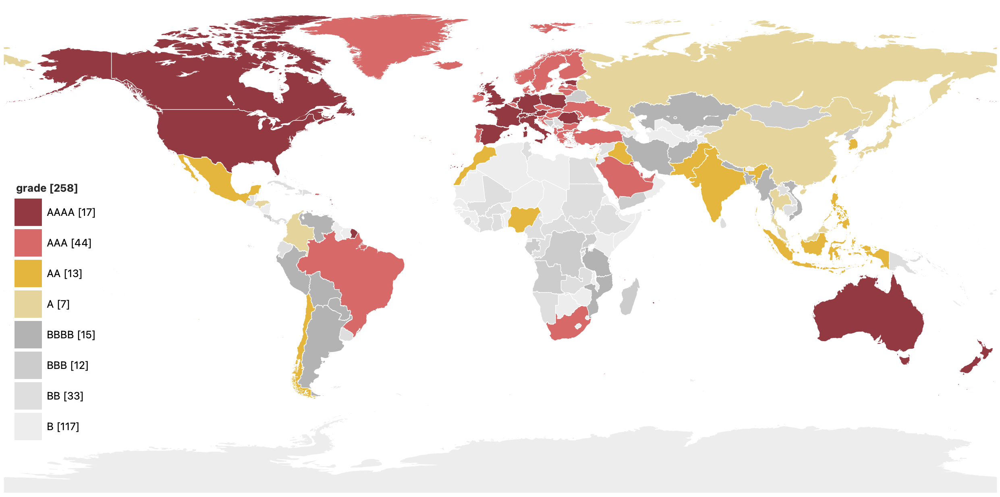

#### A range coverage by country

**AAAA:** Starting in 2017, we have rebuilt priority countries by importing authoritative, polygon-based records at all placetypes from region down to locality to provide **AAAA data quality** and coverage in: _Australia, Austria, Canada, Estonia, France, Germany, Hong Kong, Italy, Netherlands, New Zealand, Poland, Romania, Singapore, Spain, Switzerland, United Kingdom, and United States._

**AAA:** Other countries in North America, Europe, Middle East, Asia, and elsewhere have had selective rebuilds at a mix of placetypes to provide **AAA data quality** and coverage using national mapping agency data – though possibly of an older vintage that may not reflect all recent administrative updates. _These include: Akrotiri Sovereign Base Area, Aland, Albania, Bahrain, Belgium, Brazil, Bulgaria, Croatia, Cyprus, Czechia, Denmark, Dhekelia Sovereign Base Area, Faroe Islands, Finland, Greece, Greenland, Guernsey, Hungary, Iceland, Ireland, Isle of Man, Kuwait, Latvia, Liechtenstein, Lithuania, Luxembourg, Moldova, North Macedonia, Northern Cyprus, Norway, Portugal, Puerto Rico, Qatar, San Marino, Saudi Arabia, Slovakia, Slovenia, South Africa, Sweden, Turkey, Ukraine, United Arab Emirates, and Vatican._

**AA:** WOF provides **AA data quality** with extensive (but not universal) polygon coverage at locality level in _Chile, India, Indonesia, Iraq, Israel, Mexico, Morocco, Nigeria, Pakistan, Palestine, Philipeans, South Korea, and Taiwan._ These polygons often date back to 2013 and represent the largest urban settlements.

**A:** WOF provides **A data quality** with approximate locality polygons in _China, Japan, Malaysia, Russia, and Thailand_. Several countries with extensive and higher quality point locality coverage, including: _Columbia and Honduras_.

#### B range coverage by country

**BBBB:** WOF provides BBBB quality data with dense point locality coverage in _Afghanistan, Argentina, Bangladesh, Baykonur, Bolivia, Iran, Kazakhstan, Mozambique, Myanmar, Nepal, Paraguay, Peru, Tanzania, Venezuela, and Vietnam._

**BBB:** WOF provides BBB quality data with dense point locality coverage in  _Angola, Belarus, Bosnia and Herzegovina, Congo (DRC), Costa Rica, Gabon, Madagascar, Mongolia, North Korea, Rwanda, Uganda, and Yemen._

**BB:** WOF provides BB quality date with medium density point locality coverage in _Armenia, Burkina Faso, Burundi, Cambodia, Cameroon, Central African Republic, Congo (ROC), Cuba, Dominican Republic, Ecuador, Egypt, Ethiopia, Ghana, Guatemala, Haiti, Ivory Coast, Kosovo, Kyrgyzstan, Laos, Mali, Montenegro, Namibia, Panama, Papua New Guinea, Serbia, Sierra Leone, South Sudan, Sri Lanka, Sudan, Syria, Tunisia, Uruguay, and Zambia._

**B:** WOF provides B quality date with basic density point locality coverage in_ Algeria, Azerbaijan, Belize, Benin, Bhutan, Botswana, Chad, Djibouti, El Salvador, Equatorial Guinea, Eritrea, eSwatini, Gambia, Georgia, Guinea, Guinea-Bissau, Guyana, Jamaica, Jordan, Kenya, Lesotho, Liberia, Libya, Malawi, Mauritania, Nicaragua, Niger, Oman, Senegal, Somalia, Somaliland, Suriname, Tajikistan, Togo, Turkmenistan, Uzbekistan, and Zimbabwe. This category also includes several smaller island countries._

NOTE: We still provide detailed region and county polygon coverage for all these to generate full administrative hierarchies, except counties in _Namibia, Botswana, Belarus, Bulgaria, Turkmenistan, and Uzbekistan. Greenland, Iceland, and Western Sahara do not have county subdivisions IRL._

### Data size by country

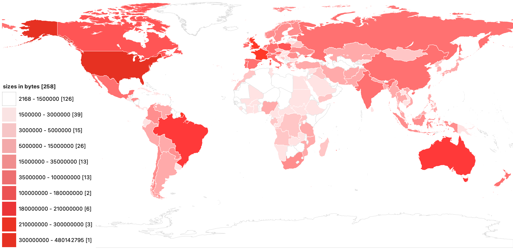

_NOTE: Methodology: [https://data.geocode.earth/wof/dist/shapefile/inventory.json](https://data.geocode.earth/wof/dist/shapefile/inventory.json) to get sizes per country._

Even though most countries are limited to locality points past the county polygon level, those features (and their properties including name localizations) can add up to sizable downloads, especially when mixed in with the polygon features.

### Features by country

Looking at “administrative” placetype features by country (country code), the trend mostly follows population density.

rank | country | count | .  | rank | country | count | .  | rank | country | count
---- | ------- | ----: | -- | ---- | ------- | ----: | -- | ---- | ------- | ----:
1 | China (CN) | 679,207 |  | 21 | Bangladesh (BD) | 48,696 |  | 41 | Austria (AT) | 23,458
2 | India (IN) | 509,567 |  | 22 | Philippines (PH) | 45,819 |  | 42 | Iraq (IQ) | 22,900
3 | United States (US) | 293,571 |  | 23 | Morocco (MA) | 45,577 |  | 43 | Mozambique (MZ) | 22,782
4 | Indonesia (ID) | 256,068 |  | 24 | Viet Nam (VN) | 41,889 |  | 44 | Bosnia & Herz. (BA) | 22,147
5 | Mexico (MX) | 232,389 |  | 25 | Spain (ES) | 41,443 |  | 45 | Netherlands (NL) | 21,912
6 | Russia (RU) | 203,058 |  | 26 | Peru (PE) | 40,653 |  | 46 | Malaysia (MY) | 21,102
7 | Germany (DE) | 167,516 |  | 27 | Myanmar (MM) | 39,287 |  | 47 | Portugal (PT) | 20,519
8 | Pakistan (PK) | 135,126 |  | 28 | Yemen (YE) | 39,204 |  | 48 | Lithuania (LT) | 19,988
9 | France (FR) | 122,484 |  | 29 | Congo (CD) | 36,677 |  | 49 | Taiwan (TW) | 18,687
10 | Thailand (TH) | 87,191 |  | 30 | Ukraine (UA) | 35,145 |  | 50 | Sri Lanka (LK) | 17,956
11 | Nepal (NP) | 80,713 |  | 31 | Colombia (CO) | 33,723 |  | 51 | Czechia (CZ) | 17,341
12 | Iran (IR) | 78,355 |  | 32 | Afghanistan (AF) | 32,419 |  | 52 | Romania (RO) | 16,666
13 | Brazil (BR) | 76,335 |  | 33 | Sweden (SE) | 31,859 |  | 53 | Angola (AO) | 16,585
14 | Italy (IT) | 73,273 |  | 34 | Korea (DPR) (KP) | 31,755 |  | 54 | Greece (GR) | 15,855
15 | Japan (JP) | 56,979 |  | 35 | Australia (AU) | 28,204 |  | 55 | Bolivia (BO) | 15,495
16 | Nigeria (NG) | 55,893 |  | 36 | Canada (CA) | 28,097 |  | 56 | South Africa (ZA) | 15,402
17 | Türkiye (TR) | 54,420 |  | 37 | Switzerland (CH) | 25,691 |  | 57 | Laos (LA) | 15,262
18 | Korea (KR) | 53,030 |  | 38 | Belarus (BY) | 25,276 |  | 58 | Finland (FI) | 15,143
19 | United Kingdom (GB) | 52,950 |  | 39 | Madagascar (MG) | 24,260 |  |  | Others | 659,904
20 | Poland (PL) | 51,522 |  | 40 | Venezuela (VE) | 23,819 |  |  | TOTAL | 5,018,244

### Depth of administrative levels by country

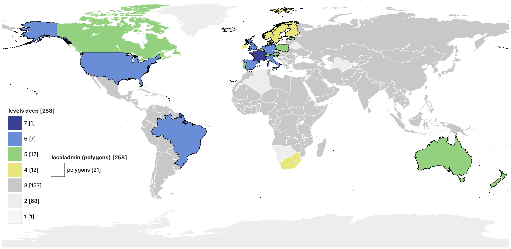

Who’s On First tracks 1st and 2nd order administrative divisions for most countries and dependencies (so three levels deep including `country` (and/or `dependency` and `empire`), `region`, and `county`). A handful only have 1st order divisions (2 levels). Around 39 countries include 4 to 7 administrative levels. Around 24 of those include features at the municipality (`localadmin`) level. We have point records only for `localadmin` in another 19 countries, and anticipate polygon features for this placetype can be imported for another 53 countries (see “[Future Directions](#improving-wof-data-coverage-and-quality)” section below).

_NOTE: All the countries in the map above also include `locality` points and polygons but because those don't form a continuous in-country or global fabric this level is excluded from the counts above._

### Vintage of data by country

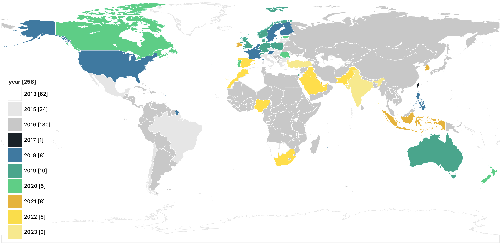

While 2013-era Quattroshapes is the skeleton for Who’s On First, we’ve substantially updated the gazetteer in the last decade. In 2015, we imported the original Quattroshapes polygon features to normalize them and otherwise clean them up. In 2016, we added polygons for 2nd order administrative divisions (“`county`”) for almost every country and dependency in the world. In 2017, we imported Quattroshapes point gazetteer and GeoNames “`locality`” points to provide global coverage at that placetype in all countries. Most country and dependency capitals and major metropolitan centers were updated with approximate `locality` polygons in 2021. Select countries have been rebuilt in whole or partially since 2017, including 42 countries in North America, Europe, and elsewhere.

Most of the **AAAA** and **AAA** countries (see section above) have a 5- or 10-year census, and we attempt to incorporate polygon data from their most recent census &/or INSPIRE-related open data efforts. Some eastern European countries have earlier 2013 vintage locality polygons. Generally region and county level changes less per year, with the localadmin level experiencing more consolidation and occasional splits on an annual basis (~1% change per year).

When Who’s On First observes a change in a country’s administrative subdivisions we add the new or changed features with an [inception](https://github.com/whosonfirst/whosonfirst-properties/blob/main/properties/edtf/README.md#inception) date, and mark the old ones with a [cessation](https://github.com/whosonfirst/whosonfirst-properties/blob/main/properties/edtf/README.md#cessation) date using the expressive U.S. [Library of Congress' Extended Date/Time Format](https://github.com/whosonfirst/whosonfirst-dates) (EDTF) syntax. When possible, we also point back and forth between new and old with [supersedes](https://github.com/whosonfirst/whosonfirst-properties/blob/main/properties/wof/README.md#supersedes) and [supersedes_by](https://github.com/whosonfirst/whosonfirst-properties/blob/main/properties/wof/README.md#superseded_by) properties. This allows older administrative units to be queried within a date range in the SQLite distribution (while the Shapefile distribution excludes non-current records). We’ve also experimented with the same for countries, like the former [Yugoslavia](https://whosonfirst.org/blog/2017/06/29/tackling-space-and-time-in-whosonfirst/), which we discussed in an earlier blog post, and for the 2016 French “region” level consolidation (for example the WOF `macroregion` of [Rhone-Alpes](https://spelunker.whosonfirst.org/id/404227439/) was consolidated into the new  [Auvergne-Rhone-Alpes](https://spelunker.whosonfirst.org/id/1108826389/) WOF `macroregion`).

We catalog changes to our place data in the [CHANGELOG](https://github.com/whosonfirst-data/whosonfirst-data/blob/master/CHANGELOG.md) by year, month, and country.

### Select data properties

##### Population by placetype

By tracking population (and the related population_rank), similarly named places can be ranked and disambiguated in search and visually distinguished in map display. For example, there are many places named [San Francisco](https://spelunker.whosonfirst.org/search/?q=san+francisco) in the world, but only [one](https://spelunker.whosonfirst.org/id/85922583/) with an exact name match also with the largest population located in the California region of the United States.

For global coverage placetypes like continent, country (and dependency), region, county, and locality the population should eventually sum to the planet’s population – modulo import vintage and population growth and the “per global” provides an coverage &/or accuracy scoring. For other placetypes like macroregion and localadmin they should sum to the population in the covered countries (not included in the table). Other placetypes are not available globally so the “per global” indicates the global significance of that placetype when viewed by population instead of feature count.

_(below) This chart sums available population values on WOF records grouped by placetype. Some placetypes that have global coverage should sum to the current “per global” population estimate of 7.888 billion people but currently may not because (a) the vintage of per feature population estimates either lags behind actual population growth or may over-estimate population e.g. because of disputed territories and (b) some features lack population entirely._

placetype | population | per global
--------- | ---------: | ---------:
borough   | 29,474,816    | 0.40%
campus    | 133,650       | 0.00%
continent | 7,627,184,440 | 96.70%
country   | 7,175,089,564 | 91.00%
county    | 4,934,055,579 | 62.60%
dependency | 16,724,919   | 0.20%
disputed  | 461,098,876   | 5.80%
empire    | 2,009,661,518 | 25.50%
localadmin | 963,706,749  | 12.20%
locality  | 5,717,437,257 | 72.50%
macrocounty | 231,167     | 0.00%
macrohood | 4,034,954     | 0.10%
macroregion | 94,515,886  | 1.20%
marinearea |              | 0.00%
marketarea |              | 0.00%
microhood  | 51,741       | 0.00%
neighbourhood | 411,640,484 | 5.20%
ocean      |              | 0.00%
planet     |              | 0.00%
region     | 9,300,891,860 | 117.90%
timezone   |              | 0.00%
unknown    |              | 0.00%

##### Zoom ranges by placetype

Some records should be displayed earlier on a map and some later, and not all features within the same placetype are equal. For example, region subdivisions in the United States are large geographically compared regions in Albania so the former should be shown earlier and the latter shown later. This is especially true of localities where most localities can be labeled on a zoom 12 map – but only a few shown on a zoom 2 map (especially considering name translations within a limited vector tile budget).

A few areas stand out for future work: county zooms should be spread out (mostly increasing them from zoom 6 to later zooms and as an offset for their parent region’s zoom), some localadmin are visible too early, some macrohood are visible too late, and some neighbourhood and microhood are visible too early – this can be mitigated in application logic when using the data but we should clean it up at the source.

_(below) This chart counts available min_zoom values on WOF records grouped by placetype. Course placetypes group features that are suitable for labeling on a low-zoom world map as “countries” or their 1st and 2nd order subdivisions, generally from zooms 0 thru 8 (though some counties should label later). Settlement placetypes include both locality and localadmin and are rarely labeled at low zooms, typically coming in the mid-zooms of 9, 10, 11, 12, and 13. Neighbourhood placetypes are subdivisions of settlements and generally should only be displayed at high-zooms of 11 thru 17._

Course placetypes | `min_zoom` | count | . | Settlement placetypes | `min_zoom` | count | . | Neighbourhood placetypes | `min_zoom` | count
----------------- | :--------- | ----: | -- | --------------------- | :--------- | ----: | -- | ------------------------ | :--------- | ----:
continent | 0 | 7 |  | localadmin | 3 | 5 |  | borough | 9 | 2
continent | 1 | 1 |  | localadmin | 4 | 50 |  | borough | 10 | 204
country | 0 | 4 |  | localadmin | 4.7 | 1 |  | borough | 11 | 63
country | 1.7 | 19 |  | localadmin | 5 | 60 |  | borough | 12 | 60
country | 2 | 26 |  | localadmin | 5.1 | 1 |  | borough | 13 | 39
country | 2.5 | 5 |  | localadmin | 5.6 | 3 |  | borough | 14 | 20
country | 3 | 54 |  | localadmin | 6 | 182 |  | borough | 15 | 3
country | 4 | 60 |  | localadmin | 6.7 | 13 |  | borough | 18 | 4
country | 4.5 | 11 |  | localadmin | 7 | 297 |  | borough |  | 0
country | 5 | 34 |  | localadmin | 8 | 681 |  | campus | 0 | 1
country | 6 | 1 |  | localadmin | 9 | 2054 |  | campus | 12 | 165
country |  | 0 |  | localadmin | 10 | 2302 |  | campus | 13 | 22705
county | 5.6 | 1 |  | localadmin | 11 | 26558 |  | campus | 14 | 1
county | 6 | 37206 |  | localadmin | 12 | 68889 |  | campus |  | 0
county | 6.1 | 1 |  | localadmin |  | 0 |  | macrohood | 11 | 9
county | 6.7 | 6 |  | locality | 1.7 | 8 |  | macrohood | 12 | 78
county | 7 | 9 |  | locality | 2 | 8 |  | macrohood | 13 | 970
county | 8 | 33 |  | locality | 2.1 | 14 |  | macrohood | 14 | 89
county | 8.7 | 5 |  | locality | 2.5 | 3 |  | macrohood | 15 | 46
county | 9 | 76 |  | locality | 2.7 | 3 |  | macrohood | 16 | 9
county | 10 | 112 |  | locality | 3 | 34 |  | macrohood | 17 | 1
county |  | 0 |  | locality | 3.7 | 30 |  | macrohood | 21 | 3
dependency | 0 | 4 |  | locality | 4 | 312 |  | macrohood |  | 0
dependency | 3 | 3 |  | locality | 4.7 | 27 |  | microhood | 11 | 1
dependency | 3.5 | 1 |  | locality | 5 | 450 |  | microhood | 12 | 14
dependency | 4 | 10 |  | locality | 5.1 | 165 |  | microhood | 13 | 81
dependency | 4.5 | 10 |  | locality | 5.6 | 400 |  | microhood | 14 | 255
dependency | 5 | 10 |  | locality | 5.7 | 2 |  | microhood | 15 | 604
dependency | 6.5 | 2 |  | locality | 6 | 1787 |  | microhood | 16 | 1021
dependency | 7 | 2 |  | locality | 6.1 | 563 |  | microhood | 17 | 33
dependency |  | 0 |  | locality | 6.7 | 2044 |  | microhood | 18 | 25
disputed | 0 | 35 |  | locality | 7 | 2512 |  | microhood | 19 | 89
disputed | 3.7 | 7 |  | locality | 8 | 3294 |  | microhood |  | 0
disputed | 4 | 3 |  | locality | 9 | 12118 |  | neighbourhood | 0 | 70
disputed | 4.7 | 2 |  | locality | 10 | 10441 |  | neighbourhood | 2 | 2
disputed | 5 | 16 |  | locality | 11 | 295462 |  | neighbourhood | 2.5 | 1
disputed | 6 | 5 |  | locality | 12 | 3845767 |  | neighbourhood | 3 | 1
disputed | 6.7 | 1 |  | locality | 13 | 73875 |  | neighbourhood | 4 | 4
disputed | 7 | 34 |  | locality | 14 | 84 |  | neighbourhood | 5 | 3
disputed |  | 0 |  | locality | 15 | 110 |  | neighbourhood | 5.1 | 4
empire |  | 0 |  | locality | 16 | 9 |  | neighbourhood | 5.6 | 4
macrocounty | 5 | 148 |  | locality | 17 | 1 |  | neighbourhood | 6 | 6
macrocounty |  | 0 |  | locality | 20 | 792 |  | neighbourhood | 6.1 | 1
macroregion | 3 | 78 |  | locality | 30 | 18702 |  | neighbourhood | 6.7 | 11
macroregion | 11 | 3 |  | locality |  | 0 |  | neighbourhood | 7 | 15
macroregion |  | 0 |  |  |  |  |  | neighbourhood | 8 | 16
marinearea | 2 | 24 |  |  |  |  |  | neighbourhood | 9 | 79
marinearea | 4 | 32 |  |  |  |  |  | neighbourhood | 10 | 43
marinearea | 5 | 13 |  |  |  |  |  | neighbourhood | 11 | 741
marinearea | 5.7 | 44 |  |  |  |  |  | neighbourhood | 12 | 14937
marinearea | 6 | 74 |  |  |  |  |  | neighbourhood | 13 | 11515
marinearea | 7 | 13 |  |  |  |  |  | neighbourhood | 14 | 21666
marinearea | 7.6 | 59 |  |  |  |  |  | neighbourhood | 14.5 | 189
marinearea | 7.7 | 36 |  |  |  |  |  | neighbourhood | 15 | 162012
marinearea | 7.8 | 23 |  |  |  |  |  | neighbourhood | 15.2 | 776
marinearea |  | 0 |  |  |  |  |  | neighbourhood | 15.5 | 350
marketarea |  | 0 |  |  |  |  |  | neighbourhood | 16 | 6556
ocean | 1 | 7 |  |  |  |  |  | neighbourhood | 16.5 | 761
planet |  | 0 |  |  |  |  |  | neighbourhood | 17 | 1499
region | 2 | 72 |  |  |  |  |  | neighbourhood | 18 | 372
region | 3 | 28 |  |  |  |  |  | neighbourhood | 19 | 279
region | 4 | 121 |  |  |  |  |  | neighbourhood | 20 | 71
region | 4.5 | 1 |  |  |  |  |  | neighbourhood | 21 | 17
region | 4.6 | 112 |  |  |  |  |  | neighbourhood | 26 | 1
region | 4.7 | 83 |  |  |  |  |  | neighbourhood |  | 0
region | 5 | 10 |  |  |  |  |  |  |  |
region | 6 | 130 |  |  |  |  |  |  |  |
region | 6.6 | 335 |  |  |  |  |  |  |  |
region | 6.7 | 301 |  |  |  |  |  |  |  |
region | 7 | 272 |  |  |  |  |  |  |  |
region | 7.7 | 516 |  |  |  |  |  |  |  |
region | 8 | 821 |  |  |  |  |  |  |  |
region | 8.7 | 323 |  |  |  |  |  |  |  |
region | 9 | 503 |  |  |  |  |  |  |  |
region | 10 | 715 |  |  |  |  |  |  |  |
region | 11 | 647 |  |  |  |  |  |  |  |
region | 18 | 113 |  |  |  |  |  |  |  |
region |  | 0 |  |  |  |  |  |  |  |
timezone |  | 0 |  |  |  |  |  |  |  |
unknown |  | 0 |  |  |  |  |  |  |  |

_NOTE: The zoom ranges in the table above are for standard 256 px sized tiles, which map to the following [natural scales](https://web.archive.org/web/20230329004638/https://kelsocartography.com/blog/?p=2407) and match Leaflet and Google Maps. When viewed in the Mapbox or MapLibre rendering library the zooms will be offset by 1 due to their assumption about 512 px size._

### Improving WOF data coverage and quality

As human population grows (and declines) so the world’s heart beats, and so our work as gazetteer maintainers carries on – by both [repainting](https://www.goldengate.org/bridge/bridge-maintenance/painting-the-bridge/) and “touching up” the data.

Our top two priorities in 2023 are:

1. Improve locality coverage in India, and
2. expand localadmin coverage globally

We expect to land the India locality coverage by June this year with polygons for most localities and points for smaller rural villages.

Our localadmin efforts are largely focused on achieving complete coverage in Europe, introducing localadmin coverage in Africa, and expand localadmin coverage in Asia and South America.

Priority countries (blue outlines below) include: Indonesia, Mexico, Ireland, Portugal, Belgium, and Luxembourg. An additional 26 countries (black outlines below) have been prioritized for minor edits or more complete imports &/or rebuilds. Please [reach out](#contact-whos-on-first) to help :)

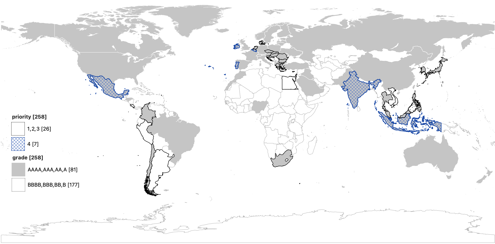

#### Detailed plan for 2023

We have sourced for import in 2023 new data from national mapping agencies in 12 countries, potential NMA data in another 7 countries, 39 countries at the localadmin level via the [geoBoundaries](https://www.geoboundaries.org/) project, and need to review licenses on another 17 localadmin geoBoundaries countries. We’re still searching for data in several priority countries, including Costa Rica, Egypt, Peru, and Thailand.

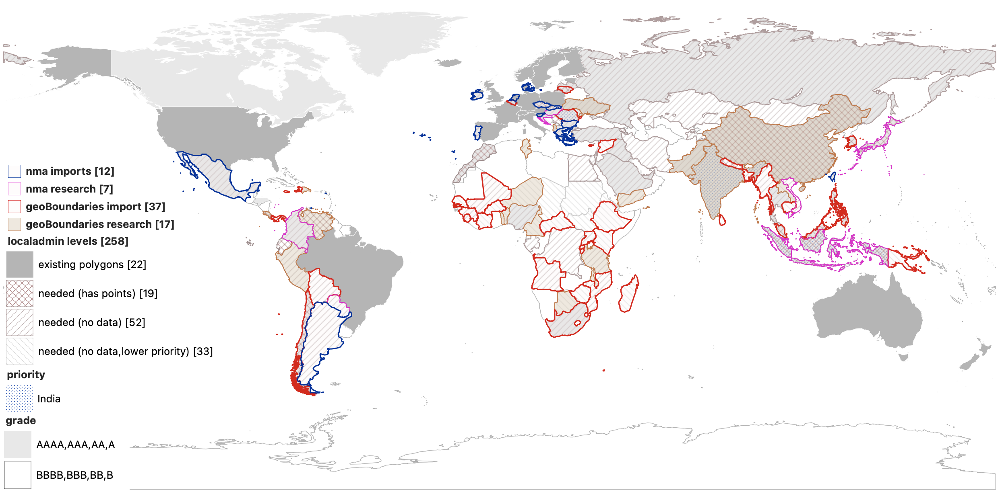

For densely populated countries with complex administrative subdivisions (like in China and India), we may consider adding an optional `microcounty` placetype between county and localadmin.

While we don’t have concrete plans for expanding `postalcode` or `constituency` coverage, if those are important to you please reach out. Two tractable problems are importing newer open polygon data for `postalcode` features in Europe and rescuing point geometry `postalcode` records that are visiting Null Island.

## Localization

Who’s On First includes name localizations ([L10n](https://en.wikipedia.org/wiki/Internationalization_and_localization)) into 494 languages. Individual language coverage ranges from rich to sparse. Major cities like [New York](https://spelunker.whosonfirst.org/id/85977539/) are translated into most of the languages, but a rural locality is probably only provided in the local language and translated into English and/or the latin character set.

While the source GeoJSON and SQLite distribution include all languages, for Shapefiles we provide a more ergonomic experience by pre-joining the SPR to the names table to include the default and 25 more localized names, when available, for:

> Arabic, Bengali, Chinese (simplified and/or traditional), Dutch, English, Farsi, French, German, Greek, Hebrew, Hindi, Hungarian, Indonesian, Italian, Japanese, Korean, Polish, Portuguese, Russian, Spanish, Swedish, Turkish, Ukrainian, Urdu, and Vietnamese

Who’s On First [uses](https://github.com/whosonfirst/whosonfirst-names#rfc-5646-bcp-47-comformance) the RFC 5646 / BCP-47 [language indications](https://www.loc.gov/standards/iso639-2/php/code_list.php) for names to specify a 3-character code for the name translations, like `name:{language}_x_preferred` in the GeoJSON and `name_{locale}` in the Shapefiles. For example, English is stored as `name:eng_x_preferred` in the GeoJSON and `name_eng` in the Shapefiles.

The list of supported Shapefile languages is adapted from [Natural Earth](https://github.com/nvkelso/natural-earth-vector/tree/master/tools/wikidata#supported-languages--now-26) and [Tilezen's](https://github.com/tilezen/vector-datasource/blob/master/docs/SEMANTIC-VERSIONING.md#languages-are-not-versioned) list of core languages. Arabic, Chinese, English, French, Russian and Spanish are used by the United Nations for meetings and official documents. The other languages listed are either proposed as an official language of the United Nations (Bengali, Hindi, Portuguese, and Turkish) or frequently used in OpenStreetMap, Who's On First, or Wikipedia.

If you need to discern the “local” name for a given place record, the parent `country` record indicates [official](https://github.com/whosonfirst/whosonfirst-properties/tree/main/properties/wof#lang_x_official) and/or [spoken language](https://github.com/whosonfirst/whosonfirst-properties/tree/main/properties/wof#lang_x_spoken) codes. In some countries the parent `region` (or `macroregion`) record will also indicate language preferences (like [Catalonia](https://spelunker.whosonfirst.org/id/404227379/) in [Spain](https://spelunker.whosonfirst.org/id/85633129/)), which can allow for local variations.

By current WOF convention, a feature’s default name is stored in ASCII-7 English. For latin script based languages you can maximize localized name coverage by coalescing `name:{lang}_x_preferred`, `name:eng_x_preferred`, and `wof:name`. Specific coalesce logic depends on your application and the locale(s) used by your audience.

### Localized name coverage by placetype

By convention, Who’s On First tracks a single “preferred” name spelling per language for a place. Because of the many different ways to [translate and/or transliterate](https://www.oneskyapp.com/blog/translation-vs-transliteration-vs-transcription/#:~:text=The%20sole%20purpose%20of%20translation,that%20make%20up%20each%20word.) a place’s name from one language into another WOF also allows multiple “variant” names per language. Some languages have formalized rules for transliterating into another, but those rules can evolve over longer spans of time (e.g. romanization of [Chinese](https://en.wikipedia.org/wiki/Romanization_of_Chinese)) and generate time and system variants. Languages without formalized transliteration rules can organically generate even more variants.

The large variation in names is one of the reasons gazetteers like Who’s On First assign unique IDs for our features and, when we discern a match in another gazetteer, provide ID crosswalk between the “this is the same as that” features.

placetype | feature count | Preferred names in all locales | Preferred in Shapefile locales | Alternate names in all locales | Alternate names in Shapefile locales
--------- | ------------: | -----------------------------: | -----------------------------: | -----------------------------: | -----------------------------------:
borough | 467 | 5,897 | 3,225 | 881 | 847
campus | 24,452 | 106,282 | 75,138 | 39,862 | 39,066
continent | 8 | 1,887 | 270 | 91 | 22
country | 232 | 53,977 | 7,756 | 13,493 | 4,218
county | 47,431 | 1,046,479 | 481,357 | 125,178 | 108,200
dependency | 43 | 5,228 | 1,214 | 1,702 | 908
disputed | 104 | 6,088 | 2,379 | 914 | 604
empire | 12 | 2,370 | 237 | 12 | 12
localadmin | 203,513 | 2,170,698 | 1,187,815 | 259,808 | 243,505
locality | 4,498,136 | 22,396,047 | 12,908,288 | 6,869,767 | 5,000,119
macrocounty | 482 | 13,908 | 6,965 | 1,281 | 1,251
macrohood | 1,272 | 10,067 | 5,882 | 1,641 | 1,616
macroregion | 117 | 9,227 | 2,600 | 789 | 418
marinearea | 402 | 16,438 | 7,264 | 1,609 | 1,063
marketarea | 210 | 4,771 | 1,577 | 433 | 433
microhood | 2,127 | 9,316 | 6,669 | 2,910 | 2,859
neighbourhood | 233,712 | 1,482,405 | 852,647 | 318,119 | 288,618
ocean | 7 | 1,504 | 238 | 107 | 37
planet | 1 | 258 | 26 | 29 | 17
region | 5,139 | 269,007 | 109,135 | 33,508 | 23,478
timezone | 376 | 753 | 752 | 380 | 380
TOTALS | 5,018,243 | 27,612,607 | 15,661,434 | 7,672,514 | 5,717,671

### Localized name coverage by language

The most common language in Who’s On First is English, followed by Chinese, and French. Rounding out the top 10 in ranked order are Russian, German, Dutch, Swedish, Spanish, Italian, and Polish.

The table below only includes the top 37 languages. A total of 63 languages have more than 100,000 preferred names. Another 45 languages have more than 50,000 preferred names.

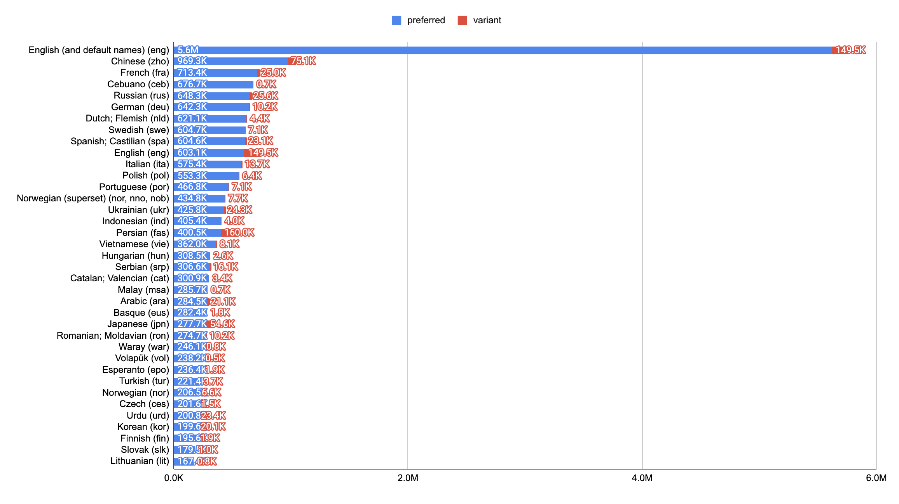

_NOTE: The default language for `wof:name` is English, so almost all records include an implicit default English name and many also include an explicit localized English name. The Cebuano `ceb` localizations are largely from a Wikipedia bot and are suspect so not included in the stats above. The Norwegian language uses multiple codes, including: `nno`, `nob`, and `nor`._

## Internationalization

For internationalization ([i18n](https://en.wikipedia.org/wiki/Internationalization_and_localization)), we track 104 “disputed” territories (polygons between countries for contested areas) around the world, and Who’s On First hold hands with Natural Earth allowing you to make use of their extensive catalog of pairwise points-of-view.

Disputed placetype records include an optional [`mz:hieararchy_label`](https://github.com/whosonfirst/whosonfirst-properties/tree/main/properties/mz#hierarchy_label) property (and related properties for each ancestor level in the placetype hierarchy) to indicate if place records that reverse geocode within the disputed area should include full, any, or partial text strings for that record's ancestors. For example, [Western Sahara](https://spelunker.whosonfirst.org/id/1159339507/) which, assuming a reverse geocoder like Pelias has implemented the flag, won’t include text for country or region ancestors but will allow showing locality names. We recommend using the Natural Earth point-of-views to localize the hierarchy label properties (e.g. to allow viewers within Morocco to also see country and region ancestor details).

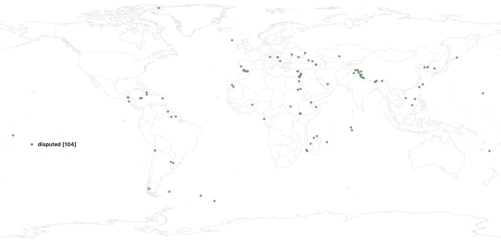

_NOTE: The [Hans Island](https://en.wikipedia.org/wiki/Whisky_War) disputed between Canada and Denmark has been resolved and needs to be updated. Huzzah diplomacy!_

## Open Data

Who’s On First’s permissive, [attribution required](https://github.com/whosonfirst-data/whosonfirst-data/blob/master/LICENSE.md) ([CC-BY](https://creativecommons.org/licenses/by/4.0/) equivalent) open license means you can use the data however you want (including for commercial purposes), as long as you provide credit somewhere in your map or app.

Crediting the Who's On First project is required because some of the open data projects that WOF aggregates require attribution. Linking back to the License is required in [hypermedia](https://en.wikipedia.org/wiki/Hypermedia) projects.

For example, on a website or in an app’s about page, you should also include the License hyperlink:

> Data from Who's On First. [License](https://whosonfirst.org/docs/licenses/).

For example, in a web map’s sources (displayed on the map), hyperlinked to the License:

> [Who's On First](https://whosonfirst.org/docs/licenses/)

Where the “License” text (or project name) hyperlinks either to the whosonfirst.org hosted license page, or to a detailed data licenses page (or section of your terms of service) on your web site or in your app. At that location, you must credit the Who’s On First sources that require attribution. It may be more practical to credit both Who’s On First and all of our sources – it’s the kind thing to do.

For stand alone print maps, a simple text credit to the project will suffice:

> Who's On First

If the map is included in a book or atlas publication then the data credits section should also repeat the Who’s On First credit and the web link (https://whosonfirst.org/docs/licenses/).

## Sources

The Who's On First dataset is both an original work and a modification of existing open data. The WOF gazetteer includes data from 360 sources. There are 139 primary sources, 188 additional sources via Quattroshapes, Mesoshapes, and other aggregators, and 33 concordance-only sources.

Sources include national mapping agencies in: [United States](https://github.com/whosonfirst/whosonfirst-sources/blob/main/sources/README.md#united-states-census-bureau) (US Census), [Australia](https://github.com/whosonfirst/whosonfirst-sources/blob/main/sources/README.md#australian-government-open-data-portal) (PSMA and ABS), [Austria](https://github.com/whosonfirst/whosonfirst-sources/blob/main/sources/README.md#austria-open-data), [Belgium](https://github.com/whosonfirst/whosonfirst-sources/blob/main/sources/README.md#voorlopig-referentiebestand-gemeentegrenzen) (Geopunt), Brazil (IBGE via [Quattroshapes](https://github.com/whosonfirst/whosonfirst-sources/blob/main/sources/README.md#quattroshapes)), Canada (multiple, including Census Canada and Statistics Canada), [Denmark](https://github.com/whosonfirst/whosonfirst-sources/blob/main/sources/README.md#geodanmark), [Estonia](https://github.com/whosonfirst/whosonfirst-sources/blob/main/sources/README.md#republic-of-estonias-land-board-geoportal) (Land Board), [Finland](https://github.com/whosonfirst/whosonfirst-sources/blob/main/sources/README.md#nls-national-land-survey-of-finland) (National Land Survey), [France](https://github.com/whosonfirst/whosonfirst-sources/blob/main/sources/README.md#open-data-france) (IGN), [Germany](https://github.com/whosonfirst/whosonfirst-sources/blob/main/sources/README.md#bundesamt-fur-kartographie-und-geodasie) (BKG), [Ireland](https://github.com/whosonfirst/whosonfirst-sources/blob/main/sources/README.md#ordnance-survey-ireland) (Ordnance Survey), Italy (IGN via [Quattroshapes](https://github.com/whosonfirst/whosonfirst-sources/blob/main/sources/README.md#quattroshapes)), [Japan](https://github.com/whosonfirst/whosonfirst-sources/blob/main/sources/README.md#mesoshapes) (GSI), [Mexico](https://github.com/whosonfirst/whosonfirst-sources/blob/main/sources/README.md#instituto-nacional-de-estad%C3%ADstica-y-geograf%C3%ADa-inegi) (INEGI and IGN), [Netherlands](https://github.com/whosonfirst/whosonfirst-sources/blob/main/sources/README.md#centraal-bureau-voor-de-statistiek) (CBS and NLD Kadaster), [New Zealand](https://github.com/whosonfirst/whosonfirst-sources/blob/main/sources/README.md#land-information-new-zealand) (LINZ), [Norway](https://github.com/whosonfirst/whosonfirst-sources/blob/main/sources/README.md#geonorge-norway) (Geonorge), [Poland](https://github.com/whosonfirst/whosonfirst-sources/blob/main/sources/README.md#office-of-geodesy-and-cartography-poland) (GUGIK), [Portugal](https://github.com/whosonfirst/whosonfirst-sources/blob/main/sources/README.md#directorate-general-for-the-territorial-development-of-portugal) (DG Territorio), [Romania](https://github.com/whosonfirst/whosonfirst-sources/blob/main/sources/README.md#romanian-national-agency-for-cadastre-and-land-registration-ancpi) (ANCPI), Spain (IGN via [Quattroshapes](https://github.com/whosonfirst/whosonfirst-sources/blob/main/sources/README.md#quattroshapes)), [Sweden](https://github.com/whosonfirst/whosonfirst-sources/blob/main/sources/README.md#lantmateriet-sweden) (Lantmateriet), [Singapore](https://github.com/whosonfirst/whosonfirst-sources/blob/main/sources/README.md#singapore-open-data-portal), [Slovenia](https://github.com/whosonfirst/whosonfirst-sources/blob/main/sources/README.md#surveying-and-mapping-authority-of-the-republic-of-slovenia) (EPG), [South Africa](https://github.com/whosonfirst/whosonfirst-sources/blob/main/sources/README.md#the-municipal-demarcation-board-of-south-africa) (NBC and Municipal Demarcation Board), [Switzerland](https://github.com/whosonfirst/whosonfirst-sources/blob/main/sources/README.md#swisstopo) (SwissTopo), and [United Kingdom](https://github.com/whosonfirst/whosonfirst-sources/blob/main/sources/README.md#ordnance-survey) (Ordnance Survey).

Other global sources include: [GeoNames](https://github.com/whosonfirst/whosonfirst-sources/blob/main/sources/README.md#geonames), Yahoo’s [GeoPlanet](https://github.com/whosonfirst/whosonfirst-sources/blob/main/sources/README.md#yahoo-geoplanet), Foursquare’s [Quattroshapes](https://github.com/whosonfirst/whosonfirst-sources/blob/main/sources/README.md#quattroshapes), and Mapzen’s [Mesoshapes](https://github.com/whosonfirst/whosonfirst-sources/blob/main/sources/README.md#mesoshapes). Several of our founders and core contributors were instrumental in these other projects.

We detail all sources and their specific license, usage, and vintage metadata in the full [sources list](https://github.com/whosonfirst/whosonfirst-sources/blob/main/sources/README.md).

## Concordances

WOF includes a large number of concordances to allow our project to “hold hands” with other datasets – individual WOF records link to specific features in other open and closed gazetteer projects.

Not all sources include concordances, but when they do we indicate in the condances section the dataset prefix (like `gn` for GeoNames and `wd` for Wikidata) and the name of the unique identifier that project uses (mostly `id`, so put together `gn:id` and `wd:id` fully qualified property names).

Who’s On First tracks our sources in the [sources](https://github.com/whosonfirst/whosonfirst-sources/blob/main/sources/README.md) repo. Besides the concordances, WOF also notes the source for each geometry in the “[src:geom](https://github.com/whosonfirst/whosonfirst-properties/blob/main/properties/src/README.md#geom)” property (using the JSON “name” of the source) and imported properties from that source will have their name prepended with the “prefix” in the source’s JSON file. This is _mostly_ machine readable today and we’re working to make it fully machine readable soon.

_(below) Use the [sources list](https://github.com/whosonfirst/whosonfirst-sources/blob/main/sources/README.md) to decode the source project prefixes used in the following table._

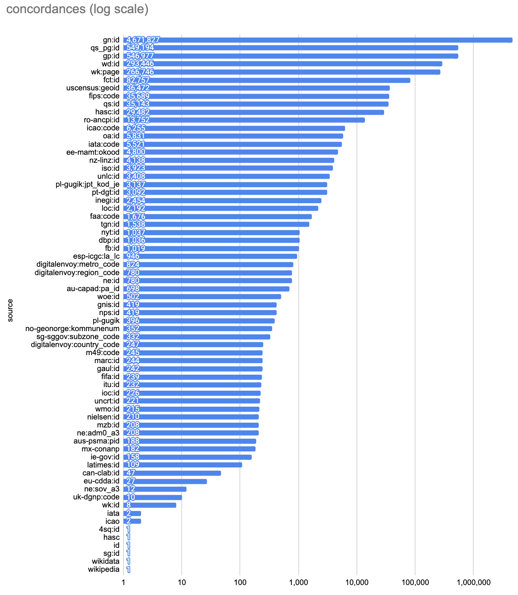

## Applications

When the Who’s On First (WOF) gazetteer started in 2015 we partnered closely with **[Pelias](https://pelias.io/)**, another [Mapzen](https://www.mapzen.com/) project, to ensure our big list of places could power:

* **Search** for forward geocoding based on full name string input and type-ahead “autocomplete” based on partial string matching per keystroke
* **Hierarchy** lookup allowing a place’s parent and other ancestors to be reverse geocoding from a given latitude, longitude input. Specific attention was paid to disputed territories and which hierarchy components should be masked in a reverse geocoding lookup.
* **Single feature display** with label centroids for polygons, label bounding boxes, detailed polygons.
* **Metrics logging** is possible because of WOF’s stable unique IDs – to turn data exhaust into insights about customer usage patterns.

The results of a search can then be pipped to **[Valhalla](https://valhalla.github.io/valhalla/)**, another [Mapzen](https://www.mapzen.com/) project for:

* **Routing** with polygon navigation and label “centroids” that are close to a place’s urban center rather than the math centroid of the polygon, and guaranteed to be on land.

Places can also be added to vector tiles **[Tilezen](https://tilezen.readthedocs.io/en/latest/layers/)**, another [Mapzen](https://www.mapzen.com/) project for:

* **Basemap** with label “centroids” for neighbourhood polygons.

All these [Mapzen](https://www.mapzen.com/) projects ([Who’s On First](https://www.whosonfirst.org/), [Pelias](https://pelias.io/), [Valhalla](https://valhalla.github.io/valhalla/), and [Tilezen](https://tilezen.readthedocs.io/en/latest/layers/)) are now part of the [Linux Foundation](https://www.linuxfoundation.org/) and are free for anyone to use and adapt.

### Future applications looking for collaboration and funding

* **Map display for label points**
    * **Label min zoom and label max zooms** exist but can to be fine tuned for global, multi-zoom basemaps (especially for county and locality placetypes)
    * **Population estimate** coverage expansion to determine relative label zoom and townspot size grading (for latest census counts)
* **Map display for thematic polygons**
    * **Min zoom and max zoom** variable per placetype and per country with area grading for a composite global, multi-zoom basemap
    * **Vector tilesets** (global and per placetype) with newer tools like [Tippicanoe](https://github.com/felt/tippecanoe) and [Planetiler](https://github.com/onthegomap/planetiler) delivered as serverless [PMTiles](https://protomaps.com/docs/pmtiles) archives
    * **Edge matching**of boundaries between countries
    * **Land clipping** of boundaries inside countries for terrestrial land mass. This is a partially addressed problem in the USA for data from the US Census, and sometimes occurs in Europe
    * **Quality checks** to ensure no feature dupes between placetypes (e.g. `localadmin` paired with `locality,` and `neighbourhood` paired with `localadmin`) and that historical features are marked not current
* **Single feature display**
    * **Preview polygons** with pre-cached, small “200 kb” display ready alternate geometries as existing default polygon geometries vary widely in size from a few KB to more than 50 MB. These are useful for displaying search results with a polygon (not just with a centroid zoomed to the bounding box).
* **Hierarchy**
    * **Disputed point-of-view:** For administrative hierarchy, further work to power “point-of-view” on the hierarchy masks, can be adapted from [Natural Earth](https://github.com/nvkelso/natural-earth-vector)’s efforts for automated reverse geocoding so users in various countries get locally adjusted polygon data instead of globally masked data
* **Names and Concordances**
    * **U.S. Board on Geographic Names:** Adding concordance IDs and toponymic information from the [Geographic Names Database](https://geonames.nga.mil/geonames/GNSHome/index.html), containing official standard names approved by the United States Board on Geographic Names (BGN) and maintained by the National Geospatial-Intelligence Agency.
* **Routing**
    * **Intersect with urbanized landcover** to ensure feature point geometries are inside urban areas and polygon feature’s navigation points are in the place’s urban center (ideally downtown)
* **Placetypes**
    * Expand **localadmin** placetypes globally (see section above)
    * Update **United States** placetypes for Census 2020 data releases
    * Update **European** placetypes for newer data releases, including in Germany, France, and Netherlands.
    * Add **Indonesia** placetypes for newer data releases
    * Add **Vietnam** placetypes for newer data releases
    * Update **Brazil** placetypes for newer data releases
    * Update **Mexico** placetypes for newer data releases
    * Expand **postalcode** polygon coverage using latest open map data, especially in Europe
    * Expand **constituency** coverage outside of the USA using latest open map data
    * Add **statistical aggregations** like NUTS and US Census
    * Add **metropolitan/micropolitan/rural area** globally using original research
    * Add **colloquial areas** (like [Outer Banks](https://en.wikipedia.org/wiki/Outer_Banks)) via crowdsourcing

### Example applications by placetype

When decomposing address data into placetypes (using [libPostal](https://www.mapzen.com/blog/inside-libpostal/), an [OpenAI prompt](https://help.openai.com/en/articles/6654000-best-practices-for-prompt-engineering-with-openai-api), or another tool), it can be helpful to think how those strings can geo match to Who’s On First records.

Decomposing Data... | ...into Data Sources
------------------- | --------------------
 | 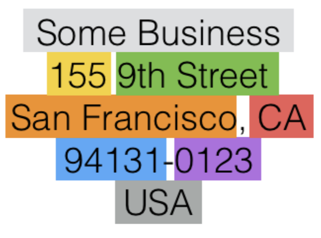

Who’s On First is a “coarse” geocoder meaning it doesn’t provide street level features. But WOF data can be complemented (as [Pelias](https://pelias.io/) does) with data from other open data projects, including: [OpenAddresses](https://openaddresses.io/), [All The Places](https://www.alltheplaces.xyz/), [Natural Earth](https://www.naturalearthdata.com/), and even the ODbL licensed [OpenStreetMap](https://www.openstreetmap.org/) for a complete geocoding solution.

If you need to process and deduplicate venue data using latitude, longitude, name, and address information we also recommend **Lieu** ([code repo](https://github.com/openvenues/lieu) and [blog post](https://www.mapzen.com/blog/whosonfirst-sotmus-2017)).

Sources                                             | Precision | Component | Example
--------------------------------------------------- | --------- | --------- | -----------------
[Who’s On First](https://whosonfirst.org/) and [All The Places](https://www.alltheplaces.xyz/) and [OpenStreetMap](https://www.openstreetmap.org/) | Exact  | Venue         | `Some Business`
[OpenAddresses](https://openaddresses.io/) and [All The Places](https://www.alltheplaces.xyz/) and  [OpenStreetMap](https://www.openstreetmap.org/) | Exact  | Street number | `155`
[OpenStreetMap](https://www.openstreetmap.org/)                                       | Fine   | Street name   | `9th Street`
[Who’s On First](https://whosonfirst.org/)                                      | Course | Locality      | `San Francisco`
[Who’s On First](https://whosonfirst.org/) and [Natural Earth](https://www.naturalearthdata.com/)                    | Course | Region        | `CA` _(short code for California)_
[Who’s On First](https://whosonfirst.org/)                                      | Course | Postcode      | `94131`
[OpenAddresses](https://openaddresses.io/)                                       | Fine   | Postcode+4    | `1234`
[Who’s On First](https://whosonfirst.org/) and [Natural Earth](https://www.naturalearthdata.com/)                    | Course | Country       | `USA` _(short code for United States of America)_

_NOTE: While our WOF gazetteer does include 21M venue records they are of an older vintage and do not reflect closed venues or recently opened venues. Depending on your needs, it may be better to use _[All The Places](https://www.alltheplaces.xyz/)_ (scraper project for international, national, and regional chains), _[OpenStreetMap](https://www.openstreetmap.org/)_ (caveat ODbL license restrictions), or license data from proprietary sources including [Foursquare](https://foursquare.com/)_, _[SafeGraph](https://www.safegraph.com/)_, [TripAdvisor](https://www.tripadvisor.com/) or [others](https://www.safegraph.com/guides/openstreetmap-api-alternative). Postalcode polygon country coverage can be augmented with proprietary sources like [MBI](https://www.mbi-geodata.com/en/area-boundaries/postcode-zip-boundary-maps/).

## Collaboration

Most people engage with the project by downloading and “reading” the data. In the course of using the data, you might find a few tools helpful both for finding specific records and for editing them to fix small problems in the data (like a misspelled name).

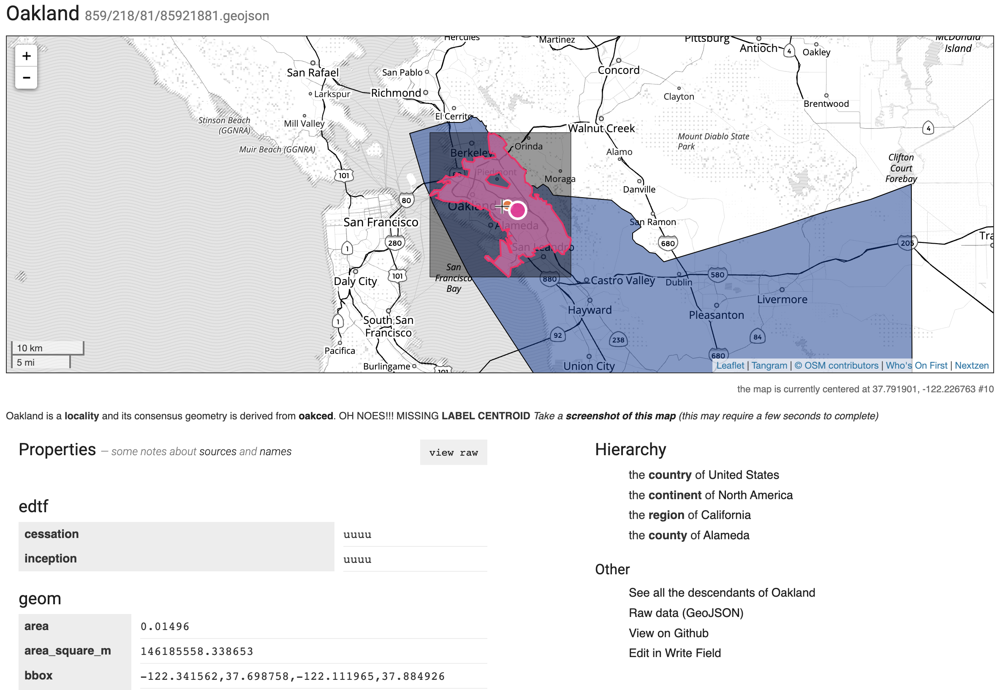

### View Who’s On First records

The **[Spelunker](https://spelunker.whosonfirst.org/)** is a web tool for browsing Who’s On First (shown in the screenshot immediately above) and includes search functionality. For example: [view New York](https://spelunker.whosonfirst.org/id/85977539/) city.

You can also View raw data on **[Github](https://github.com/whosonfirst-data/)**. Because navigating the many `whosonfirst-data` repos can be overwhelming, each individual WOF record self describes in which repo it can be found. For example, [view New York](https://github.com/whosonfirst-data/whosonfirst-data-admin-us/blob/master/data/859/775/39/85977539.geojson) city as raw GeoJSON.

### Editing of Who’s On First records

We use **[Write Field](https://writefield.nextzen.org/)** for quick property data edits. For example, [load New York city for editing](https://writefield.nextzen.org/place/edit?url=https://raw.githubusercontent.com/whosonfirst-data/whosonfirst-data-admin-us/master/data/859/775/39/85977539.geojson). This requires a Github account to create a pull request which can be reviewed by the WOF team.

For more complex and bulk imports we use **[QGIS](https://qgis.org/)** and scripts to iterate over files managed in git. This workflow is described in more detail in our recent [Shapefiles](https://whosonfirst.org/blog/2023/05/31/shapefiles/) blog post.

## Downloads

Accessibility facilitates access for all and Who’s On First data is available to download in several formats, including:

* [Shapefiles](https://geocode.earth/data/whosonfirst/) - for GIS mappers in applications like QGIS and ArcGIS
* [SQLite](https://geocode.earth/data/whosonfirst/) - for database driven applications

_Thanks to [Geocode Earth](https://geocode.earth/) for sponsoring processing and hosting of the downloads._

While we manage Who’s On First place records as individual text files in git repos hosted on Github, from the early days we’ve made “bundled” distributions available. Those distributions were more geared for software engineers than for a more general audience of map makers and cartographers.

**[Shapefile](https://geocode.earth/data/whosonfirst/)** downloads for the Who’s On First gazetteer were added in April 2023 as per-country ZIP archives including admin (country, region, county, locality, neighbourhood & more), postalcode, and constituency placetypes. They only contain basic properties, names, and geometries.

**[SQLite](https://geocode.earth/data/whosonfirst/)** databases contain the full firehose of Who's On First data, including mixed geometry types and full set of nested GeoJSON properties. Unlike the raw GeoJSON files in the git repos, data in the SQLite databases are organized into several tables, including: _spr, names, concordances, ancestors, and geojson_. Geometries (default and alternate) are stored as properties in the _geojson_ table. The field layout of the spr table is explained in the Standard Place Response section of the [Shapefiles](https://whosonfirst.org/blog/2023/05/31/shapefiles/) blog post.

## Sponsor Who’s On First

A large project like Who’s On First relies on good will to function, some amount of organization to sustain it year to year, and funding to pay data curation, engineering development, and internet server bills.

If you or your organization relies on Who’s On First please considering sponsoring us with a recurring or one-time donation. Please reach out to Nathaniel at [wofgazetteer@gmail.com](mailto:wofgazetteer@gmail.com?subject=Sponsoring&nbsp;the&nbsp;Who&#39;s&nbsp;On&nbsp;First&nbsp;places&nbsp;gazetteer) to discuss options.

## Contact Who’s On First

If you have feedback, please submit a [new issue](https://github.com/whosonfirst-data/whosonfirst-data/issues/new) or [discussion](https://github.com/whosonfirst-data/whosonfirst-data/discussions/new/choose) topic via Github.

[Subscribe to WOF Announcements](http://eepurl.com/ipOxd2) for "big news", via Mailchimp. Frequency is a few times per year. Subscribe now and you'll be first to know about our big India locality data drop!

Join our new [WOF Gazetteer discussion group](https://groups.google.com/g/wof-gazetteer) on Google to ask questions and share updates on your country's latest changes to its internal administrative subdivisions. If you're a geography geek, this one's for you.

Need to reach out privately? Email [wofgazetteer@gmail.com](mailto:wofgazetteer@gmail.com).

## Conclusion

Open gazetteers, including Who’s On First, have come a long way in the last 10 years – largely because of the success of the global open data movement. To the many people who have advocated with your local or national government to “free” this bounty of data, thank you!

Administrative borders are rarely “visible on the ground” and gazetteers that aggregate this data remain relevant by providing important and broad access to this type of map data. Each open gazetteer project has its particular license that reflects origin stories and day-to-day workflows.

At Who’s On First we’re proud to offer our over `5M` administrative places and another `25M` supplemental places – all with `CC-BY` attribution – allowing you to both read access and commercial use – with polygons, localization, and internationalization.

Who’s On First holds hands with 360 sources, has great name translations, with unique IDs, and has been confirmed to work in a wide range of applications, several of which have more than `300M` monthly active users globally.

While we can and will add even more data, we think there’s enough in Who’s On First for you to get started making a map or building an app today. We’re excited to see what you build!