[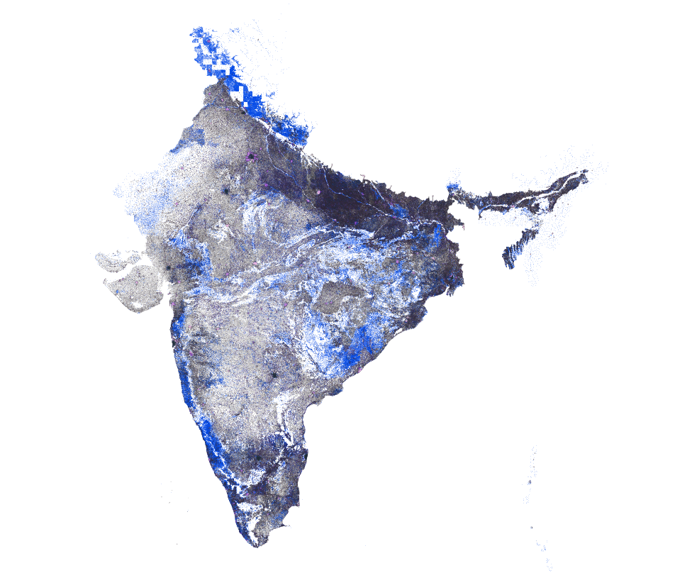]()

Printing Block (India); wood; 1957-123-6 <a href="https://collection.cooperhewitt.org/objects/18412045/">Collection of Cooper Hewitt Museum</a>.

# Improving Locality Coverage in India

Who’s On First now provides the best open data for towns and villages in India, with 915,468 locality records, thanks to the Karmashapes initiative.

_(above) Locality coverage of India, visualized. Polygon coverage shown in black, point coverage in blue._

In the Who’s on First gazetteer, a [locality](https://github.com/whosonfirst/whosonfirst-placetypes/tree/main#locality) represents an individual populated place regardless of population or size. While the number of villages in India is often quoted as being closer to 500,000 or 600,000 in total, the number of locality records is higher than this because localities are not limited to certain local government areas. As mentioned in the [State of the Gazetteer](https://whosonfirst.org/blog/2023/06/07/state-of-the-gazetteer/) blog post:

_“WOF gazetteer’s focus on localities and unique identifiers sets us apart from many other projects. We choose to approach geography at a personal level – starting with the locality (or populated place) where people play, study, work, and sleep – and country for when people need a passport to cross a frontier and experience something new and exciting."_

Over the last several years, we’ve improved India data coverage in Who’s On First through various projects; cleaning up [regions](https://github.com/whosonfirst-data/whosonfirst-data/pull/1341) for Indian states and union territories (including adding the new [Telengana](https://github.com/whosonfirst-data/whosonfirst-data/pull/1330) state and India’s many [border disputes](https://github.com/whosonfirst-data/whosonfirst-data/issues/496)), adding and refining polygons for the [100 largest localities](https://github.com/whosonfirst-data/whosonfirst-data/issues/1589) and then improving the [1,000 largest localities](https://github.com/whosonfirst-data/whosonfirst-data-admin-in/pull/124), and [adding neighbourhood records](https://github.com/whosonfirst-data/whosonfirst-data/issues/1593) to some of the largest metropolitan areas. We’ve also added extensive [name localization](https://github.com/whosonfirst-data/whosonfirst-data/issues/1763) in over a dozen common local languages, including Hindi, Bengali, Urdu, and Punjabi. And we’ve made many one-off fixes based on user feedback (examples: [1](https://github.com/whosonfirst-data/whosonfirst-data/issues/1788), [2](https://github.com/whosonfirst-data/whosonfirst-data/issues/1838), [3](https://github.com/whosonfirst-data/whosonfirst-data/issues/1855), and [4](https://github.com/whosonfirst-data/whosonfirst-data/issues/1874)).

Even with those earlier efforts, WOF heard consistent feedback from our users:

1. _Some localities are missing entirely from the WOF gazetteer_
2. _Some point localities are offset in WOF compared to their real ground position_
3. _Some polygon localities in WOF have the wrong shape compared with their real ground position (too small, too large, too coarse, or otherwise misshapen)_
4. _Existing locality data is sometimes miscategorized/misclassified and would be better represented as instead with a different WOF placetype of neighbourhood or borough_

These data gaps create challenges when operating location service applications like search and reverse geocoding for India. When a place is missing, it can’t be searched by name using a partial or complete text string. And the absence of places, incorrect centroids, and incorrect polygons for existing WOF places can cause reverse geocoding services to [hallucinate](https://en.wikipedia.org/wiki/Hallucination_(artificial_intelligence)#:~:text=In%20artificial%20intelligence%20(AI)%2C,insufficient%2C%20biased%20or%20too%20specialised.) when answering the question of _“What locality is here?”_

As anyone who’s searched for Indian map data knows, the sheer number of people and populated places, combined with the historic paucity of openly licensed and/or authoritative government data, has presented significant challenges. India recently [surpassed](https://www.un.org/development/desa/dpad/publication/un-desa-policy-brief-no-153-india-overtakes-china-as-the-worlds-most-populous-country/#:~:text=In%20April%202023%2C%20India's%20population,to%20grow%20for%20several%20decades.) China to become the most populous country on Earth with over 1.4 billion people; most are clustered in over 500,000 rural villages, yet some of the towns and urban areas have incredible density themselves.

The Karmashapes project was initiated to solve the data gap by mashing up several new and existing datasets, like the Indian Ministry of Rural Development’s recently released _Habitations_ open data layer. This work was done in partnership with [Justin Meyers](https://www.linkedin.com/in/justin--meyers/) at Revolutionary GIS.

After a year’s worth of development, we’re excited to announce a step change improvement for India locality coverage in Who’s On First – as openly licensed, CC-BY data.

# By the Numbers

We recently finished importing Karmashpes into WOF to generally improve coverage and address common user feedback. Doing so allows Karmashapes to also benefit from WOF’s [stable identifiers](https://github.com/whosonfirst/whosonfirst-properties/blob/main/properties/wof/id.json), [Github](https://github.com/whosonfirst-data/whosonfirst-data/) (as well as Github’s [issue tracking](https://github.com/whosonfirst-data/whosonfirst-data/issues) for future improvements), and to supplement with the [existing sources](https://github.com/whosonfirst/whosonfirst-sources/blob/main/sources/README.md) that WOF already maintains to fill in any coverage or localization gaps that the raw Karmashapes dataset might have.

Importing Karmashapes also allows any downstream consumer of WOF, like [Pelias](https://pelias.io/) via [Geocode.Earth](https://geocode.earth/) to benefit from the full scope of data Karmashapes provides. Let’s take a look at the locality and neighbourhood coverage now available in WOF:

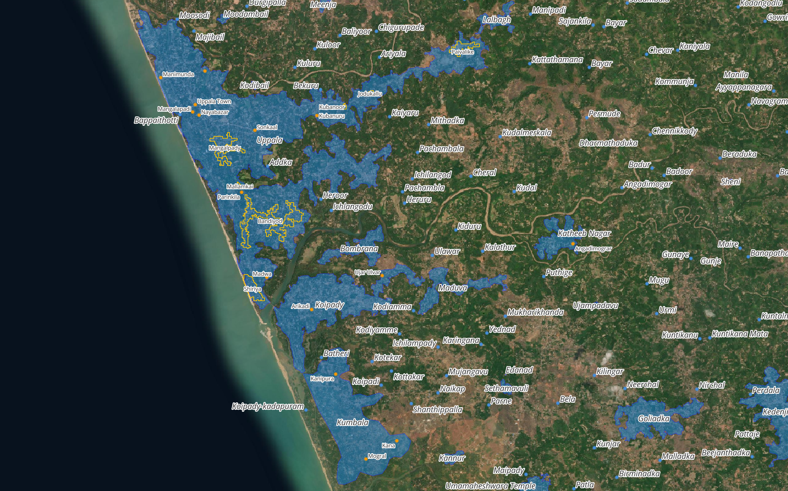
_(above) Locality (blue) and neighbourhood (orange) coverage along the northern Kerala coast_

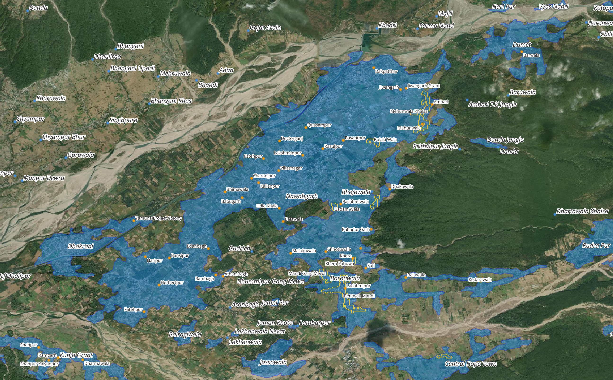
_(above) Locality (blue) and neighbourhood (orange) coverage northwest of Dehradun_

_(above) Locality (blue) and neighbourhood (orange) coverage in and around Chandigarh_

Above, you can see three areas of India - the northern Kerala coast, areas of Dehradun, and the greater Chandigarh area - with orange representing the neighbourhood placetype and blue representing the locality placetype. These example areas illustrate the complexity, density, and coverage that Karmashapes has added to Who’s On First.

Below are two charts - the first is a per-placetype feature count in WOF before and after the Karmashapes import, the second is a more detailed breakdown of neighbourhood and locality placetype counts per region of India.

<table>
  <tr>
   <td><strong>Placetype</strong>
   </td>
   <td><strong>WOF feature count, pre-Karmashapes</strong>
   </td>
   <td><strong>WOF feature count, post-Karmashapes</strong>
   </td>
  </tr>
  <tr>
   <td><em>Country</em>
   </td>
   <td><strong><em>1 total;</em></strong>

<em>1 polygon geometry</em>
   </td>
   <td><strong><em>1 total; 1 polygon geometry</em></strong>
   </td>
  </tr>
  <tr>
   <td><em>Region</em>
   </td>
   <td><strong><em>37 total; 37 polygons</em></strong>
   </td>
   <td><strong><em>37 total; 37 polygons</em></strong>
   </td>
  </tr>
  <tr>
   <td><em>County</em>
   </td>
   <td><strong><em>640 total; 640 polygons</em></strong>
   </td>
   <td><strong><em>640 total; 640 polygon</em></strong>
   </td>
  </tr>
  <tr>
   <td><em>Locality</em>
   </td>
   <td><strong><em>497,880 total; 1,546 polygons, 496,334 points</em></strong>
   </td>
   <td><strong><em>915,468 total; 553,804 polygons, 361,664 point</em></strong>
   </td>
  </tr>
  <tr>
   <td><em>Neighbourhood</em>
   </td>
   <td><strong><em>9,679 total:  1,302 polygons, 8,377 points</em></strong>
   </td>
   <td><strong><em>190,397 total; 25,312 polygons, 165,067 points</em></strong>
   </td>
  </tr>
</table>

_(above) A chart, per placetype, with pre and post Karmashapes feature counts, split by geometry type_

<table>
  <tr>
   <td><strong>State / Union Territory</strong>
   </td>
   <td><strong>Neighbourhood Feature Count, pre-Karmashapes import</strong>
   </td>
   <td><strong>Neighbourhood Feature Count, post-Karmashapes import</strong>
   </td>
   <td><strong>Locality Feature Count, pre-Karmashapes import</strong>
   </td>
   <td><strong>Locality Feature Count, post-Karmashapes import</strong>
   </td>
  </tr>
  <tr>
   <td><em>Andaman and Nicobar Islands</em>
   </td>
   <td><strong><em>3</em></strong>
   </td>
   <td><strong><em>8</em></strong>
   </td>
   <td><strong><em>96</em></strong>
   </td>
   <td><strong><em>166</em></strong>
   </td>
  </tr>
  <tr>
   <td><em>Andhra Pradesh</em>
   </td>
   <td><strong><em>239</em></strong>
   </td>
   <td><strong><em>8,433</em></strong>
   </td>
   <td><strong><em>23,567</em></strong>
   </td>
   <td><strong><em>43,563</em></strong>
   </td>
  </tr>
  <tr>
   <td><em>Arunachal Pradesh</em>
   </td>
   <td><strong><em>2</em></strong>
   </td>
   <td><strong><em>5</em></strong>
   </td>
   <td><strong><em>304</em></strong>
   </td>
   <td><strong><em>351</em></strong>
   </td>
  </tr>
  <tr>
   <td><em>Assam</em>
   </td>
   <td><strong><em>29</em></strong>
   </td>
   <td><strong><em>7,502</em></strong>
   </td>
   <td><strong><em>1,077</em></strong>
   </td>
   <td><strong><em>23,517</em></strong>
   </td>
  </tr>
  <tr>
   <td><em>Bihar</em>
   </td>
   <td><strong><em>366</em></strong>
   </td>
   <td><strong><em>20,781</em></strong>
   </td>
   <td><strong><em>37,075</em></strong>
   </td>
   <td><strong><em>56,473</em></strong>
   </td>
  </tr>
  <tr>
   <td><em>Chandigarh</em>
   </td>
   <td><strong><em>103</em></strong>
   </td>
   <td><strong><em>104</em></strong>
   </td>
   <td><strong><em>1</em></strong>
   </td>
   <td><strong><em>1</em></strong>
   </td>
  </tr>
  <tr>
   <td><em>Chhattisgarh</em>
   </td>
   <td><strong><em>84</em></strong>
   </td>
   <td><strong><em>2,400</em></strong>
   </td>
   <td><strong><em>15,551</em></strong>
   </td>
   <td><strong><em>29,401</em></strong>
   </td>
  </tr>
  <tr>
   <td><em>Dadra and Nagar Haveli</em>
   </td>
   <td><strong><em>1</em></strong>
   </td>
   <td><strong><em>4</em></strong>
   </td>
   <td><strong><em>32</em></strong>
   </td>
   <td><strong><em>46</em></strong>
   </td>
  </tr>
  <tr>
   <td><em>Daman and Diu</em>
   </td>
   <td><strong><em>3</em></strong>
   </td>
   <td><strong><em>5</em></strong>
   </td>
   <td><strong><em>21</em></strong>
   </td>
   <td><strong><em>20</em></strong>
   </td>
  </tr>
  <tr>
   <td><em>Delhi</em>
   </td>
   <td><strong><em>583</em></strong>
   </td>
   <td><strong><em>623</em></strong>
   </td>
   <td><strong><em>1</em></strong>
   </td>
   <td><strong><em>12</em></strong>
   </td>
  </tr>
  <tr>
   <td><em>Goa</em>
   </td>
   <td><strong><em>62</em></strong>
   </td>
   <td><strong><em>88</em></strong>
   </td>
   <td><strong><em>379</em></strong>
   </td>
   <td><strong><em>507</em></strong>
   </td>
  </tr>
  <tr>
   <td><em>Gujarat</em>
   </td>
   <td><strong><em>194</em></strong>
   </td>
   <td><strong><em>2,422</em></strong>
   </td>
   <td><strong><em>3,991</em></strong>
   </td>
   <td><strong><em>30,946</em></strong>
   </td>
  </tr>
  <tr>
   <td><em>Haryana</em>
   </td>
   <td><strong><em>307</em></strong>
   </td>
   <td><strong><em>1,393</em></strong>
   </td>
   <td><strong><em>6,908</em></strong>
   </td>
   <td><strong><em>7,712</em></strong>
   </td>
  </tr>
  <tr>
   <td><em>Himachal Pradesh</em>
   </td>
   <td><strong><em>125</em></strong>
   </td>
   <td><strong><em>138</em></strong>
   </td>
   <td><strong><em>19,426</em></strong>
   </td>
   <td><strong><em>20,845</em></strong>
   </td>
  </tr>
  <tr>
   <td><em>Jammu and Kashmir</em>
   </td>
   <td><strong><em>205</em></strong>
   </td>
   <td><strong><em>205</em></strong>
   </td>
   <td><strong><em>10,845</em></strong>
   </td>
   <td><strong><em>11,359</em></strong>
   </td>
  </tr>
  <tr>
   <td><em>Jharkhand</em>
   </td>
   <td><strong><em>39</em></strong>
   </td>
   <td><strong><em>4,245</em></strong>
   </td>
   <td><strong><em>6,934</em></strong>
   </td>
   <td><strong><em>36,023</em></strong>
   </td>
  </tr>
  <tr>
   <td><em>Karnataka</em>
   </td>
   <td><strong><em>906</em></strong>
   </td>
   <td><strong><em>7,004</em></strong>
   </td>
   <td><strong><em>28,462</em></strong>
   </td>
   <td><strong><em>62,045</em></strong>
   </td>
  </tr>
  <tr>
   <td><em>Kerala</em>
   </td>
   <td><strong><em>448</em></strong>
   </td>
   <td><strong><em>3,099</em></strong>
   </td>
   <td><strong><em>5,580</em></strong>
   </td>
   <td><strong><em>17,768</em></strong>
   </td>
  </tr>
  <tr>
   <td><em>Ladakh</em>
   </td>
   <td><strong><em>0</em></strong>
   </td>
   <td><strong><em>0</em></strong>
   </td>
   <td><strong><em>0</em></strong>
   </td>
   <td><strong><em>352</em></strong>
   </td>
  </tr>
  <tr>
   <td><em>Lakshadweep</em>
   </td>
   <td><strong><em>0</em></strong>
   </td>
   <td><strong><em>0</em></strong>
   </td>
   <td><strong><em>2</em></strong>
   </td>
   <td><strong><em>11</em></strong>
   </td>
  </tr>
  <tr>
   <td><em>Madhya Pradesh</em>
   </td>
   <td><strong><em>273</em></strong>
   </td>
   <td><strong><em>8,431</em></strong>
   </td>
   <td><strong><em>43,739</em></strong>
   </td>
   <td><strong><em>66,683</em></strong>
   </td>
  </tr>
  <tr>
   <td><em>Maharashtra</em>
   </td>
   <td><strong><em>708</em></strong>
   </td>
   <td><strong><em>7,253</em></strong>
   </td>
   <td><strong><em>20,402</em></strong>
   </td>
   <td><strong><em>76,022</em></strong>
   </td>
  </tr>
  <tr>
   <td><em>Manipur</em>
   </td>
   <td><strong><em>5</em></strong>
   </td>
   <td><strong><em>9</em></strong>
   </td>
   <td><strong><em>187</em></strong>
   </td>
   <td><strong><em>197</em></strong>
   </td>
  </tr>
  <tr>
   <td><em>Meghalaya</em>
   </td>
   <td><strong><em>3</em></strong>
   </td>
   <td><strong><em>14</em></strong>
   </td>
   <td><strong><em>187</em></strong>
   </td>
   <td><strong><em>238</em></strong>
   </td>
  </tr>
  <tr>
   <td><em>Mizoram</em>
   </td>
   <td><strong><em>2</em></strong>
   </td>
   <td><strong><em>2</em></strong>
   </td>
   <td><strong><em>164</em></strong>
   </td>
   <td><strong><em>184</em></strong>
   </td>
  </tr>
  <tr>
   <td><em>Nagaland</em>
   </td>
   <td><strong><em>2</em></strong>
   </td>
   <td><strong><em>13</em></strong>
   </td>
   <td><strong><em>132</em></strong>
   </td>
   <td><strong><em>150</em></strong>
   </td>
  </tr>
  <tr>
   <td><em>Odisha</em>
   </td>
   <td><strong><em>63</em></strong>
   </td>
   <td><strong><em>5,954</em></strong>
   </td>
   <td><strong><em>10,645</em></strong>
   </td>
   <td><strong><em>57,759</em></strong>
   </td>
  </tr>
  <tr>
   <td><em>Puducherry</em>
   </td>
   <td><strong><em>7</em></strong>
   </td>
   <td><strong><em>51</em></strong>
   </td>
   <td><strong><em>36</em></strong>
   </td>
   <td><strong><em>88</em></strong>
   </td>
  </tr>
  <tr>
   <td><em>Punjab</em>
   </td>
   <td><strong><em>327</em></strong>
   </td>
   <td><strong><em>2,021</em></strong>
   </td>
   <td><strong><em>11,234</em></strong>
   </td>
   <td><strong><em>13,922</em></strong>
   </td>
  </tr>
  <tr>
   <td><em>Rajasthan</em>
   </td>
   <td><strong><em>451</em></strong>
   </td>
   <td><strong><em>6,152</em></strong>
   </td>
   <td><strong><em>18,288</em></strong>
   </td>
   <td><strong><em>48,302</em></strong>
   </td>
  </tr>
  <tr>
   <td><em>Sikkim</em>
   </td>
   <td><strong><em>9</em></strong>
   </td>
   <td><strong><em>9</em></strong>
   </td>
   <td><strong><em>328</em></strong>
   </td>
   <td><strong><em>352</em></strong>
   </td>
  </tr>
  <tr>
   <td><em>Tamil Nadu</em>
   </td>
   <td><strong><em>879</em></strong>
   </td>
   <td><strong><em>10,859</em></strong>
   </td>
   <td><strong><em>17,807</em></strong>
   </td>
   <td><strong><em>48,330</em></strong>
   </td>
  </tr>
  <tr>
   <td><em>Telangana</em>
   </td>
   <td><strong><em>438</em></strong>
   </td>
   <td><strong><em>4,417</em></strong>
   </td>
   <td><strong><em>11,700</em></strong>
   </td>
   <td><strong><em>6,888</em></strong>
   </td>
  </tr>
  <tr>
   <td><em>Tripura</em>
   </td>
   <td><strong><em>1</em></strong>
   </td>
   <td><strong><em>972</em></strong>
   </td>
   <td><strong><em>72</em></strong>
   </td>
   <td><strong><em>6,102</em></strong>
   </td>
  </tr>
  <tr>
   <td><em>Uttar Pradesh</em>
   </td>
   <td><strong><em>2,198</em></strong>
   </td>
   <td><strong><em>72,163</em></strong>
   </td>
   <td><strong><em>140,462</em></strong>
   </td>
   <td><strong><em>176,615</em></strong>
   </td>
  </tr>
  <tr>
   <td><em>Uttarakhand</em>
   </td>
   <td><strong><em>246</em></strong>
   </td>
   <td><strong><em>1,679</em></strong>
   </td>
   <td><strong><em>10,425</em></strong>
   </td>
   <td><strong><em>21,072</em></strong>
   </td>
  </tr>
  <tr>
   <td><em>West Bengal</em>
   </td>
   <td><strong><em>372</em></strong>
   </td>
   <td><strong><em>10,612</em></strong>
   </td>
   <td><strong><em>3,562</em></strong>
   </td>
   <td><strong><em>43,286</em></strong>
   </td>
  </tr>
</table>

# Creating Karmashapes

Karmashapes was a journey into mapping India; it took years of patience, hundreds of emails and months to fully develop. But what exactly _is_ Karmashapes and _how_ was it developed?

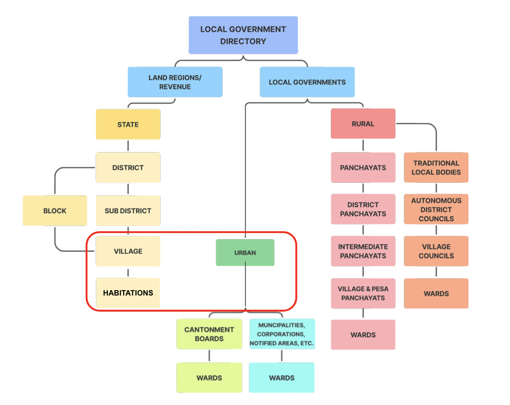
_(above) This image shows the placetype structure in India. The placetypes circled in red (village, habitations, and urban) are the placetypes that Karmashapes catalogs as `locality` records._

Well, this build wasn't possible until 2022, when five openly-licensed datasets were each available and combined to create Karmashapes; this included three vector datasets and two raster datasets.

Last year, the Indian Ministry of Rural Development ([PMGSY](https://geosadak-pmgsy.nic.in/opendata/)) openly released its ‘Habitations’ dataset. This was the first localities dataset released in India with a clear and friendly license. Geospatial census data from Columbia University’s Socioeconomic Data and Applications Center ([SEDAC](https://sedac.ciesin.columbia.edu/data/set/india-india-village-level-geospatial-socio-econ-1991-2001/data-download)) for all Indian villages helped confirm and verify the locations in the PMGSY dataset. Lastly, a vector dataset from the Geographic Names Server created by the National Geospatial-Intelligence Agency ([NGA](https://geonames.nga.mil/geonames/GNSHome/welcome.html)) was used to cross-reference PMGSY and SEDAC data.

Once a single cleaned and verified vector dataset was created, “unique candidate” urban area polygons were synthesized from two additional global raster datasets: the World Settlement Footprint ([WSFEVO](https://download.geoservice.dlr.de/WSF_EVO/)) Evolution from the German Aerospace Center (DLR) at 10m resolution and a global map of land use/land cover (LULC) derived from the European Space Agency’s (ESA) [Sentinel-2 imagery](https://www.arcgis.com/apps/instant/media/index.html?appid=fc92d38533d440078f17678ebc20e8e2), also at 10m resolution. These raster layers were converted to two additional vector datasets, which were used for an additional cross-reference for the primary vector datasets listed below.

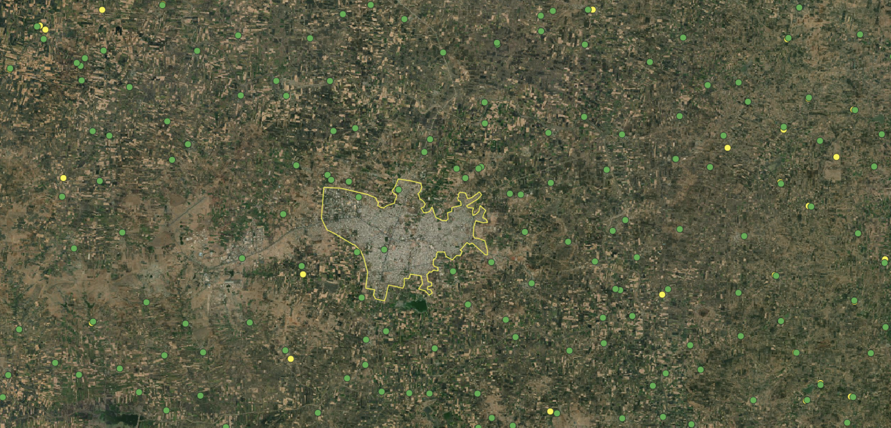

**[Pradhan Mantri Gram Sadak Yojana (PMGSY)](https://geosadak-pmgsy.nic.in/opendata/)**

* **Coverage:** 1,084,413 points
* **License**: CC-BY (equivalent)
* **Description**: Used for locality points across India. Population data may be gathered from this source.
* **Data Type**: Vector data.

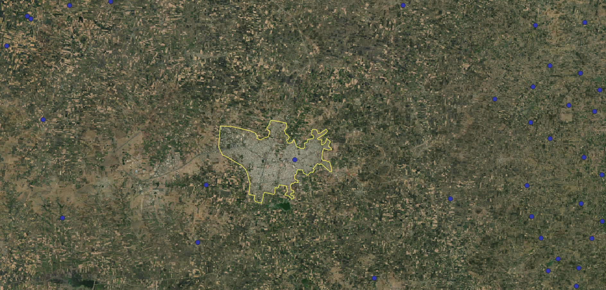

**[National Geospatial Intelligence Agency (NGA)](https://geonames.nga.mil/geonames/GNSHome/welcome.html)**

* **Coverage:** 573,007 points
* **License**: Public Domain
* **Description**: These are settlement points, and actually exist in Verrazano today as GeoNames-sourced localities. We may be sourcing new localities from NGA, since the initial GeoNames import occurred in ~2018. We may also get names from this source.
* **Data Type**: Vector data.

 Evolution example")

**[World Settlement Footprint (WSF) Evolution - Landsat-5/7 Dataset (WSFEVO)](https://download.geoservice.dlr.de/WSF_EVO/)**

* **Coverage:** 2,323,907 polygons
* **License**: CC-BY 4.0
* **Description**: Raw raster data, being converted into vector data. Place counts represent cell count from raster > vector conversion.
* **Data Type**: Vectorized raster data

**[Socioeconomic Data and Applications Center (SEDAC) / Center for International Earth Science Information Network (CIESIN)](https://sedac.ciesin.columbia.edu/data/set/india-india-village-level-geospatial-socio-econ-1991-2001/data-download)**

* **Coverage:** 627,199 polygons
* **License**: CC-BY
* **Description**: Used for locality polygons across India (1991 & 2001 vintage). Population data may be gathered from this source.
* **Data Type**: Vector data.

**[Sentinel-2 10m Land Use/Land Cover (ESRI, Microsoft, National Geographic)](https://www.arcgis.com/apps/instant/media/index.html?appid=fc92d38533d440078f17678ebc20e8e2)**

* **Coverage:** 3,377,461 polygons
* **License**: CC-BY 4.0
* **Description**: Raw raster data, being converted into vector data. Place counts represent cell count from raster > vector conversion.
* **Data Type**: Vectorized raster data

**[Global Human Settlement Layer (GHSL)](https://ghsl.jrc.ec.europa.eu/ghs_stat_ucdb2015mt_r2019a.php)**

* **Coverage:** 3,242,056 polygons
* **License**: CC-BY 4.0
* **Description**: Raw raster data, being converted into vector data. Place counts represent cell count from raster > vector conversion. Being used to “optimize” urban localities; if GHSL points fell within one of the raster data sources, a place would be considered valid.
* **Data Type**: Vectorized raster data

**Honorable mention:** After the Karmashapes data initiative was completed and as we were importing Karamashapes into Who’s On First, the [SHRUG](https://www.devdatalab.org/shrug) version 2 (Socioeconomic High-resolution Rural-Urban Geographic Platform for India) dataset from Development Data Lab was released. SHRUG includes 500,000 villages and 8,000 towns with data attributes covering a span of 25 years, all linked together with a set of common geographic identifiers. While the SHURG v2 CC-BY-NC-SA license limits it for non-commercial projects or direct import into Who’s On First, this could be an area of future collaboration.

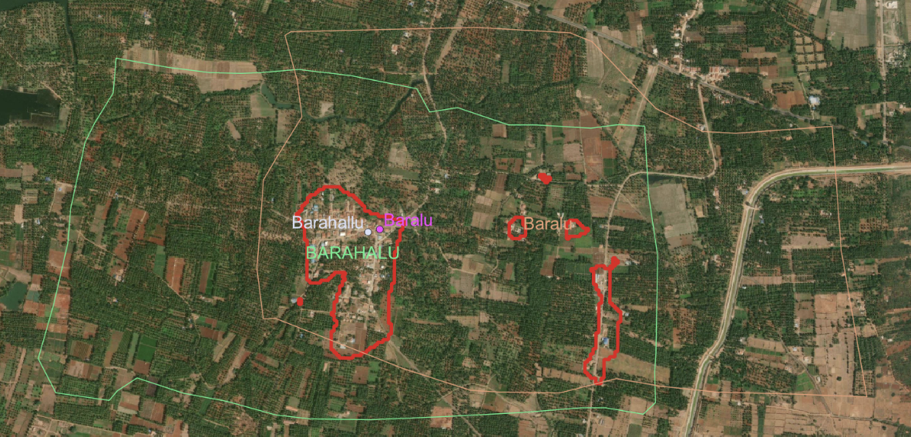
_(above) All data sources for Baralu/Barahalu/Barahallu overlaid in QGIS_

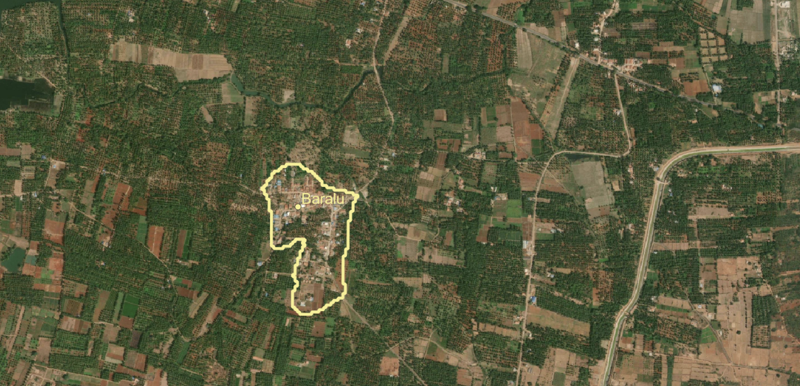
_(above) The final polygon and label position for the place of Baralu_

Numerous geoprocessing tools in QGIS were used to analyze and combine these five datasets, resulting in composite polygons and points for habitations and villages in India. Each of these input datasets helped to create detailed feature attributes of Karmashapes, including:

* _Population values_
* _Population vintage_
* _Name (Latin-based)_
* _Name variants (Latin-based and limited local script names)_
* _Label centroids_

Collaborating with data developers and contributors to each of these projects was very helpful. The insight and knowledge they shared helped increase Karmashape’s awareness of the local administrative structure, naming conventions and regional name spellings/localizations. It took dozens of conversations with people in the [Datameet group](https://datameet.org/), colleagues from OpenStreetMap (OSM), and friendly strangers on Twitter to help answer detailed questions about rural areas and the various megacities of India.

On their own, each of these datasets is busy, messy, and don’t represent locations across India well. While the PMGSY data represents habitations (the lowest level division of people loosely accounted for by the Indian government) well, the dataset lacks larger villages, towns, and cities. Karmashapes used SEDAC data to fill in most coverage gaps, along with the NGA point data. The two vectorized raster datasets then brought urban boundaries into focus and helped flush out unique location matches or agglomerations where parent-child structures are implemented to showcase the main place of the urban fabric.

All of this was done through dozens of detailed matching steps, edit sessions, refining poor-quality data, cleaning/scrubbing data attributes, and squeezing out every drop of potential from each data source.

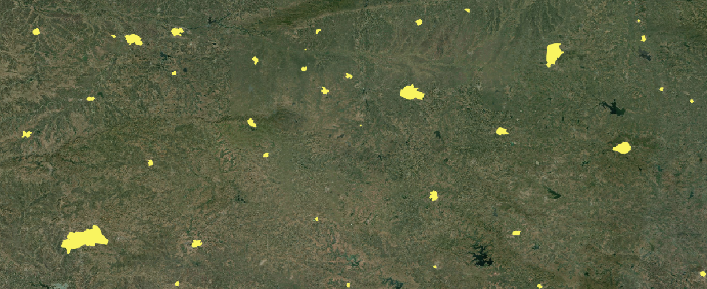
_(above) Example polygon coverage, WOF (pre-Karmashapes import)_

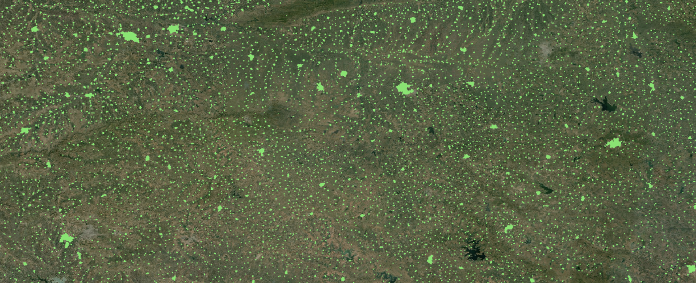
_(above) Example polygon coverage, Karmashapes_

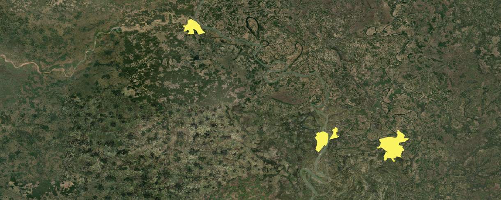
_(above) Example polygon coverage, WOF (pre-Karmashapes import)_

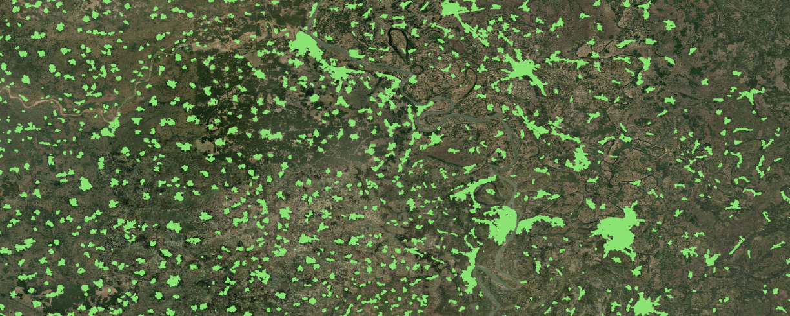
_(above) Example polygon coverage, Karmashapes_

# Merging into Who’s On First

Before Karmashapes, locality coverage in WOF was mainly represented using publicly available [GeoNames](https://www.geonames.org/) Point data and roughly 1,500 hand-curated polygons for large, populous localities. In WOF, urban and village-level places in India were imported at the locality placetype. Habitations were imported at the neighbourhood placetype.

However, because Karmashapes was developed using several input datasets, each of different vintage, some geographic overlap between town and village polygons is present in the dataset. To solve this overlap issue, WOF relied on Karmashapes attributes and spatial geoprocessing tools to move some villages to the neighbourhood placetype.

If a Karmashape record fell inside a town, for example, it was imported as a WOF neighbourhood. The “urban” administrative level that represents some of India’s largest metropolitan areas was confusing to fit properly into WOF, due to the sprawling and often overly large polygons created during Karmashapes processing steps. In cases where WOF already maintained hand-curated, accurate polygons for large cities, Karmashapes polygons were added as [alt-geometries](https://whosonfirst.org/docs/geometries/alt/) for these places and the existing polygons were maintained as-is.

Below, you’ll find a chart that maps the “core” admin levels in India’s administrative hierarchy to current (and proposed) Who’s On First placetypes.

<table>
  <tr>
   <td><strong>Indian Admin Level</strong>
   </td>
   <td><strong>WOF placetype</strong>
   </td>
   <td><strong>Notes</strong>
   </td>
  </tr>
  <tr>
   <td><em>State</em>
   </td>
   <td><em>Region</em>
   </td>
   <td><em>In WOF pre-Karmashapes</em>
   </td>
  </tr>
  <tr>
   <td><em>Union territory</em>
   </td>
   <td><em>Region</em>
   </td>
   <td><em>In WOF pre-Karmashapes</em>
   </td>
  </tr>
  <tr>
   <td><em>District</em>
   </td>
   <td><em>County</em>
   </td>
   <td><em>In WOF pre-Karmashapes</em>
   </td>
  </tr>
  <tr>
   <td><em>Sub-district</em>
   </td>
   <td><em>N/A</em>
   </td>
   <td><em>Speculative new WOF placetype, a followup to the Karmashapes import</em>
   </td>
  </tr>
  <tr>
   <td><em>Village</em>
   </td>
   <td><em>Localadmin and locality</em>
   </td>
   <td><em>Significant WOF upgrade post-Karmashapes</em>
   </td>
  </tr>
  <tr>
   <td><em>Urban</em>
   </td>
   <td><em>Localadmin and locality (sometimes coterminous with county)</em>
   </td>
   <td><em>In WOF pre-Karmashapes</em>
   </td>
  </tr>
</table>

Additional localization work was done in WOF once Karmashapes geometries and properties were imported. Hindi translations were added to any locality record with a population of 50,000 or more and additional localizations were added based on regional language patterns. WOF maintains official and spoken language by region, so each locality’s parent region was evaluated to prompt additional relevant localizations to match local expectations and supplement the Hindi localizations. In total, name translations were added to over 17,000 records over what was provided by Karmashapes.

Using openly-licensed data at each step of the build process allows Karmashapes to be released under a simple CC-BY license and, in turn, allows Who’s On First to import the full Karmashapes dataset. Without openly licensed data, this build would not have been possible.

# Get the Data

Karmashapes and Who’s On First data are available in several file formats and through various endpoints. You can access and browse data here:

* [Browse](https://spelunker.whosonfirst.org/placetypes/locality/?&iso=in) Who’s On First records in the Spelunker
* [Download](https://geocode.earth/data/whosonfirst/#IN) Who’s On First data in Shapefile and SQLite formats, via Geocode.Earth: 
* [Learn](https://whosonfirst.org/blog/2023/05/31/shapefiles/) more about downloading Who’s On First data in various formats
* Want the raw Karmashapes files? Full Karmashapes downloads are [available](https://karmashapes.wordpress.com/) on Justin’s blog. 

# Next Steps

Because the village and habitation data in India often overlaps, especially near the largest metro areas in the country, Karmashapes records were imported into Who’s On First most often as locality records and sometimes as neighbourhood records when they fell in an existing WOF locality. Practically speaking, this means many of the Who’s On First records in and around the ~1,500 largest metropolitan areas in India should be reviewed.

Some of the input sources used to create Karmashapes use population estimates from before the last census and those vintage population values for localities and neighbourhoods may also need to be updated.

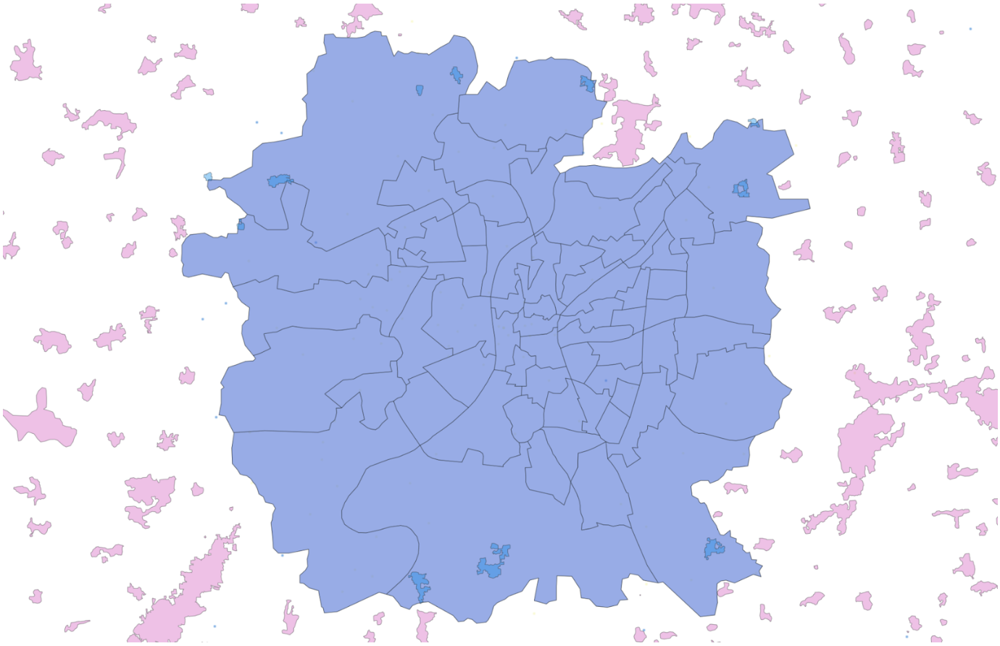
_(above) Ahmedabad locality extent with curated neighbourhood boundaries and a few new, funky Karamashapes neighbourhoods on the margins_

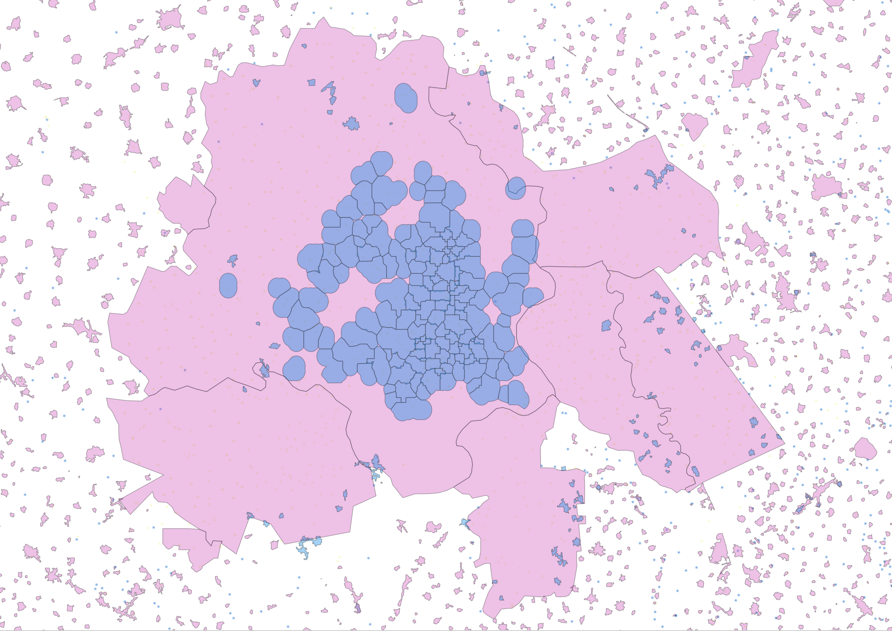
_(above) Delhi metropolitan area with pink locality polygons and blue neighbourhood polygons (original Quattroshapes neighbourhood polygons are contained in the urban core and Karmashapes neighbourhood polygons are visible on the margins)._

So, reviewing the placetypes and geometries of records at the edge of large locality polygons like those shown in the above screenshots will be an important next step when updating WOF records.

Improving neighborhood coverage within locality polygons and reviewing the hierarchies of all WOF records in India will also be a priority. In some cases, Karmashapes has created village and urban polygons that span slightly outside of expected parent region boundaries. We’ll want to review these polygons to ensure they’re extent is accurate and their hierarchies are expected.

And, while Karmashapes provided English names for the villages, habitations, and urban areas of India, name localization into official and spoken languages for many places is a work in progress. While the most populous places that were already in WOF have good name localization coverage, thanks to Karmashapes over one million place records are now available in India and it is challenging to localize all place names into all local languages. We’re open to contributions if you have them!

Lastly, if updates to PMGSY data become available (or any future dataset for localities in India are released under an open license), we’ll want to review those sources to keep WOF as up to date as possible - which it turns out can be quite tricky.

# Contact Who’s On First

Do you have suggestions for data improvements in India? Please file a [new issue](https://github.com/whosonfirst-data/whosonfirst-data/issues/new) or [discussion topic](https://github.com/whosonfirst-data/whosonfirst-data/discussions/new/choose) in Github about improving place records and coverage. [Subscribe to WOF Announcements](http://eepurl.com/ipOxd2) for “big news”, via Mailchimp. Frequency is a few times per year. Subscribers are the first to know about change like this big India locality data drop!

You can also join our new [WOF Gazetteer discussion group](https://groups.google.com/g/wof-gazetteer) on Google to ask questions and share updates on your country’s latest changes to its internal administrative subdivisions. If you’re a geography geek, this one’s for you.

If you or your organization relies on Who’s On First please consider sponsoring us with a recurring or one-time donation. Please reach out to Nathaniel at [wofgazetteer@gmail.com](mailto:wofgazetteer@gmail.com) to discuss options.