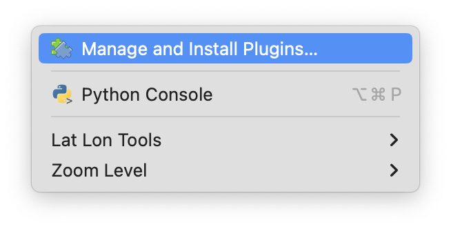
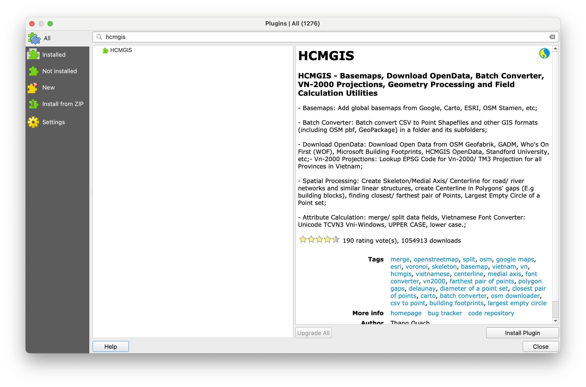
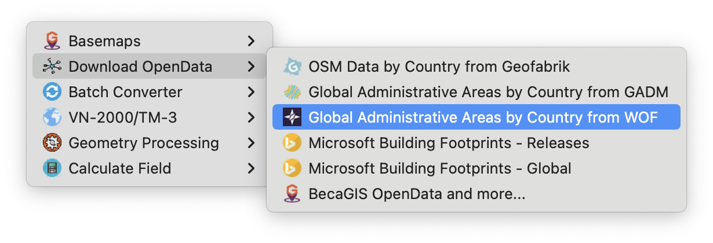
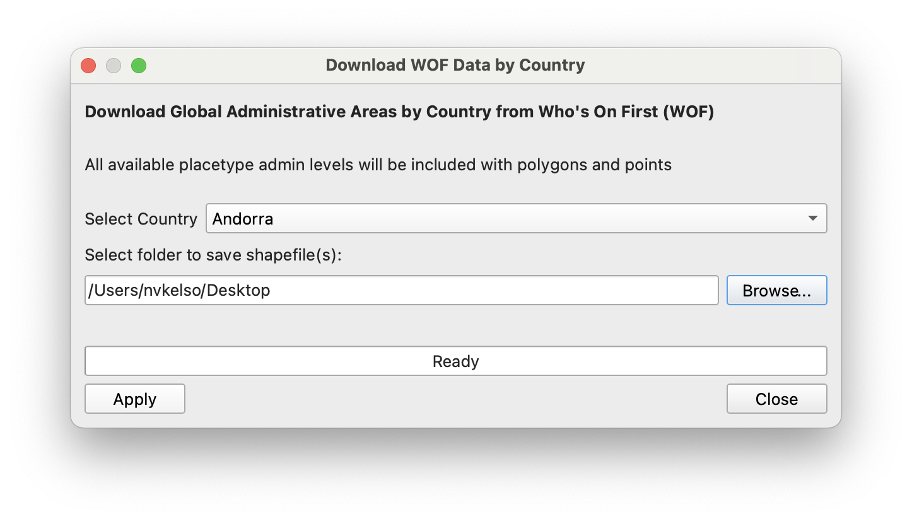
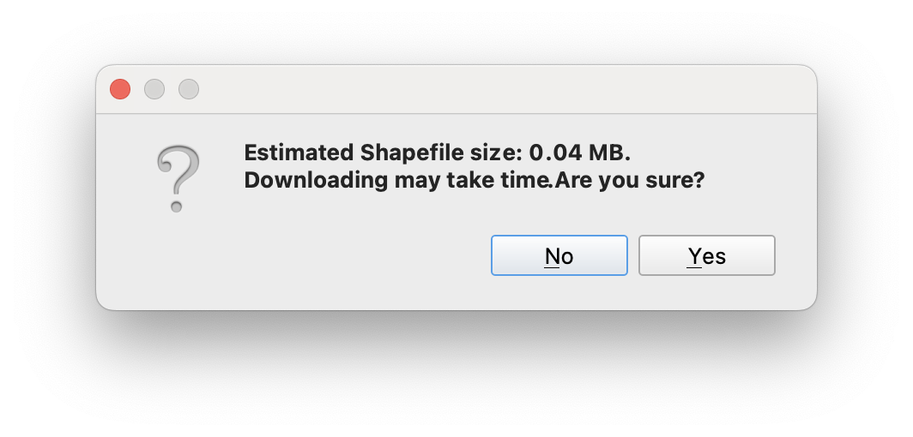
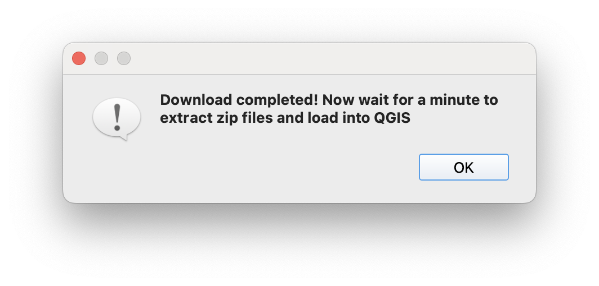
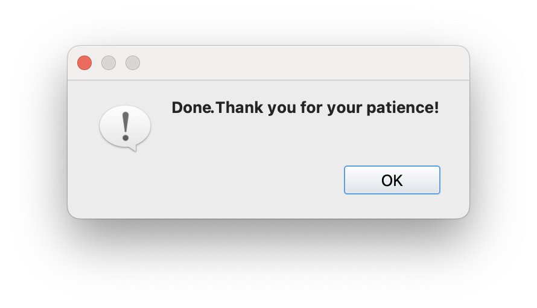
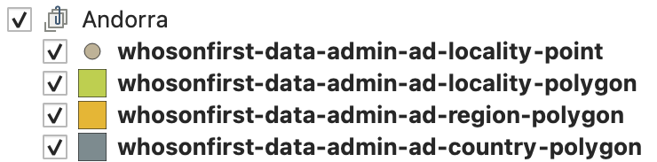

Decretive border by Bellwether Design; screen printed; 1992 <a href="https://collection.cooperhewitt.org/objects/18412045/">Collection of Cooper Hewitt Museum</a>.

## Who’s On First shapefile downloads in QGIS and on HDX

Since Who’s On First began [publishing](https://whosonfirst.org/blog/2023/05/31/shapefiles/) shapefile distributions in May of 2023 we’ve seen a large increase in downloads – with 20% of downloads now in shapefile format, 74% for the SQLite used by the open source [Pelias](https://pelias.io/) search project and by similar consumers interested in the full set of “raw" data, and remaining 6% in a legacy format.

Today we’re announcing three additional methods to download Who’s On First shapefiles:

* In QGIS desktop mapping app with the popular [HCMGIS](https://plugins.qgis.org/plugins/HCMGIS/) plugin
* Via the [Humanitarian Data Exchange](https://data.humdata.org/) (HDX) web platform
* Directly from whosonfirst.org

These new offerings bring WOF data directly into the apps you’re already using to make maps and we hope will broaden the audience for Who’s On First users.

Looking at the last 30 days of [stats](https://data.geocode.earth/wof/dist/stats.json), we see the most shapefile engagement from QGIS users (60%), followed by general web users (27%), and then HDX (12%). 

We’ve also updated the shapefile schema based on user feedback to add localized placetype strings, add official concordance identifiers to facilitate data joins with statistical tables, fixed a property name bug (“date" to “modified"), now include “unnamed" features and “placetype_alt" features to match SQLite coverage for current places, and a few other changes like backfilling country_id with the dependency’s ID to improve ergonomics.

## New shapefile access methods

### QGIS plugin

The [HCMGIS](https://plugins.qgis.org/plugins/HCMGIS/#plugin-about) plugin by Thang Quach is one of the [top 10 most popular](https://plugins.qgis.org/plugins/most_downloaded/) QGIS plugins. HCMGIS facilitates loading basemaps, downloading open data from a variety of sources, geometry processing, and field calculation utilities. 

We extended the HCMGIS plugin to add new point-and-click download functionality for Who’s On First open data with the new plugin version going live in January 2024.

#### Installation of the HCMGIS plugin in QGIS

To install the HCMGIS plugin within the QGIS desktop app, choose the "Plugins" menu and "Manage and Install Plugins..." menu item.

In the left sidebar ensure “All" plugins context is set, and then search for “HCMGIS" text at the top input box. Then select the “HCMGIS" result in the middle panel so the description text is populated in the right panel. 

Finally, use the “Install Plugin" button at the bottom right of the window to activate the plugin. After the plugin is installed you can “Close" the plugins window. 

#### Useage of the HCMGIS plugin in QGIS

From the new "HCMGIS" menu within QGIS, choose the "Download OpenData" submenu and then "Global Administrative Areas by Country from WOF" menu item.

Select a country from the dropdown menu. Names are listed in English followed my local scripts. Then select a local folder to save the shapefiles in by using the “Browse..." button.

To download, press the “Apply" button.

A prompt will list the expected download size. For Andora the size is small, for some other countries it can be quite a bit larger:

There isn’t a progress bar, so large countries may take some time. Once completed, a dialog will alert while the files are being extracted from the ZIP archive to your machine and loaded into your QGIS project as grouped table of contents layers.

Finally a completion dialog will popup: 

After dismissing it with the “OK" button, you’ll also want to “Close" the main download window – unless you want to download additional countries.

The QGIS table of contents sidebar will display all the available placetypes by geometry type for the downloaded country, like this for Andora: 

Which may be visualized on the map like:

### Humanitarian Data Exchange (HDX)

If you’re in the humanitarian or crisis mapping space you may already be familiar with the [Humanitarian Data Exchange (HDX)](https://data.humdata.org/). Since 2014, HDX has provided an open platform for sharing data across crises and organizations with the goal of making humanitarian data easy to find and use for analysis to ensure a coherent response to emergencies. HDX is managed by the United Nation’s OCHA Centre for Humanitarian Data.

Who’s On First was added to HDX in mid-April this year and now composes around 12% of our shapefile downloads ([HDX stats](https://data.humdata.org/organization/stats/wof)). We’re among a [small cohort](https://data.humdata.org/organization?sort=datasets%20desc#organizationsSection) of organizations that provide global data on HDX, and the only organization that provides global polygon and point administrative and locality human settlement data.

HDX's [GRID methodology](https://data.humdata.org/dashboards/overview-of-data-grids) is a powerful way to evaluate 22 countries for data availability to better coordinate humanitarian responses, and WOF is proud to contribute data for 2 of those core infrastructure layers. We hope to collaborate in the future to import openly licensed HDX data into WOF, and to start filling in some of the impactful gaps identified via the GRID methodology.

* Load the [WOF](https://data.humdata.org/organization/wof) organization page
* Enter a country name in the "Search all datasets..." box
* Click that country's name in the results list
* Confirm it's the right place using the preview map
* In the Data and Resources section below the map, press the Download button

### Who's On First website

If you land on the Who's On First download page, distribution downloads are now enabled for SQLite, Shapefile, and "Bundles" for full planet and per-country.

* Load the [Download](https://whosonfirst.org/download/) page
* Scholl to the relevant [SQLite](https://whosonfirst.org/download/#sqlite), [Shapefile](https://whosonfirst.org/download/#shapefile), or ["Bundles"](https://whosonfirst.org/download/#bundles) format section
* Choose a country name from the dropdown menu
* Press the Download button

### Geocode.Earth website

The original Who’s On First data downloads are still kindly processed and hosted by [Geocode Earth](https://geocode.earth/data/whosonfirst/), including SQLite and Shapefiles by country. Particular thanks to [Peter Johnson](https://www.linkedin.com/in/missinglink/) there for getting the shapefile format updated.

* Load the [Data Downloads](https://geocode.earth/data/whosonfirst/) page
* Click on the desired 2-character country code button in the top matrix (eg `US` for United States)
* Confirm your country’s name and flag below the top matrix
* Scroll down to the Shapefiles section, `Administrative Boundaries` section, and click the name of the ZIP file to download it (eg [whosonfirst-data-admin-us-latest.zip](https://data.geocode.earth/wof/dist/shapefile/whosonfirst-data-admin-us-latest.zip))

_NOTE: There’s also an [inventory.json](https://data.geocode.earth/wof/dist/shapefile/inventory.json) file available for programmatic use._

## Updated shapefile documentation

To recap our [post](https://whosonfirst.org/blog/2023/05/31/shapefiles/) from last year, shapefile downloads for the Who’s On First gazetteer are available as per-country ZIP archives including admin (with country, region, county, locality, neighbourhood & more), postalcode, and constituency placetype bundles.

Since first publishing shapefiles last year, we’ve modified the shapefile schema and filtering a bit based on user feedback. 

### Shapefile schema updates

* Adds a new `placelocal` property. For example, the WOF `region` records of Spain are known locally as `provincia`
*  Adds a new official `concord_id` and `concord_ke` columns to facilitate data joins with statistical tables
* The earlier `usgeo_id` column has been removed as it was United States only while the new concordance columns are global and include previous data, too
*  Adds new `iso_code` column for country and subdivision codes
* Backfille WOF `dependency_id` into `country_id` for some features as a convenience
* Rename `date` to `modified` to match SPR spec

### Shapefile filtering updates

* Removes the `name` constraint as some records (especially statistical gores) purposely don’t have names but are needed to form a continuous fabric at a placetype level within a country
* `placetype_alt` features are now included in all their `placetype` and `placetype_alt` layers, filling gaps as this is common for “unitary authority" type features in many countries. This means features with the same WOF ID can be present in multiple placetype-based shapefiles.

Our new [shapefile documentation](https://whosonfirst.org/docs/shapefiles/) fully summarizes the current state of play.

## Feedback

We hope you enjoy open data from the Who’s On First gazetteer!

If you have feedback please submit a [new issue](https://github.com/whosonfirst-data/whosonfirst-data/issues/new) or [discussion](https://github.com/whosonfirst-data/whosonfirst-data/discussions/new/choose) topic via Github.

If you prefer email:

* [Subscribe to WOF Announcements](http://eepurl.com/ipOxd2) for “big news", via Mailchimp. Frequency is a few times per year. 
* Join our new [WOF Gazetteer discussion group](https://groups.google.com/g/wof-gazetteer) on Google to ask questions and share updates on your country’s latest changes to it’s internal administrative subdivisions. If you’re a geography geek, this one’s for you.

Or on social media:

* Follow us on Mastadon at [mapstodon/@whosonfirst](https://mapstodon.space/@whosonfirst)