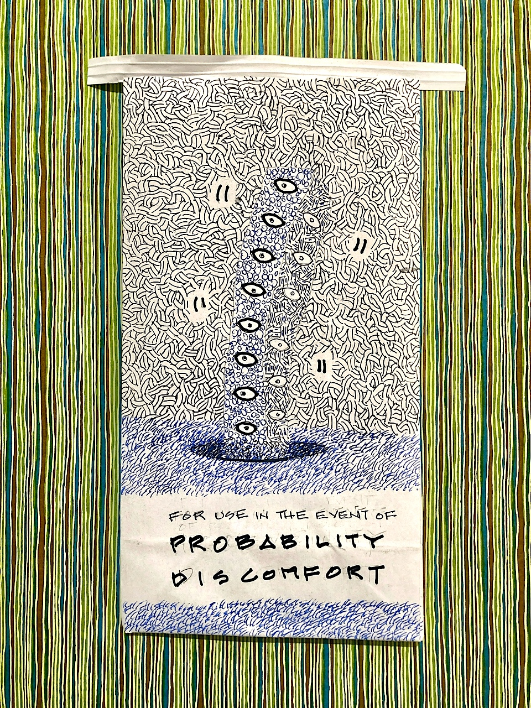
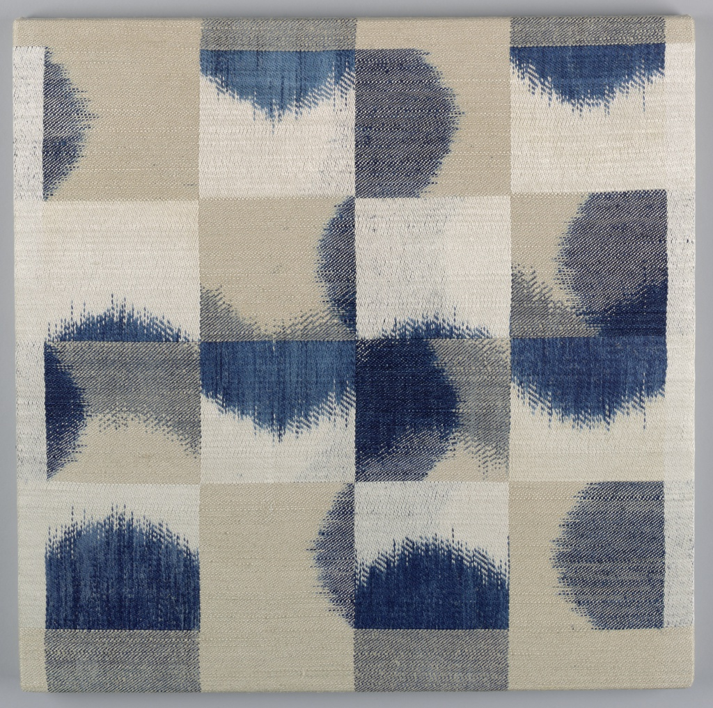
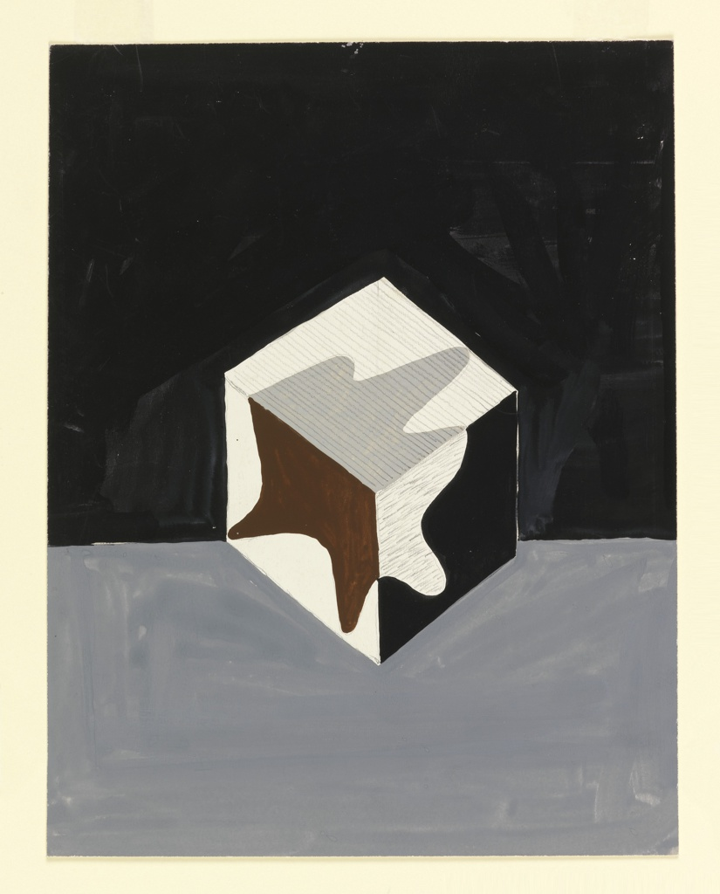
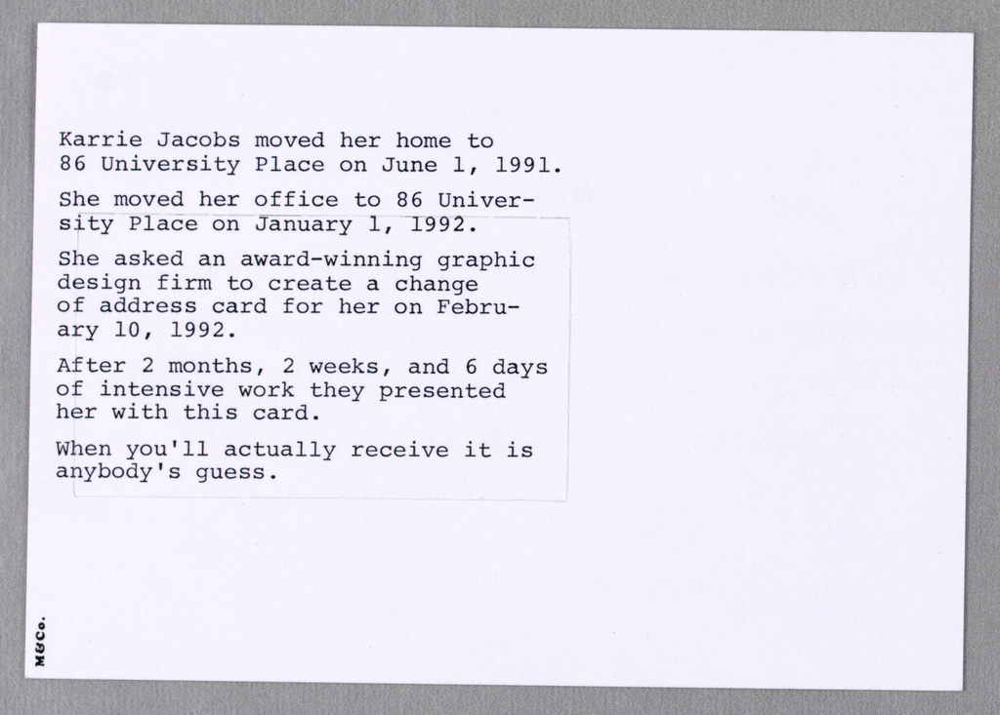

> If address parsing is where you go to cry then address de-duplication is where you go to give up.

I said that in 2017 as part of [a talk I did at State of the Map US](https://whosonfirst.org/blog/2017/10/24/whosonfirst-sotmus-2017/) about the work the Who's On First project was doing around publishing venue records, including [Al Barrantine's work to de-deplicate those records](https://github.com/openvenues/lieu). Unfortunately, a few months later [Mapzen shut down](https://whosonfirst.org/blog/2018/01/02/chapter-two/) so everything pretty much stalled out afterwards.

Earlier this year I started to wonder whether it would be possible to use the [vector embeddings produced by, and for, large language models](https://simonwillison.net/2023/Oct/23/embeddings/) to restart some of that de-duplication work. The short answer is: Yes, it is possible. The longer answer is: Nothing is especially "fast" yet and, to date, the code which has been written preferences (relative) ease of use, modularity and reproducability in favour of speed and other optimizations.

So far, testing with four [Who's On First venue repositories](https://github.com/whosonfirst-data), I have been able to use that code to first [deprecate about 45,000 duplicate records](https://github.com/whosonfirst-data/whosonfirst-data-deprecated-venue) and then, second, derive over 100,000 concordances with [Overture Data](https://overturemaps.org/) place records, 8,000 concordances with [All The Places](https://www.alltheplaces.xyz/) venues and another 500 concordances with [Institute of Library and Museum Studies (ILMS) museum records](https://www.imls.gov/research-evaluation/data-collection/museum-data-files). Specifically:

* Overture Data concordances: 73,939 in [whosonfirst-data-venue-us-ca](https://github.com/whosonfirst-data/whosonfirst-data-venue-us-ca), 25,190 in [whosonfirst-data-venue-us-ny](https://github.com/whosonfirst-data/whosonfirst-data-venue-us-ny), 5,099 in [whosonfirst-data-venue-ca](https://github.com/whosonfirst-data/whosonfirst-data-venue-ca), 4,265 in [whosonfirst-data-venue-gb](https://github.com/whosonfirst-data/whosonfirst-data-venue-gb)
* All The Places concordances: 6,108 in [whosonfirst-data-venue-us-ca](https://github.com/whosonfirst-data/whosonfirst-data-venue-us-ca), 1,985 in [whosonfirst-data-venue-us-ny](https://github.com/whosonfirst-data/whosonfirst-data-us-ny)
* ILMS concordances: 326 in [whosonfirst-data-venue-us-ca](https://github.com/whosonfirst-data/whosonfirst-data-venue-us-ca), 171 in [whosonfirst-data-venue-us-ny](https://github.com/whosonfirst-data/whosonfirst-data-venue-us-ny)

There are almost certainly still bugs, or at least "gotchas", but importantly the work so far passes the "better than yesterday" test.


<div style="font-size:small;font-style:italic;text-align:center;">
Rolodex Open Rotary Card File; bent tubular metal, molded plastic, rubber, paper; Gift of Rolodex Corporation; <a href="https://collection.cooperhewitt.org/objects/18653089/">Collection of Cooper Hewitt Museum</a>.
</div>

All of the code to do this work is contained in the [whosonfirst/go-dedupe](https://github.com/whosonfirst/go-dedupe) package. Although the code was written by and for the [Who's On First](https://whosonfirst.org) project many of the tools are data source (or provider) agnostic. The package is designed to be modular and extensible so that it can be tested against a variety of data providers, data models and database engines.

To date the bulk of the work has been done using Alex Garcia's [sqlite-vec extension](https://alexgarcia.xyz/blog/2024/sqlite-vec-stable-release/index.html) for storing and querying locations alongside the [Ollama REST API](https://github.com/ollama/ollama?tab=readme-ov-file#rest-api) and the [mxbai-embed-large](https://huggingface.co/mixedbread-ai/mxbai-embed-large-v1) model for deriving embeddings. There may well be better, easier and faster ways to do this and this code is meant to help facilitate those investigations.

The `whosonfirst/go-dedupe` package is structured around around (1) common date structure and (5) interfaces, and their provider-specific implementations. They are:

* [location.Location](https://github.com/whosonfirst/go-dedupe/blob/main/location/README.md#locationlocation) – A Go language struct containing a normalized representation of a place or venue.

* [location.Parser](https://github.com/whosonfirst/go-dedupe/blob/main/location/README.md#locationparser) – A Go language interface for parsing JSON-encoded GeoJSON records and producing `location.Location` instances.

* [location.Database](https://github.com/whosonfirst/go-dedupe/blob/main/location/README.md#locationdatabase) – A Go language interface for storing and querying `location.Location` records.

* [iterator.Iterator](https://github.com/whosonfirst/go-dedupe/blob/main/iterator/README.md) – A Go language interface for iterating through arbirtrary database sources and emiting JSON-encoded GeoJSON records.

* [embeddings.Embedder](https://github.com/whosonfirst/go-dedupe/blob/main/embeddings/README.md) – A Go language interface for generating vector embeddings from input text.

* [vector.Database](https://github.com/whosonfirst/go-dedupe/blob/main/vector/README.md) – A Go language interface for storing and querying vector embeddings.

The basic working model is as follows:

* Given a data source or provider, iterate through its records generating and storing `location.Location` records.

* Given two databases of `location.Location` records, one of them the "source" and the other the "target":

* Derive the set of unique 5-character geohashes from the records in the "target" database.

* For each of those geohashes, find all the `location.Location` records in the "source" database which a matching geohash and index each record in a vector database using an `embeddings.Embedder` instance to generate the vectors to store.

* Query each of the ("target") records matching a given geohash against the records in the vector database; as with the records in the second database, embeddings for each record in the first database are derived using an `embeddings.Embedder` instance.

* Matching records are emitted as CSV-encoded rows to `STDOUT`. Eventually there will be some sort of formal "publish" and "subscribe" mechanism for matching records but today there are only CSV rows.

What happens with those CSV rows of matching records is left for implementors to decide. For example:

```
$> tail -f /usr/local/data/wof-wof-ny.csv
dr5rr,wof:id=353594351,wof:id=353593911,"Cogliano Angelo Jr, 9407 101st Ave Ozone Park NY 11416","Cogliano Angelo Acctnt Jr, 9407 101st Avenue Ozone Park NY 11416",3.018408
dr5xg,wof:id=572126199,wof:id=287214377,"Prosthodontic Associates PC, 1 Hollow Ln Ste 202 New Hyde Park NY 11042","Prosthodontic Associates, 1 Hollow Ln New Hyde Park NY 11042",3.716114
dr5x6,wof:id=303812969,wof:id=269602859,"Hudson Shipping Lines Corp, 20 W Lincoln Ave Valley Stream NY 11580","Hudson Shipping Lines Corp, 20 E Lincoln Ave Valley Stream NY 11580",0.795845
dr7b3,wof:id=370248145,wof:id=253556813,"Pisciotta Capital, 775 Park Dr Huntington Station NY 11793","Pisciotta Capital, 775 Park Ave Huntington NY 11743",3.776641
dr8v9,wof:id=387002999,wof:id=320123265,"Gray Cpa Pc, 16 E Main St Ste 400 Rochester NY 14614","Gray CPA PC, 16 Main St W Rochester NY 14614",2.519037
dr5xq,wof:id=353801261,wof:id=270152357,"Maurice Fur Designer, 69 Merrick Ave Merrick NY 11566","Maurice Fur Designer-Merrick, 69 Merrick Rd North Merrick NY 11566",3.880814
dr5xq,wof:id=555197305,wof:id=253237525,"Matteo's Cafe, 412 Bedford Ave Bellmore NY 11710","Matteos Cafe, 416 Bedford Ave Bellmore NY 11710",3.053007
```

And so on...



<div style="font-size:small;font-style:italic;text-align:center;">
Panel, #5; silk; Museum purchase through gift of Anonymous Donor; <a href="https://collection.cooperhewitt.org/objects/18701879/">Collection of Cooper Hewitt Museum</a>.
</div>

Some things to note about this approach:

* A 5-character geohash represents an area of approximately 2.4 km. In the future it may be the case that a longer geohash will be stored (in the location database) and a variable length geohash will be queried based on properties that can be derived about a location. For example, a venue in the center of Manhattan might use a longer, more precise geohash, versus a venue in a rural area might use a shorter, more inclusive, geohash.

* Likewise, if `location.Location` records have been [supplemented with Who's On First hierarchies](https://github.com/whosonfirst/go-overture?tab=readme-ov-file#append-wof) (on ingest or at runtime) then they might also be filtered by geohash _and_ region to account for the fact that the same geohash can span multiple administrative boundaries (for example `dr5re`).

* This code works best with small and short-lived (temporary) vector databases on disk or in memory. Storing and querying millions of venue records and their embeddings on consumer grade hardware (my laptop) has proven to be slow and impractical. Many (but not all, yet) of the `vector.Database` implementations have been configured with the ability to create (and remove) temporary databases automatically.



<div style="font-size:small;font-style:italic;text-align:center;">
Drawing, Design for a Composition, Cube with Leaf; brush and gouache, graphite on paper; Gift of Mrs. E. McKnight Kauffer; <a href="https://collection.cooperhewitt.org/objects/18446851/">Collection of Cooper Hewitt Museum</a>.
</div>

Records that have been with concordances will also contain `label` and `similarity` properties for their corresponding data source. [For example](https://github.com/whosonfirst-data/whosonfirst-data-venue-ca/blob/585cf6178cf49b632626890c43f0bc2d30754a04/data/974/692/285/974692285.geojson#L25):

```
    "ovtr:label": "Foufounes Electriques, 87 Rue Ste-Catherine E Montréal QC CA",
    "ovtr:similarity": 3.9585158824920654,
    ...
    "wof:concordances": {
      "4sq:id": "4ad4c06bf964a5208bf920e3",
      "ovtr:id": "08f2baa46acf386e03da5ca94237203e",
      "sg:id": "SG_56tBn4ravrIrQi02NJruOl_45.510967_-73.562973@1293573121",
      "wk:page": "Les_Foufounes_Électriques"
    },
    ...
    "wof:id": 974692285,
    "wof:name": "Foufounes Electriques",    
```

In some cases it's also been possible to update a record's `mz:is_current` property, based on a concordance, to signal whether that venue is considered to be a comptemporary and active. I haven't done this for the Overture Data concordances because I've been working with a database of records with a confidence level of 0.95 or higher (approximately 7 million out of the total 60 million available records) and Overture only says they are sure about something if it has a confidence level of 1.

The way things stand today a data provider's confidence level is not stored in the location databases (described above) but that may change in the future to allow for logic to automatically determine whether a (Who's On First) record should be marked as "current" or at least "vetted".

This is on-going work so there's a lot left to do including better tools for sourcing, distributing and visualizing venues. That will come in and, in the meantime, [suggestions or contributions are welcome](https://github.com/orgs/whosonfirst-data/discussions). In the meantime things are (a little bit) better than they were yesterday which is always nice.



<div style="font-size:small;font-style:italic;text-align:center;">
Card, Karrie Jacobs: Change of Address; offset lithograph on paper; Gift of Tibor Kalman; <a href="https://collection.cooperhewitt.org/objects/18644345/">Collection of Cooper Hewitt Museum</a>.</div>

